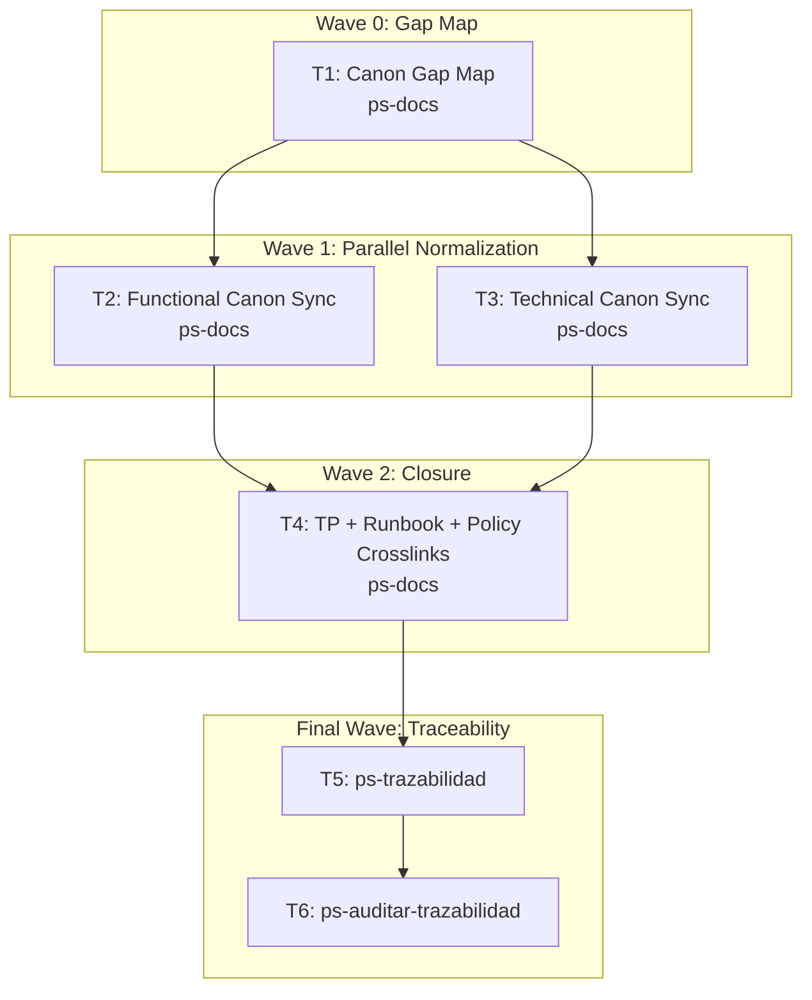

# Wave-Prod 10 — Docs Normalización Canon Implementation Plan

**Goal:** Normalize the functional and technical canon so the remaining MVP work starts from a single truthful documentation baseline, and synchronize project policy docs so future exploration starts with `mi-lsp`.

**Architecture:** This phase is documentation-only. It aligns `03/04/05/06/07/08/09` with the repo state already verified in `src/Bitacora.Api`, `src/Bitacora.Domain`, `src/Bitacora.DataAccess.EntityFramework`, and the existing production bootstrap, while preserving future scope as explicit pending work rather than accidental drift. It also syncs `AGENTS.md` and `CLAUDE.md` so exploration remains `mi-lsp`-first and workspace aliases are validated before use.

**Tech Stack:** Markdown wiki, .NET 10 backend, PostgreSQL, Supabase Auth, Dokploy, Telegram Bot, `mi-lsp`.

**Context Source:** Verified on 2026-04-10 from `.docs/wiki/02_arquitectura.md`, `.docs/wiki/05_modelo_datos.md`, `.docs/wiki/07_baseline_tecnica.md`, `.docs/wiki/09_contratos_tecnicos.md`, `.docs/wiki/06_matriz_pruebas_RF.md`, plus `mi-lsp` evidence showing `MapAuthEndpoints`, `MapConsentEndpoints`, and `MapRegistroEndpoints` in `src/Bitacora.Api/Program.cs`, no `CareLink`, no `TelegramSession`, and no `frontend/`.

**Runtime:** Codex

**Available Agents:**
- `ps-docs` — documentation updates and wiki/spec maintenance
- `ps-worker` — shell, git, config, and operational execution
- `ps-explorer` — read-only repo exploration
- `ps-dotnet10` — .NET 10 backend implementation
- `ps-next-vercel` — Next.js 16 frontend implementation
- `ps-python` — Python helpers and Telegram tooling
- `ps-qa` — QA audit over code, tests, and security
- `ps-reviewer` — read-only review with performance/design/security focus
- `ps-gap-terminator` — read-only docs/code gap detection

**Initial Assumptions:** The canonical RF set is directionally correct and needs normalization rather than full replacement. `wave-1` remains historical evidence, not the active source for pending work. The new portfolio will not reopen already-closed backend production bootstrap work.

---

## Risks & Assumptions

**Assumptions needing validation:**
- The current `RF-*` set still maps to the intended MVP slices; validate against `03_FL` and the implemented repo state before editing.
- Existing tech docs can be normalized in place instead of split again; validate while touching `07_tech`, `08_db`, and `09_contratos`.

**Known risks:**
- Documentation drift may incorrectly present future scope as already implemented; mitigate by marking current truth and deferred work explicitly.
- `wave-1` artifacts may still read as active; mitigate by adding explicit precedence notes where needed.

**Unknowns:**
- Whether any RF/FL entries still reference entities no longer desired in the MVP; resolve during the gap map task.
- Whether the current TP matrix already covers all release-critical pending slices; resolve during matrix normalization.

---

## Wave Dispatch Map

| Task | Wave | Agent | Subdoc | Done When |
|------|------|-------|--------|-----------|
| T1 | 0 | ps-docs | `./10-docs-normalizacion-canon/T1-canon-gap-map.md` | A durable gap map captures current repo truth, active precedence, and docs that need normalization |
| T2 | 1 | ps-docs | `./10-docs-normalizacion-canon/T2-functional-canon-sync.md` | `03_FL`, `04_RF`, and `05_modelo_datos.md` align with current truth and pending scope |
| T3 | 1 | ps-docs | `./10-docs-normalizacion-canon/T3-technical-canon-sync.md` | `07/08/09` and detailed technical docs align with implemented runtime and pending seams |
| T4 | 2 | ps-docs | `./10-docs-normalizacion-canon/T4-tp-runbook-crosslinks.md` | Test matrix, TP docs, runbooks, and policy docs point to the normalized canon, active portfolio, and `mi-lsp`-first exploration rule |
| T5 | F | — | inline | `ps-trazabilidad` closure completed |
| T6 | F | — | inline | `ps-auditar-trazabilidad` verdict recorded |

## Final Wave

### T5 — Run `ps-trazabilidad`
- Verify `03_FL`, `04_RF`, `05`, `06`, `07`, `08`, `09`, and `infra/` references all reflect the normalized truth.
- Confirm `wave-prod` precedence is explicit wherever `wave-1` might still confuse future execution.

### T6 — Run `ps-auditar-trazabilidad`
- Audit that no functional or technical doc now claims `CareLink`, `TelegramSession`, or `frontend/` already exist in code.
- Block closure if validation timing is still described before implementation.
