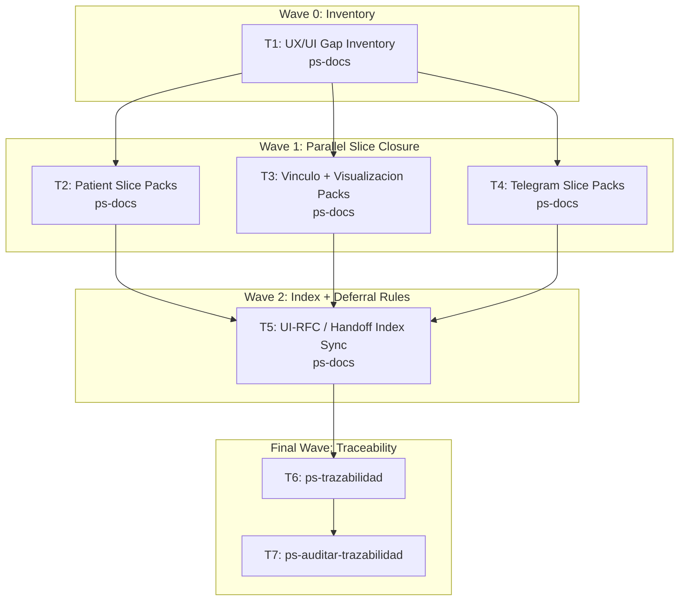

# Wave-Prod 11 — Docs UX/UI Canon Implementation Plan

**Goal:** Close the remaining pre-code UX/UI documentation packs required to implement the MVP without reinterpreting the product in code.

**Architecture:** This phase finishes the hardened UX/UI canon for the slices still missing technical UI closure. It reuses the existing `ONB-001` authority pack, keeps `UX-VALIDATION` deferred until functional code exists, and expands `UI-RFC + HANDOFF` coverage for the patient, vínculo, visualization, export, professional, and Telegram-visible slices.

**Tech Stack:** Markdown UX/UI canon, HTML prototypes, Next.js 16 target runtime, Telegram channel UX, `mi-lsp`.

**Context Source:** Verified on 2026-04-10 from `.docs/wiki/23_uxui/INDEX.md`, `.docs/wiki/21_matriz_validacion_ux.md`, the existing `ONB-001` `UI-RFC + HANDOFF` pack, and the repo truth showing there is still no `frontend/` and no Telegram session runtime.

**Runtime:** Codex

**Available Agents:**
- `ps-docs` — documentation updates and wiki/spec maintenance
- `ps-worker` — shell, git, config, and operational execution
- `ps-explorer` — read-only repo exploration
- `ps-dotnet10` — .NET 10 backend implementation
- `ps-next-vercel` — Next.js 16 frontend implementation
- `ps-python` — Python helpers and Telegram tooling
- `ps-qa` — QA audit over code, tests, and security
- `ps-reviewer` — read-only review with performance/design/security focus
- `ps-gap-terminator` — read-only docs/code gap detection

**Initial Assumptions:** Existing `UXR/UXI/UJ/VOICE/UXS/PROTOTYPE` docs are good enough to harden rather than rewrite. `ONB-001` remains the reference slice for handoff depth. `UX-VALIDATION` must stay prepared-only until the final post-code phase.

---

## Risks & Assumptions

**Assumptions needing validation:**
- The remaining visible slices can be closed with the current canon numbering and do not require a new UX taxonomy.
- `REG-001` and `REG-002` can be hardened into implementation-ready packs without live runtime evidence.

**Known risks:**
- There is a temptation to run UI validation too early; mitigate by keeping the validation matrix explicitly deferred.
- Telegram and professional slices may over-promise behaviors not yet frozen in technical contracts; mitigate by coordinating with Phase 20.

**Unknowns:**
- Whether export needs additional visible UI states beyond the existing `EXP-001` flow; resolve during the slice hardening tasks.
- Whether Telegram visible states can stay in the same canon depth as web slices; resolve during the Telegram UX task.

---

## Wave Dispatch Map

| Task | Wave | Agent | Subdoc | Done When |
|------|------|-------|--------|-----------|
| T1 | 0 | ps-docs | `./11-docs-uxui-canon/T1-uxui-gap-inventory.md` | A durable inventory captures which visible slices already have or still lack UI-RFC and handoff coverage |
| T2 | 1 | ps-docs | `./11-docs-uxui-canon/T2-patient-slice-packs.md` | `REG-001` and `REG-002` have pre-code technical UI closure |
| T3 | 1 | ps-docs | `./11-docs-uxui-canon/T3-vinculo-visualizacion-packs.md` | `VIN`, `VIS`, `EXP`, and professional-visible slices have hardened UI packs as needed |
| T4 | 1 | ps-docs | `./11-docs-uxui-canon/T4-telegram-slice-packs.md` | `TG-*` visible slices have pre-code UX/UI closure without premature validation |
| T5 | 2 | ps-docs | `./11-docs-uxui-canon/T5-index-and-validation-deferral-sync.md` | Indexes and validation matrix clearly show what is implementation-ready vs still awaiting post-code evidence |
| T6 | F | — | inline | `ps-trazabilidad` closure completed |
| T7 | F | — | inline | `ps-auditar-trazabilidad` verdict recorded |

## Final Wave

### T6 — Run `ps-trazabilidad`
- Verify every newly opened slice has the full canon chain required before code.
- Confirm `UX-VALIDATION` remains explicitly deferred to the final portfolio phase.

### T7 — Run `ps-auditar-trazabilidad`
- Audit that the UX/UI canon does not claim runtime evidence that does not yet exist.
- Block closure if any slice still requires frontend interpretation for core hierarchy, states, or copy.
