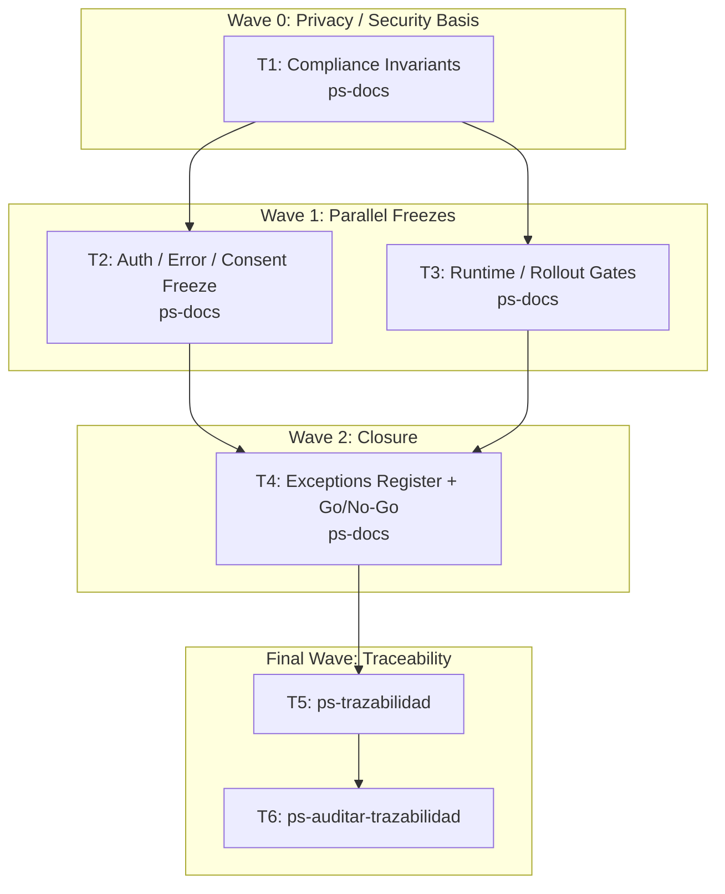

# Wave-Prod 20 — Hardening Specs Gates Implementation Plan

**Goal:** Freeze the pre-code hardening layer for security, privacy, contracts, operability, and rollout gates before implementation begins.

**Architecture:** This phase does not generate product code. It converts the normalized canon into explicit fail-closed rules, ownership boundaries, contract freezes, data-protection decisions, rollout constraints, and operational gates that later code must obey. It is the last documentation-first checkpoint before coding.

**Tech Stack:** Markdown specs, .NET 10 target backend, Next.js 16 target frontend, PostgreSQL, Supabase Auth, Dokploy, Telegram, `mi-lsp`.

**Context Source:** Verified on 2026-04-10 from the canonical wiki, the existing detailed technical docs (`TECH-CIFRADO.md`, `TECH-FRONTEND-SYSTEM-DESIGN.md`, `TECH-TELEGRAM.md`, `DB-MIGRACIONES-Y-BOOTSTRAP.md`, `CT-AUTH.md`, `CT-AUDIT.md`, `CT-ERRORS.md`), and the repo truth that still lacks `CareLink`, `TelegramSession`, and `frontend/`.

**Runtime:** Codex

**Available Agents:**
- `ps-docs` — documentation updates and wiki/spec maintenance
- `ps-worker` — shell, git, config, and operational execution
- `ps-explorer` — read-only repo exploration
- `ps-dotnet10` — .NET 10 backend implementation
- `ps-next-vercel` — Next.js 16 frontend implementation
- `ps-python` — Python helpers and Telegram tooling
- `ps-qa` — QA audit over code, tests, and security
- `ps-reviewer` — read-only review with performance/design/security focus
- `ps-gap-terminator` — read-only docs/code gap detection

**Initial Assumptions:** The functional and UX/UI canon is normalized before this phase starts. Sensitive-data decisions must be explicit before code. Runtime hardening is a later phase; this one only freezes the rules that code must satisfy.

---

## Risks & Assumptions

**Assumptions needing validation:**
- Existing `CT-*` docs can be extended to cover the missing public surfaces without creating ambiguity.
- The current data-protection baseline can support the future export and Telegram features with explicit extra controls.

**Known risks:**
- Security rules left implicit will lead to divergent backend and frontend implementations; mitigate by freezing them now.
- Rollout gates may stay underspecified because backend production is already live; mitigate by defining delta rollout rules for new surfaces.

**Unknowns:**
- Whether export requires additional legal disclaimers or retention rules; resolve in the contract freeze task.
- Whether Telegram reminders need stronger operational throttling and consent rules than currently documented; resolve in the runtime gate task.

---

## Wave Dispatch Map

| Task | Wave | Agent | Subdoc | Done When |
|------|------|-------|--------|-----------|
| T1 | 0 | ps-docs | `./20-hardening-specs-gates/T1-compliance-invariants.md` | Privacy, consent, audit, and retention invariants are explicit and actionable |
| T2 | 1 | ps-docs | `./20-hardening-specs-gates/T2-contract-freeze.md` | Auth, error, consent, and public contract rules are frozen before code |
| T3 | 1 | ps-docs | `./20-hardening-specs-gates/T3-runtime-rollout-gates.md` | Rollout, fail-closed behavior, observability, and operational gates are explicit |
| T4 | 2 | ps-docs | `./20-hardening-specs-gates/T4-exceptions-register-and-gonogo.md` | A single go/no-go checklist captures what code phases must satisfy |
| T5 | F | — | inline | `ps-trazabilidad` closure completed |
| T6 | F | — | inline | `ps-auditar-trazabilidad` verdict recorded |

## Final Wave

### T5 — Run `ps-trazabilidad`
- Verify every hardening rule is reflected in the technical and functional canon before code starts.
- Confirm validation timing still remains post-code only.

### T6 — Run `ps-auditar-trazabilidad`
- Audit that privacy, audit, export, and Telegram rules are explicit enough to guide implementation.
- Block closure if any critical contract is still implied rather than written.
