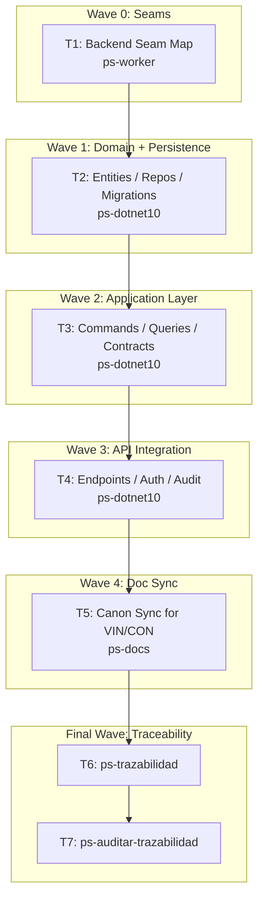

# Wave-Prod 30 — Code Backend Domain Implementation Plan

**Goal:** Implement the backend domain core for vínculos, binding codes, care links, and consent cascade behavior on top of the existing .NET 10 backend.

**Architecture:** Extend the current modular monolith instead of introducing a new service. Reuse the current command/query, repository, and Minimal API patterns already present in `src/Bitacora.Application`, `src/Bitacora.DataAccess.Interface`, `src/Bitacora.DataAccess.EntityFramework`, and `src/Bitacora.Api`, adding the missing domain entities and contract surface needed for the vínculo and consent domain.

**Tech Stack:** .NET 10, EF Core, PostgreSQL, Minimal APIs, Shared.Contract, `mi-lsp`.

**Context Source:** Verified on 2026-04-10 from `src/Bitacora.Api/Program.cs`, `src/Bitacora.Api/Endpoints/*`, `src/Bitacora.Application/Commands/*`, `src/Bitacora.Application/Queries/Consent/GetCurrentConsentQuery.cs`, `src/Bitacora.Domain/Entities/*`, `src/Bitacora.DataAccess.Interface/Repositories/*`, and `src/Bitacora.DataAccess.EntityFramework/*`. Current code has auth, consent, and registro only; `CareLink` and `BindingCode` are not implemented.

**Runtime:** Codex

**Available Agents:**
- `ps-dotnet10` — .NET 10 backend implementation
- `ps-docs` — documentation updates and wiki/spec maintenance
- `ps-worker` — shell, git, config, and operational execution
- `ps-explorer` — read-only repo exploration
- `ps-next-vercel` — Next.js 16 frontend implementation
- `ps-python` — Python helpers and Telegram tooling
- `ps-qa` — QA audit over code, tests, and security
- `ps-reviewer` — read-only review with performance/design/security focus
- `ps-gap-terminator` — read-only docs/code gap detection

**Initial Assumptions:** Phase 20 already froze the contract and security rules. Production bootstrap remains unchanged. Manual migrations remain explicit and are not replaced with auto-migrate in production.

---

## Risks & Assumptions

**Assumptions needing validation:**
- Existing application and repository patterns are sufficient for the new domain without a mediator rewrite.
- `Shared.Contract` can host the new shared DTO/event surface without a new contract assembly.

**Known risks:**
- Consent and vínculo rules intersect privacy-sensitive access paths; mitigate by wiring audit and authz from the start.
- EF schema changes are irreversible in prod without careful migration sequencing; mitigate by keeping migration work explicit and documented.

**Unknowns:**
- Whether some vínculo operations should stay command-only and avoid read-side projections in this phase; resolve in the seam map task.
- Whether export-relevant linkage data belongs here or in Phase 31; resolve in the application contract task.

---

## Wave Dispatch Map

| Task | Wave | Agent | Subdoc | Done When |
|------|------|-------|--------|-----------|
| T1 | 0 | ps-worker | `./30-code-backend-domain/T1-backend-seam-map.md` | A durable seam map captures the exact files and extension points to reuse for VIN/CON |
| T2 | 1 | ps-dotnet10 | `./30-code-backend-domain/T2-entities-repositories-migrations.md` | New domain entities, repository interfaces/implementations, and EF migrations exist and build |
| T3 | 2 | ps-dotnet10 | `./30-code-backend-domain/T3-application-commands-queries-contracts.md` | Application layer and shared contracts cover vínculo and consent cascade behavior |
| T4 | 3 | ps-dotnet10 | `./30-code-backend-domain/T4-api-auth-audit-integration.md` | New Minimal API endpoints are wired with authz, consent, and audit behavior |
| T5 | 4 | ps-docs | `./30-code-backend-domain/T5-doc-sync-vin-con.md` | The canon reflects the implemented VIN/CON backend surface |
| T6 | F | — | inline | `ps-trazabilidad` closure completed |
| T7 | F | — | inline | `ps-auditar-trazabilidad` verdict recorded |

## Final Wave

### T6 — Run `ps-trazabilidad`
- Verify VIN/CON code changes sync back to RF, flows, data model, DB, and contracts.
- Confirm manual migration/runbook instructions remain truthful.

### T7 — Run `ps-auditar-trazabilidad`
- Audit that no public backend behavior landed without matching contract and privacy documentation.
- Block closure if authz or audit rules drifted from the hardening layer.
