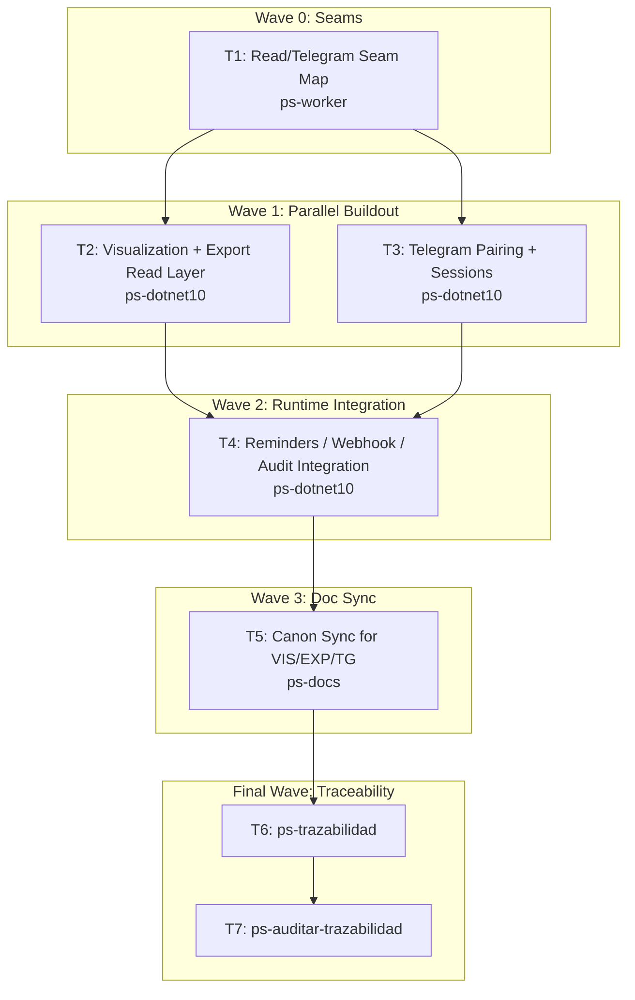

# Wave-Prod 31 — Code Backend Reads + Telegram Implementation Plan

**Goal:** Implement the backend read side for visualization/export and the Telegram runtime for pairing, sessions, and reminders.

**Architecture:** Extend the same .NET 10 monolith after the vínculo core exists. Keep read models, exports, Telegram pairing/session state, reminder scheduling, and channel audit behavior inside the existing application/data/API structure unless a new seam is strictly required.

**Tech Stack:** .NET 10, EF Core, PostgreSQL, Minimal APIs, Telegram Bot runtime, Shared.Contract, `mi-lsp`.

**Context Source:** Verified on 2026-04-10 from the current backend structure and the absence of `TelegramSession` in `src/`. Existing code already contains registro and consent primitives plus `TECH-TELEGRAM.md`, but no implemented Telegram session runtime or professional visualization/export backend.

**Runtime:** Codex

**Available Agents:**
- `ps-dotnet10` — .NET 10 backend implementation
- `ps-docs` — documentation updates and wiki/spec maintenance
- `ps-worker` — shell, git, config, and operational execution
- `ps-explorer` — read-only repo exploration
- `ps-next-vercel` — Next.js 16 frontend implementation
- `ps-python` — Python helpers and Telegram tooling
- `ps-qa` — QA audit over code, tests, and security
- `ps-reviewer` — read-only review with performance/design/security focus
- `ps-gap-terminator` — read-only docs/code gap detection

**Initial Assumptions:** Phase 30 already delivered vínculo/core ownership entities. Telegram stays inside the current backend/runtime unless Phase 20 explicitly approved a separate process. Export and visualization use the same authz and audit rules frozen in the hardening phase.

---

## Risks & Assumptions

**Assumptions needing validation:**
- Read-side projections can reuse the current data access stack without a separate CQRS datastore.
- Telegram session and reminder persistence belongs in the same primary database.

**Known risks:**
- Export and Telegram can create privacy leaks if summaries are broader than allowed; mitigate by keeping audit and redaction rules explicit in implementation.
- Reminder scheduling may create operational load if not bounded; mitigate by codifying throttling and retry behavior.

**Unknowns:**
- Whether export should generate files synchronously or asynchronously; resolve in the read/export task.
- Whether Telegram webhooks or polling is the approved runtime mode; resolve in the Telegram runtime task using the hardening docs.

---

## Wave Dispatch Map

| Task | Wave | Agent | Subdoc | Done When |
|------|------|-------|--------|-----------|
| T1 | 0 | ps-worker | `./31-code-backend-reads-telegram/T1-read-telegram-seam-map.md` | A seam map captures exact extension points for read-side and Telegram work |
| T2 | 1 | ps-dotnet10 | `./31-code-backend-reads-telegram/T2-visualization-export-read-layer.md` | Visualization/export queries, repositories, and endpoints build successfully |
| T3 | 1 | ps-dotnet10 | `./31-code-backend-reads-telegram/T3-telegram-pairing-sessions.md` | Telegram pairing/session state and core runtime contracts build successfully |
| T4 | 2 | ps-dotnet10 | `./31-code-backend-reads-telegram/T4-reminders-webhook-audit-integration.md` | Reminder delivery and Telegram runtime are wired with audit and operational controls |
| T5 | 3 | ps-docs | `./31-code-backend-reads-telegram/T5-doc-sync-vis-exp-tg.md` | The canon reflects implemented VIS/EXP/TG backend behavior |
| T6 | F | — | inline | `ps-trazabilidad` closure completed |
| T7 | F | — | inline | `ps-auditar-trazabilidad` verdict recorded |

## Final Wave

### T6 — Run `ps-trazabilidad`
- Verify read-side, export, and Telegram code sync back to RF, TP, contracts, and technical docs.
- Confirm operational constraints remain truthful for production.

### T7 — Run `ps-auditar-trazabilidad`
- Audit that Telegram and export behavior does not exceed the frozen privacy and audit rules.
- Block closure if runtime mode, authz, or observability assumptions remain implicit.
