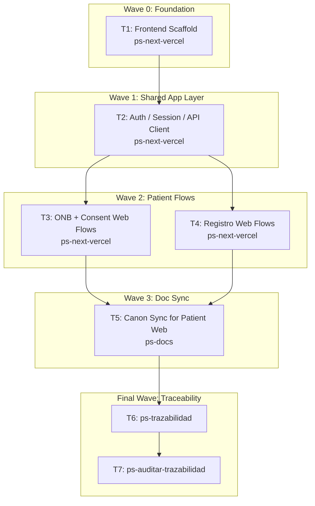

# Wave-Prod 40 — Code Frontend Foundation + Patient Implementation Plan

**Goal:** Create the `frontend/` runtime, shared auth/session layer, and patient-facing web flows for onboarding, consent, and registro.

**Architecture:** Build the new Next.js 16 app on top of the already-frozen docs and backend contracts. The frontend must consume the backend as source of truth, reuse the `ONB-001` authority pack and the REG technical UI packs, and avoid re-deciding hierarchy, states, or copy in code.

**Tech Stack:** Next.js 16, React 19, Supabase Auth, TypeScript, App Router, backend API contracts, `mi-lsp`.

**Context Source:** Verified on 2026-04-10 from the repo truth showing no `frontend/` folder exists, the `ONB-001` `UI-RFC + HANDOFF` pack is already open, and backend routes currently expose auth/bootstrap, consent, and registro behavior through `src/Bitacora.Api`.

**Runtime:** Codex

**Available Agents:**
- `ps-next-vercel` — Next.js 16 frontend implementation
- `ps-docs` — documentation updates and wiki/spec maintenance
- `ps-worker` — shell, git, config, and operational execution
- `ps-explorer` — read-only repo exploration
- `ps-dotnet10` — .NET 10 backend implementation
- `ps-python` — Python helpers and Telegram tooling
- `ps-qa` — QA audit over code, tests, and security
- `ps-reviewer` — read-only review with performance/design/security focus
- `ps-gap-terminator` — read-only docs/code gap detection

**Initial Assumptions:** Phases 10, 11, 20, 30, and 31 have already closed the docs and backend prerequisites. Supabase Auth remains the shared auth authority. This phase does not run final UX validation; it only implements the patient web runtime.

---

## Risks & Assumptions

**Assumptions needing validation:**
- Next.js 16 can be introduced in `frontend/` without changing the backend deployment topology already in place.
- The patient web can consume the backend API directly without an additional BFF layer.

**Known risks:**
- If auth/session handling is improvised, every later route will inherit drift; mitigate by building the auth foundation first.
- The patient flows are health-sensitive and copy-sensitive; mitigate by implementing directly from `UI-RFC` and handoff docs.

**Unknowns:**
- Whether SSR, server actions, or client fetch is the best default for each patient route; resolve per task using the frontend system design.
- Whether the initial shell needs route groups or parallel routes for auth states; resolve in the scaffold task.

---

## Wave Dispatch Map

| Task | Wave | Agent | Subdoc | Done When |
|------|------|-------|--------|-----------|
| T1 | 0 | ps-next-vercel | `./40-code-frontend-foundation-patient/T1-frontend-scaffold.md` | `frontend/` exists with a buildable Next.js foundation |
| T2 | 1 | ps-next-vercel | `./40-code-frontend-foundation-patient/T2-auth-session-api-client.md` | Shared auth, session, and API client layers build and route correctly |
| T3 | 2 | ps-next-vercel | `./40-code-frontend-foundation-patient/T3-onb-consent-web-flows.md` | ONB and consent patient routes implement the existing authority pack and contracts |
| T4 | 2 | ps-next-vercel | `./40-code-frontend-foundation-patient/T4-registro-web-flows.md` | Patient registro routes implement the REG docs and backend contracts |
| T5 | 3 | ps-docs | `./40-code-frontend-foundation-patient/T5-doc-sync-patient-web.md` | The canon reflects the implemented patient web surface |
| T6 | F | — | inline | `ps-trazabilidad` closure completed |
| T7 | F | — | inline | `ps-auditar-trazabilidad` verdict recorded |

## Final Wave

### T6 — Run `ps-trazabilidad`
- Verify patient web routes sync back to UI-RFC/handoff, RF, TP, and technical frontend docs.
- Confirm validation remains deferred to the final portfolio phase.

### T7 — Run `ps-auditar-trazabilidad`
- Audit that the implemented patient web does not drift from the ONB/REG authority packs.
- Block closure if auth/session handling contradicts backend or privacy rules.
