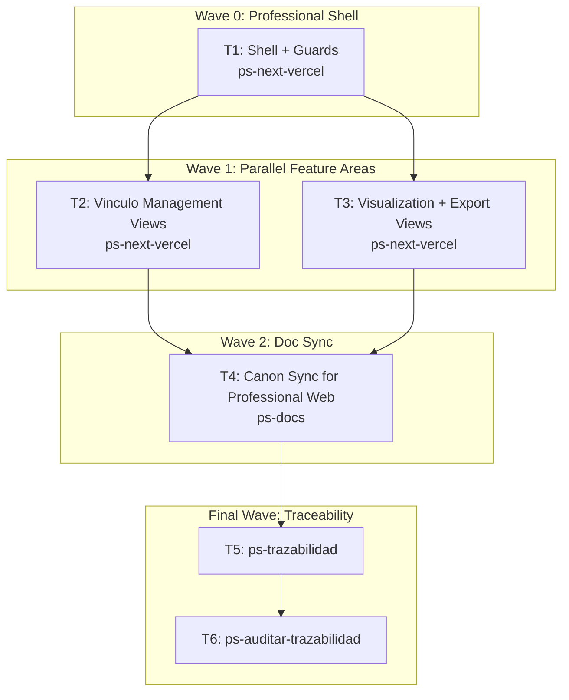

# Wave-Prod 41 — Code Frontend Professional Implementation Plan

**Goal:** Implement the professional web surface for vínculo management, visualization, and export on top of the new frontend foundation.

**Architecture:** Build professional-facing routes only after the patient foundation and backend read side are available. Reuse the same auth/session/api client layer from Phase 40 and implement the professional UX strictly from the hardened vínculo/visualization/export docs.

**Tech Stack:** Next.js 16, React 19, Supabase Auth, TypeScript, backend API contracts, `mi-lsp`.

**Context Source:** Verified on 2026-04-10 from the repo truth showing no current frontend runtime, the planned backend read/export/vínculo APIs, and the UX/UI canon prepared for `VIN`, `VIS`, `EXP`, and professional-visible slices.

**Runtime:** Codex

**Available Agents:**
- `ps-next-vercel` — Next.js 16 frontend implementation
- `ps-docs` — documentation updates and wiki/spec maintenance
- `ps-worker` — shell, git, config, and operational execution
- `ps-explorer` — read-only repo exploration
- `ps-dotnet10` — .NET 10 backend implementation
- `ps-python` — Python helpers and Telegram tooling
- `ps-qa` — QA audit over code, tests, and security
- `ps-reviewer` — read-only review with performance/design/security focus
- `ps-gap-terminator` — read-only docs/code gap detection

**Initial Assumptions:** Phases 30, 31, and 40 already delivered the backend contracts and the shared frontend foundation. The professional web is not a design exploration phase; it is a technical implementation phase over already-closed UX/UI docs.

---

## Risks & Assumptions

**Assumptions needing validation:**
- Professional access control can reuse the same auth/session infrastructure with role-aware guards.
- Visualization and export UI can share components without collapsing distinct risk states.

**Known risks:**
- Professional screens can accidentally expose more patient detail than allowed; mitigate by implementing directly from the hardened docs and backend contracts.
- Export actions can easily bypass confirmation or audit expectations; mitigate by keeping them explicit in the dedicated task.

**Unknowns:**
- Whether the professional home should land on vínculos or visualization first; resolve in the shell task from the prepared docs.
- Whether export generation is synchronous or queued by the backend implementation; resolve in the export UI task.

---

## Wave Dispatch Map

| Task | Wave | Agent | Subdoc | Done When |
|------|------|-------|--------|-----------|
| T1 | 0 | ps-next-vercel | `./41-code-frontend-professional/T1-shell-and-guards.md` | The professional route group exists with buildable role-aware shell and guards |
| T2 | 1 | ps-next-vercel | `./41-code-frontend-professional/T2-vinculo-management-views.md` | Professional vínculo management views build and consume the backend contracts |
| T3 | 1 | ps-next-vercel | `./41-code-frontend-professional/T3-visualization-export-views.md` | Visualization and export views build and consume the backend contracts |
| T4 | 2 | ps-docs | `./41-code-frontend-professional/T4-doc-sync-professional-web.md` | The canon reflects the implemented professional web surface |
| T5 | F | — | inline | `ps-trazabilidad` closure completed |
| T6 | F | — | inline | `ps-auditar-trazabilidad` verdict recorded |

## Final Wave

### T5 — Run `ps-trazabilidad`
- Verify professional web implementation syncs to UI-RFC, TP, and contract docs.
- Confirm final UX validation remains a later phase.

### T6 — Run `ps-auditar-trazabilidad`
- Audit that professional routes and exports respect privacy, role, and audit rules.
- Block closure if the implemented views drift from the hardened UX/UI contracts.
