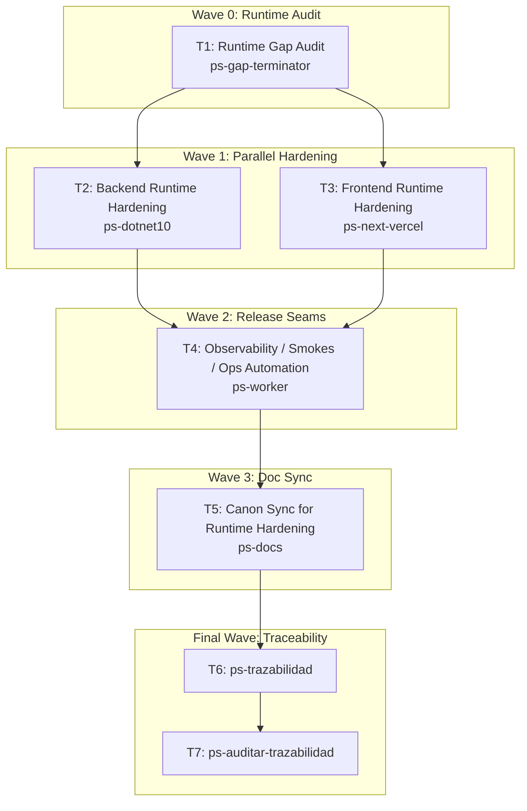

# Wave-Prod 50 — Hardening Runtime + Release Implementation Plan

**Goal:** Harden the implemented system for real runtime operation before final validation and release closure.

**Architecture:** This phase starts only after backend and frontend code phases are materially complete. It closes the gap between code that works and code that is safe to operate: security defaults, fail-closed behavior, audit coverage, observability, smoke automation, and release seams.

**Tech Stack:** .NET 10, Next.js 16, Dokploy, PostgreSQL, Supabase Auth, Telegram runtime, PowerShell smokes, `mi-lsp`.

**Context Source:** Built on top of the wave-prod code phases plus the existing operational assets in `infra/`, including the backend smoke script and runbooks. Current production bootstrap already exists; this phase hardens the newly-added application surfaces, not the already-closed bootstrap base.

**Runtime:** Codex

**Available Agents:**
- `ps-gap-terminator` — read-only docs/code gap detection
- `ps-dotnet10` — .NET 10 backend implementation
- `ps-next-vercel` — Next.js 16 frontend implementation
- `ps-worker` — shell, git, config, and operational execution
- `ps-docs` — documentation updates and wiki/spec maintenance
- `ps-qa` — QA audit over code, tests, and security
- `ps-explorer` — read-only repo exploration
- `ps-reviewer` — read-only review with performance/design/security focus
- `ps-python` — Python helpers and Telegram tooling

**Initial Assumptions:** The code phases already implemented the required features and synced the canon. This phase is about hardening and operability, not about introducing new product scope.

---

## Risks & Assumptions

**Assumptions needing validation:**
- The current smoke and runbook layer can be extended instead of replaced.
- Security headers, route guards, and audit hooks can be hardened without redesigning the product flows.

**Known risks:**
- New web and Telegram surfaces may silently bypass fail-closed expectations; mitigate with a targeted runtime gap audit first.
- Observability may lag behind new endpoints and channels; mitigate by making telemetry and smoke automation explicit.

**Unknowns:**
- Whether some release-critical checks belong in CI or in runbooks only; resolve in the release automation task.
- Whether the Telegram runtime needs dedicated throttling or circuit-breaker logic beyond current assumptions; resolve in the backend hardening task.

---

## Wave Dispatch Map

| Task | Wave | Agent | Subdoc | Done When |
|------|------|-------|--------|-----------|
| T1 | 0 | ps-gap-terminator | `./50-hardening-runtime-release/T1-runtime-gap-audit.md` | A read-only hardening gap audit identifies the exact runtime deltas still required before release |
| T2 | 1 | ps-dotnet10 | `./50-hardening-runtime-release/T2-backend-runtime-hardening.md` | Backend security, audit, and fail-closed runtime hardening build successfully |
| T3 | 1 | ps-next-vercel | `./50-hardening-runtime-release/T3-frontend-runtime-hardening.md` | Frontend hardening, guards, headers, and failure states build successfully |
| T4 | 2 | ps-worker | `./50-hardening-runtime-release/T4-observability-smokes-ops-automation.md` | Observability, smokes, and release automation are updated for the new surfaces |
| T5 | 3 | ps-docs | `./50-hardening-runtime-release/T5-doc-sync-runtime-hardening.md` | The canon reflects the hardened runtime and release seams |
| T6 | F | — | inline | `ps-trazabilidad` closure completed |
| T7 | F | — | inline | `ps-auditar-trazabilidad` verdict recorded |

## Final Wave

### T6 — Run `ps-trazabilidad`
- Verify hardening changes sync to the technical canon, TP matrix, and operational docs.
- Confirm final validation is the next and only remaining release gate.

### T7 — Run `ps-auditar-trazabilidad`
- Audit that runtime hardening now covers backend, frontend, Telegram, observability, and release seams.
- Block closure if any new runtime surface still lacks fail-closed behavior or audit coverage.
