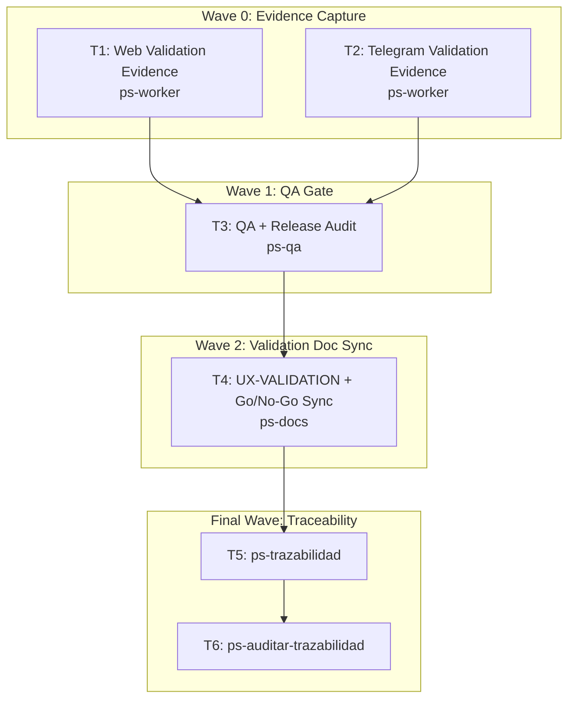

# Wave-Prod 60 — Validación Final + Trazabilidad Implementation Plan

**Goal:** Run the final post-code validation, capture evidence, update `UX-VALIDATION`, and close the portfolio with release-ready traceability.

**Architecture:** This is the only phase allowed to convert prepared UX/UI slices into evidence-backed validation. It executes the real web and channel validation, captures artifacts, runs the final QA/release audit, syncs the validation docs, and records the final go/no-go decision before terminal traceability.

**Tech Stack:** Browser/E2E validation, Telegram channel validation, QA audit, markdown validation docs, artifact capture, `mi-lsp`.

**Context Source:** Built on top of all prior wave-prod phases. Current canon already has prepared UX/UI slices and a validation matrix, but real evidence must only be generated once code, runtime hardening, and release seams are in place.

**Runtime:** Codex

**Available Agents:**
- `ps-worker` — shell, git, config, and operational execution
- `ps-qa` — QA audit over code, tests, and security
- `ps-docs` — documentation updates and wiki/spec maintenance
- `ps-next-vercel` — Next.js 16 frontend implementation
- `ps-dotnet10` — .NET 10 backend implementation
- `ps-python` — Python helpers and Telegram tooling
- `ps-explorer` — read-only repo exploration
- `ps-reviewer` — read-only review with performance/design/security focus
- `ps-gap-terminator` — read-only docs/code gap detection

**Initial Assumptions:** All code and runtime hardening phases are complete before this phase begins. Artifact capture must happen under `artifacts/e2e/`. This phase may still discover release-blocking defects and therefore retains authority to stop closure.

---

## Risks & Assumptions

**Assumptions needing validation:**
- The implemented patient and professional web can be exercised end-to-end with the available environments and credentials.
- Telegram QA can run with a dedicated test account and produce reproducible evidence.

**Known risks:**
- Teams often treat UI validation as a soft review instead of evidence capture; mitigate by forcing artifact generation and doc sync.
- Release readiness can be falsely green if QA findings do not flow back into the go/no-go record; mitigate with an explicit release audit task.

**Unknowns:**
- Whether all slices can be validated in one pass or require multiple evidence sessions; resolve during the execution tasks.
- Whether any residual defect should downgrade the release from go to no-go; resolve in the QA audit task.

---

## Wave Dispatch Map

| Task | Wave | Agent | Subdoc | Done When |
|------|------|-------|--------|-----------|
| T1 | 0 | ps-worker | `./60-validacion-final-trazabilidad/T1-web-validation-evidence.md` | Web validation artifacts exist under `artifacts/e2e/2026-04-10-wave-prod-web-validation/` |
| T2 | 0 | ps-worker | `./60-validacion-final-trazabilidad/T2-telegram-validation-evidence.md` | Telegram/channel validation artifacts exist under `artifacts/e2e/2026-04-10-wave-prod-telegram-validation/` |
| T3 | 1 | ps-qa | `./60-validacion-final-trazabilidad/T3-qa-release-audit.md` | Final QA audit returns a verdict tied to evidence and remaining defects |
| T4 | 2 | ps-docs | `./60-validacion-final-trazabilidad/T4-ux-validation-and-gonogo-sync.md` | `UX-VALIDATION` docs, matrix, and release decision are synchronized to the evidence |
| T5 | F | — | inline | `ps-trazabilidad` closure completed |
| T6 | F | — | inline | `ps-auditar-trazabilidad` verdict recorded |

## Final Wave

### T5 — Run `ps-trazabilidad`
- Verify evidence, validation docs, TP matrix, and release decision are all synchronized.
- Confirm the portfolio is either closed cleanly or blocked with explicit residual issues.

### T6 — Run `ps-auditar-trazabilidad`
- Audit that the final release story is consistent across runtime, docs, validation artifacts, and QA verdict.
- Block closure if any validated claim lacks evidence or if any critical defect lacks an owner/status.
