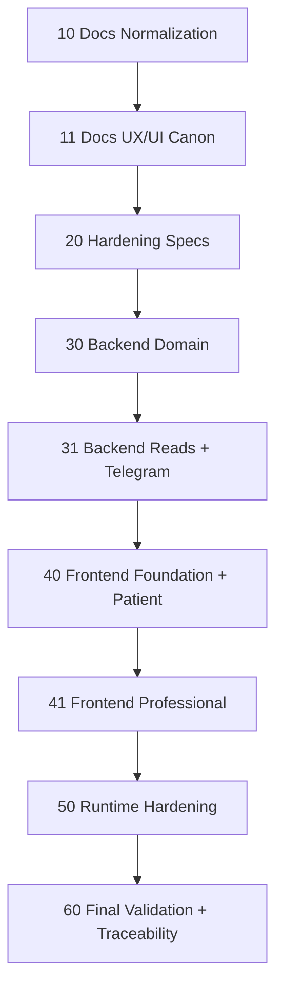

# Wave-Prod Portfolio

## Purpose
This directory is the active execution portfolio for the remaining Bitácora MVP work as of 2026-04-10. It replaces `.docs/raw/plans/wave-1/` as the operational planning surface for the pending work only; `wave-1` remains a historical record of the backend production bootstrap and earlier planning.

## Precedence
- Active portfolio: `.docs/plans/wave-prod/`
- Historical reference: `.docs/raw/plans/wave-1/`
- If a phase here conflicts with `wave-1`, `wave-prod` prevails for pending work.
- Already-closed inputs reused by this portfolio:
  - backend-only production bootstrap is already closed
  - `ONB-001` already has `UI-RFC + HANDOFF`

## Non-Negotiable Rules
- Work stays spec-driven: documentation first, then pre-code hardening, then code generation.
- Runtime hardening happens only after the code phases are materially complete.
- UI/UX validation with real evidence happens only at the end, after the code exists.
- Any plan that explores or changes code under `src/` must use `mi-lsp` as the primary navigation tool.
- Every phase closes with `ps-trazabilidad` and `ps-auditar-trazabilidad`.

## Portfolio Order
| Order | Phase | File | Intent |
|------|------|------|------|
| 1 | Docs normalization | `10-docs-normalizacion-canon.md` | Normalize the functional and technical canon against the current repo truth |
| 2 | Docs UX/UI canon | `11-docs-uxui-canon.md` | Close remaining pre-code UX/UI packs without running validation yet |
| 3 | Spec hardening | `20-hardening-specs-gates.md` | Freeze privacy, contracts, fail-closed rules, rollout gates, and operational seams |
| 4 | Backend domain code | `30-code-backend-domain.md` | Implement vínculo and consent domain core |
| 5 | Backend read/channel code | `31-code-backend-reads-telegram.md` | Implement read models, export, Telegram pairing, sessions, and reminders |
| 6 | Frontend foundation + patient | `40-code-frontend-foundation-patient.md` | Create `frontend/`, shared auth, ONB, consent, and registro patient flows |
| 7 | Frontend professional | `41-code-frontend-professional.md` | Build professional-facing routes, visualization, vínculo operations, and export flows |
| 8 | Runtime hardening | `50-hardening-runtime-release.md` | Harden security, observability, release contracts, and production seams |
| 9 | Final validation + closure | `60-validacion-final-trazabilidad.md` | Run final UI/channel validation, release readiness, and traceability closure |

## Dependency Shape

## Current Repo Truth Captured By This Portfolio
- The live repo has a backend-only runtime under `src/Bitacora.Api` with `MapAuthEndpoints`, `MapConsentEndpoints`, and `MapRegistroEndpoints`.
- `CareLink` and `TelegramSession` are not implemented in `src/` today.
- `frontend/` does not exist yet.
- `ONB-001` is open at the documentation level; `REG-001` and `REG-002` still need pre-code closure before implementation.
- The final validation phase is the first place where `UX-VALIDATION` should move from prepared status to evidence-backed status.
