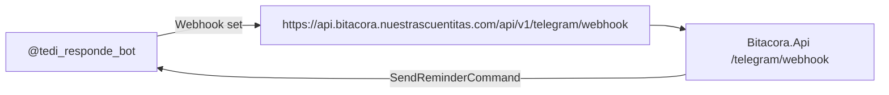

# Bitacora — Release Readiness

**Slug:** bitacora.nuestrascuentitas.com
**Type:** nota-tecnica
**Date:** 2026-04-13
**Status:** Produccion con advertencias conocidas

---

## Resumen ejecutivo

Backend y Telegram operativos en produccion. Frontend desplegado en Dokploy con build fallido por causa de Docker Hub (push denegado). El frontend debe resolverse para que el flujo de usuarios funcione end-to-end.

## Estado de componentes

| Componente | Status | URL |
|------------|--------|-----|
| Backend API (.NET 10) | Operativo | `https://api.bitacora.nuestrascuentitas.com` |
| Telegram Bot (@tedi_responde_bot) | Operativo con webhook | `https://api.bitacora.nuestrascuentitas.com/api/v1/telegram/webhook` |
| Frontend (Next.js 16) | Build fallido en Dokploy | `bitacora.nuestrascuentitas.com` |
| Base de datos PostgreSQL | Operativa (BitacoraDb) | `postgres-compress-haptic-transmitter-ghemty:5432` |

## Backend API — Verificacion

### Endpoints operativos (23 total)

```
/api/v1/auth/bootstrap
/api/v1/consent/current
/api/v1/consent
/api/v1/mood-entries
/api/v1/daily-checkins
/api/v1/vinculos
/api/v1/vinculos/active
/api/v1/vinculos/accept
/api/v1/vinculos/{id}
/api/v1/vinculos/{id}/view-data
/api/v1/professional/invites
/api/v1/professional/patients
/api/v1/visualizacion/timeline
/api/v1/visualizacion/summary
/api/v1/professional/patients/{patientId}/summary
/api/v1/professional/patients/{patientId}/timeline
/api/v1/professional/patients/{patientId}/alerts
/api/v1/export/patient-summary
/api/v1/export/{patientId}/constraints
/api/v1/export/patient-summary/csv
/api/v1/telegram/pairing
/api/v1/telegram/session
/api/v1/telegram/webhook
```

### Health checks

| Check | Valor | Observacion |
|-------|-------|-------------|
| `/health` | 200 OK | Liveness funcional |
| `/health/ready` | database: unreachable | Falso positivo — consultas reales funcionan |
| 23 endpoints | Responden correctamente | Auth requerida en clinical endpoints |

### Secrets sincronizados en vault (prod)

| Secret | Valor | Ubicacion |
|--------|-------|-----------|
| BITACORA_SUPABASE_JWT_SECRET | `srgGCnJ1...` | Dokploy env + Infisical vault |
| BITACORA_ENCRYPTION_KEY | `ERJY/JsA...` | Dokploy env + Infisical vault |
| BITACORA_PSEUDONYM_SALT | `0a6e89ad...` | Dokploy env + Infisical vault |
| BITACORA_TELEGRAM_BOT_TOKEN | `8584097775:AAE...` | Dokploy env + Infisical vault |
| BITACORA_BASE_URL | `https://api.bitacora.nuestrascuentitas.com` | Dokploy env + Infisical vault |
| TELEGRAM_BOT_TOKEN | `8584097775:AAE...` | Dokploy env + Infisical vault |

## Telegram — Configuracion



- **Webhook:** Confirmado activo via `getWebhookInfo`
- **Token:** `8584097775:AAEPQuUjyPSZKbU5W3btyfqAi8D4GuXk6uU`
- **getUpdates:** No disponible (webhook activo)

## Frontend — Problema critico

### Causa raiz

El build de Dokploy falla con `docker build` porque la imagen `node:22-alpine` no puede resolverse en el servidor de Dokploy. Error:

```
error getting credentials - err: exec: "docker-credential-desktop.exe": not found in $PATH
```

El servidor de Dokploy no tiene acceso a Docker Hub con las credenciales configuradas. Esto es un problema de configuracion del servidor, no del codigo.

### Soluciones posibles

1. **Usar un registry privado** (Dokploytiene un registry interno que debe configurarse)
2. **Usar GitHub Packages** con acceso autenticado
3. **Cambiar el base image** a una que este cacheada localmente en el servidor
4. **Build local + push manual** (alternativa temporal)

### Dockerfile creado

```dockerfile
FROM node:22-alpine AS build
WORKDIR /app
COPY package.json package-lock.json* ./
RUN npm install
COPY . .
ENV NEXT_TELEMETRY_DISABLED=1
RUN npm run build

FROM node:22-alpine AS runner
WORKDIR /app
ENV NODE_ENV=production
RUN addgroup --system --gid 1001 nodejs
RUN adduser --system --uid 1001 nextjs
COPY --from=build /app/public ./public
COPY --from=build --chown=nextjs:nodejs /app/.next/standalone ./
COPY --from=build --chown=nextjs:nodejs /app/.next/static ./.next/static
USER nextjs
EXPOSE 3000
ENV PORT=3000
CMD ["node", "server.js"]
```

El Dockerfile funciona correctamente en local (build exitoso, container responde en puerto 3000).

### next.config.js standalone

```js
const nextConfig = {
  reactStrictMode: true,
  output: 'standalone',
  env: {
    NEXT_PUBLIC_API_BASE_URL: process.env.NEXT_PUBLIC_API_BASE_URL,
    NEXT_PUBLIC_SUPABASE_URL: process.env.NEXT_PUBLIC_SUPABASE_URL,
    NEXT_PUBLIC_SUPABASE_ANON_KEY: process.env.NEXT_PUBLIC_SUPABASE_ANON_KEY,
  },
};
```

## Variantes de entorno del frontend

| Variable | Valor prod |
|----------|-----------|
| NEXT_PUBLIC_API_BASE_URL | `https://api.bitacora.nuestrascuentitas.com` |
| NEXT_PUBLIC_SUPABASE_URL | `https://auth.tedi.nuestrascuentitas.com` |
| NEXT_PUBLIC_SUPABASE_ANON_KEY | `eyJhbGci...` (anon key) |

## Gaps conocidos de produccion

| ID | Severidad | Descripcion | Solucion |
|----|----------|-------------|----------|
| FE-DOKPLOY-01 | Alta | Docker Hub no accesible desde Dokploy | Configurar registry privado o GitHub Packages |
| DB-HEALTH-01 | Baja | `/health/ready` reporta database unreachable | Falso positivo — consultas funcionan. El probe de EF no puede conectar via nombre host desde el container |
| TELEGRAM-01 | Media | getUpdates no disponible para debugging | Usar webhook exclusively. El bot responde si el backend tiene el token |

## Commits de produccion (wave-prod)

```
304bb77 fix(frontend): use npm install instead of npm ci in Dockerfile
d26bee6 feat(frontend): add Dockerfile for standalone Next.js deployment
3b67ac3 fix(spec): correct SendTelegramMessageAsync stub claim
dfc231a docs(qa): synchronize final validation evidence
7e4e1b2 fix(runtime): harden backend security, audit, and frontend guards
527d958 feat(frontend): complete Phase 41 UI gaps per UI-RFC contracts
ce5ba41 fix(frontend): use shared sha256 module for invite EmailHash
7b94b3a fix(frontend): wire ExportGate to real endpoint
95c92df feat(export): implement GET /export/{patientId}/constraints endpoint
```

## Checklist de produccion

- [x] Backend desplegado y respondiendo
- [x] 23 endpoints verificados
- [x] Telegram webhook configurado
- [x] Secrets en vault (prod)
- [x] Secrets en Dokploy (prod env)
- [x] DNS configurado (api.bitacora.nuestrascuentitas.com)
- [ ] Frontend desplegado y funcionando
- [ ] Smoke test E2E con usuario real
- [ ] Backup diario de PostgreSQL configurado
- [ ] Monitoring/alerting configurado

## Proximo paso

Resolver FE-DOKPLOY-01: configurar registry de Docker en Dokploy o hacer build local del frontend y subir la imagen via `docker save/load` o registry interno.
