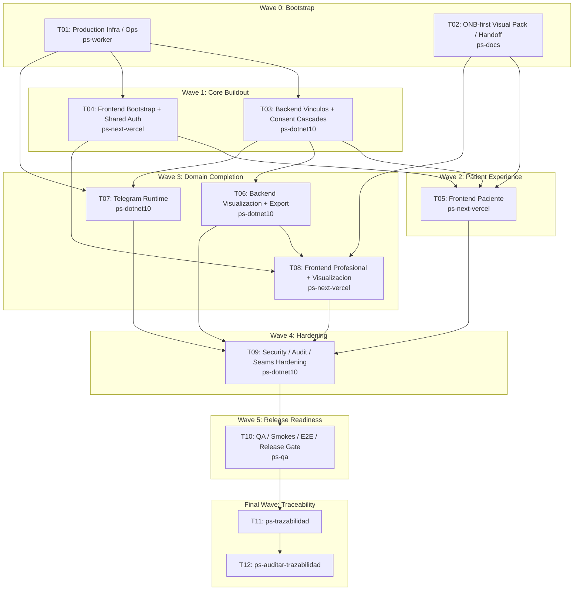

# Wave 1 — Productivizacion Implementation Plan

**Goal:** Create the execution-ready portfolio that takes Bitacora from the current Wave 1 backend to a truthful production-first lane, then layers the future web, Telegram, and release gates in later tasks.

**Architecture:** Keep the current modular .NET 10 monolith as the backend core, bootstrap only the production environment needed for the backend runtime that exists today, add a Next.js 16 web app later under `frontend/`, and preserve slice gates before slice-specific frontend implementation except where an explicit authority-pack override is approved. The portfolio separates truthful production bootstrap, ONB-first visual unblock, domain completion, hardening, and release readiness so later sessions can dispatch whole waves safely.

**Tech Stack:** .NET 10, Next.js 16 / React 19, PostgreSQL, Supabase Auth, Telegram Bot API, Dokploy/Traefik, OpenTelemetry, xUnit, Playwright.

**Context Source:** Repository verification on 2026-04-10 using `AGENTS.md`, `CLAUDE.md`, `mi-lsp`, and direct inspection. Confirmed current runtime: Wave 1 backend only (`POST /api/v1/auth/bootstrap`, consent current/grant/revoke, `POST /api/v1/mood-entries`, `POST /api/v1/daily-checkins`, `/health`, `/health/ready` after T01), materialized entities `User`, `ConsentGrant`, `MoodEntry`, `DailyCheckin`, `PendingInvite`, `AccessAudit`, `EncryptionKeyVersion`, no real Next.js app, no real Telegram runtime, repo-local `infra/` bootstrap added by T01, and `Bitacora.Tests` still scaffold-only. Confirmed UI gates: `ONB-001` is now open through a manual authority pack for `UI-RFC + HANDOFF`, while `REG-001` and `REG-002` remain blocked and the remaining slices still require audit or rerun. Confirmed Dokploy host exists on `turismo`, but live bootstrap still depends on materializing `infra/.env` / `DOKPLOY_API_KEY` locally.

**Runtime:** Codex

**Available Agents:**
- `ps-dotnet10` — .NET 10 backend implementation
- `ps-next-vercel` — Next.js 16 frontend implementation
- `ps-python` — Python helpers and Telegram tooling
- `ps-worker` — shell, git, config, and operational execution
- `ps-docs` — documentation updates and spec maintenance
- `ps-qa` — QA audit over code, tests, and security
- `ps-reviewer` — code review with performance/design/security focus
- `ps-gap-terminator` — read-only docs/code gap detection
- `ps-explorer` — read-only repo exploration

**Initial Assumptions:** The new web app will live under `frontend/` at repo root in a later task. T01 only bootstraps a truthful production topology with `bitacora-api` plus dedicated PostgreSQL on the same `turismo` host. Telegram runtime remains deferred and is not deployed in this task.

---

## Risks & Assumptions

**Assumptions needing validation:**
- The GitHub App already authorized in Dokploy can read `fgpaz/bitacora` once repo-local Dokploy bootstrap exists; validate in T01 before creating production apps.
- `bitacora.nuestrascuentitas.com` and any needed subdomains can point directly to the `turismo` Traefik entrypoint; validate DNS ownership and current records in T01.
- The existing Wave 1 backend can stay as the only backend process and host webhook/reminder logic without requiring a separate worker service; validate capacity and operational fit in T07/T09.

**Known risks:**
- The canonical docs and TP matrix are ahead of runtime and test implementation; mitigate by sequencing infra/bootstrap first, then code, then QA closure.
- Core patient UI slices are visually blocked; mitigate by running Stitch recovery in parallel and making ONB/REG frontend implementation depend on gate resolution.
- Local Dokploy bootstrap is missing; mitigate by making repo-local `infra/` and secret/runbook artifacts the first production task.
- There is no staging environment in this wave; mitigate with explicit prod-first smoke gates, backups, and controlled go-live criteria in T01/T10.

**Unknowns:**
- Whether a Bitacora application already exists in Dokploy under another name; investigate in T01 with `dokploy-cli` once credentials exist.
- Exact Telegram operational throughput and reminder scheduling cadence; investigate in T07 and codify production-safe defaults before enabling reminders.

---

## Wave Dispatch Map

| Task | Wave | Agent | Subdoc | Done When |
|------|------|-------|--------|-----------|
| T01 | 0 | ps-worker | `./wave-1/01-prod-infra-ops-dokploy-postgres-secrets-migraciones-observabilidad.md` | Backend-only production bootstrap, readiness contract, dedicated DB bootstrap, secret bridge, smoke gate, and operability runbooks are evidence-backed |
| T02 | 0 | ps-docs | `./wave-1/02-visual-unblock-stitch-reruns-auditoria-y-gates-ui-rfc.md` | `ONB-001` has a coherent `UI-RFC + HANDOFF` package, while the remaining slices keep truthful gate status |
| T03 | 1 | ps-dotnet10 | `./wave-1/03-backend-vinculos-consent-cascadas-diferidas.md` | Vinculos domain, PendingInvite consumption, CareLink access, and consent cascades are fully specified |
| T04 | 1 | ps-next-vercel | `./wave-1/04-frontend-bootstrap-nextjs-shell-supabase-auth.md` | `frontend/` bootstrap, shared auth, and app shell plan are fully specified |
| T05 | 2 | ps-next-vercel | `./wave-1/05-frontend-paciente-onboarding-consent-registro.md` | ONB/consent patient flows are ready from the ONB authority pack, while REG flows remain explicitly gated |
| T06 | 3 | ps-dotnet10 | `./wave-1/06-backend-visualizacion-export-queries-profesionales.md` | Query/export backend plan covers patient and professional read paths |
| T07 | 3 | ps-dotnet10 | `./wave-1/07-telegram-runtime-pairing-sesiones-recordatorios.md` | Telegram runtime plan covers pairing, sessions, reminders, and conversational logging |
| T08 | 3 | ps-next-vercel | `./wave-1/08-frontend-profesional-visualizacion-export.md` | Professional web plan is ready once backend and visual gates are satisfied |
| T09 | 4 | ps-dotnet10 | `./wave-1/09-hardening-seguridad-auditoria-seams-operacionales.md` | Cross-cutting hardening and dependency/security closure are explicit |
| T10 | 5 | ps-qa | `./wave-1/10-qa-release-readiness-smokes-contract-e2e-prod.md` | Production go-live gate extends the T01 backend smoke with broader automated coverage and release criteria |
| T11 | F | — | inline | `ps-trazabilidad` closure completed |
| T12 | F | — | inline | `ps-auditar-trazabilidad` verdict recorded |

## Final Wave

### T11 — Run `ps-trazabilidad`
- Walk `FL -> RF -> 07/08/09 -> TP` for every implemented wave before closure.
- Confirm every changed public interface, entity, runtime rule, and test map is synced.
- Record remaining gaps only if they are intentionally deferred and explicitly owned by a later task.

### T12 — Run `ps-auditar-trazabilidad`
- Perform the read-only cross-document audit before marking the overall wave complete.
- Verify docs, code, secrets/bootstrap, visual gates, and production evidence do not contradict each other.
- Block closure if prod-first readiness lacks observability, backup, or smoke evidence.
