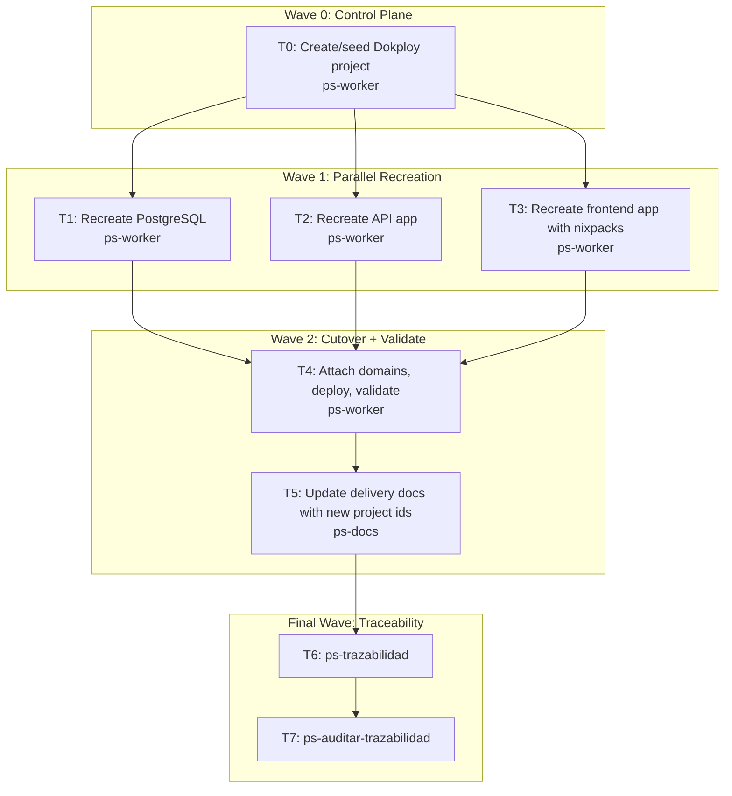

# Bitacora Dokploy Project Cutover Plan

**Goal:** Recreate Bitacora in a dedicated Dokploy project named `bitacora`, keep the backend on GitHub+Dockerfile, switch the frontend to GitHub+nixpacks, and cut over the live domains in one pass.

**Architecture:** Create a new Dokploy project and production environment, provision a fresh PostgreSQL service, recreate `bitacora-api` against that DB, recreate `bitacora-frontend` with `buildType=nixpacks` and `buildPath=frontend`, then attach the public domains after validation. The current `nuestrascuentitas` resources remain untouched until the new stack is healthy.

**Tech Stack:** Dokploy API, GitHub provider `dw08YcoirLF5MI3lIE5zc`, PostgreSQL 18, .NET 10 Dockerfile, Next.js 16 via nixpacks, Let’s Encrypt domains.

**Context Source:** Existing live surface is under project `nuestrascuentitas` / env `production` (`kU9BSDBGb_y4IRu8AZTTd`). Current Bitacora resources are `bitacora-db` (`Am5HN-M8RX5lZxKCLzQPb`), `bitacora-api` (`FBmBaFs9cZKgzbDICN3xo`), and `bitacora-frontend` (`ApFt0xks7Z2uycsz_ogl1`). Backend is healthy at `/health`, frontend Dockerfile deploy is blocked by Docker Hub, and the desired target is a dedicated project `bitacora` with frontend on nixpacks.

**Runtime:** Codex

**Available Agents:**
- `ps-explorer` — read-only code and docs exploration
- `ps-worker` — shell, API, git, and ops execution
- `ps-next-vercel` — Next.js app configuration and build reasoning
- `ps-dotnet10` — .NET 10 app/runtime reasoning
- `ps-docs` — docs and wiki synchronization

**Initial Assumptions:**
- `project.create` can be seeded with the existing production environment id and then receive a dedicated environment.
- `application.update` can be used to align the recreated apps to the same server/build settings as the current apps.
- If nixpacks still hits a registry blocker, the fallback will be GHCR prebuilt image without re-opening the project split decision.

---

## Risks & Assumptions

**Assumptions needing validation:**
- Dokploy accepts `project.create` with `environmentId=kU9BSDBGb_y4IRu8AZTTd` as a seed while we create a dedicated `bitacora` environment after.
- `application.update` can set `buildPath=frontend`, `serverId=sFel4YXcOTVOauF7quUUa`, and related fields for the recreated frontend.

**Known risks:**
- Frontend nixpacks may still need builder images from an external registry.
- Single-pass domain cutover increases operational risk if validation is incomplete.
- DB migrations are documented as explicit/manual in `infra/runbooks/manual-migrations.md`; auto-migrate cannot be assumed.

**Unknowns:**
- Exact runtime requirement for project/environment creation order in Dokploy.
- Whether backup job creation is needed immediately or can remain a follow-up after cutover.

---

## Wave Dispatch Map

| Task | Wave | Agent | Subdoc | Done When |
|------|------|-------|--------|-----------|
| T0 | 0 | ps-worker | `./2026-04-13-bitacora-dokploy-cutover/T0-create-project.md` | New project id exists and env creation path is resolved |
| T1 | 1 | ps-worker | `./2026-04-13-bitacora-dokploy-cutover/T1-recreate-postgres.md` | New postgres service is created, deployed, and host string is known |
| T2 | 1 | ps-worker | `./2026-04-13-bitacora-dokploy-cutover/T2-recreate-api.md` | New API app exists with GitHub+dockerfile config and env saved |
| T3 | 1 | ps-worker | `./2026-04-13-bitacora-dokploy-cutover/T3-recreate-frontend.md` | New frontend app exists with GitHub+nixpacks config and env saved |
| T4 | 2 | ps-worker | `./2026-04-13-bitacora-dokploy-cutover/T4-cutover-validate.md` | Domains attached to new apps and health/deploy validation passes |
| T5 | 2 | ps-docs | `./2026-04-13-bitacora-dokploy-cutover/T5-doc-sync.md` | Docs mention the new `bitacora` project ids and rollout status |
| T6 | F | inline | inline | `ps-trazabilidad` closure summary issued |
| T7 | F | inline | inline | `ps-auditar-trazabilidad` verdict issued |
