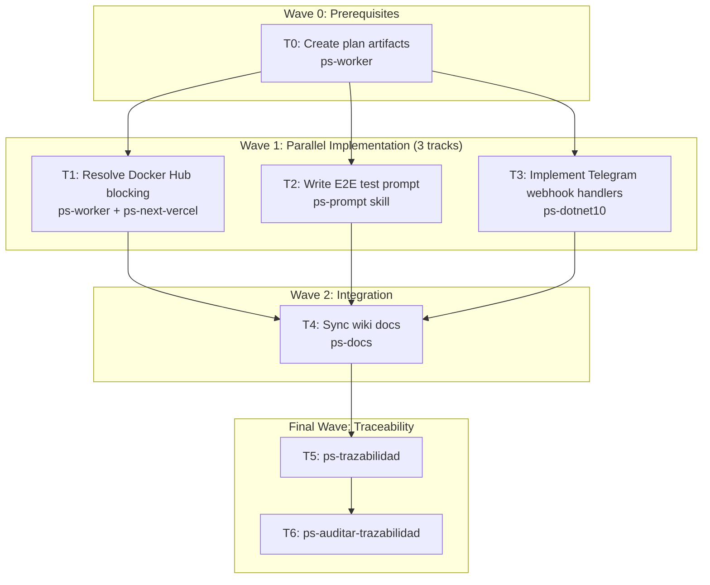

# Bitacora Wave-Prod MVP: Frontend Deployment + E2E Test Prompt + Telegram Implementation

**Goal:** Close the three remaining MVP gaps in parallel: resolve frontend Docker Hub blocking on Dokploy, write the E2E test prompt, and implement Telegram webhook business logic (RF-REG-010..015).

**Architecture:**

- **Frontend**: Next.js 16 standalone Docker container deployed to Dokploy VPS. Env vars: `NEXT_PUBLIC_API_BASE_URL`, `NEXT_PUBLIC_SUPABASE_URL`, `NEXT_PUBLIC_SUPABASE_ANON_KEY`. Auth via Supabase JWT in cookies, middleware guard on protected routes.
- **Backend**: .NET 10 API already live at `api.bitacora.nuestrascuentitas.com`. Telegram webhook at `POST /api/v1/telegram/webhook` registered but handler stubbed.
- **Telegram**: Bot token `TELEGRAM_BOT_TOKEN` -> `@mi_bitacora_personal_bot`. Pairing flow via `BIT-XXXXX` codes. RF-REG-010..015 deferred.
- **Database**: PostgreSQL multi-tenant via `PatientId` query filter. 12 entities. 3 migrations applied.
- **Secrets**: Infisical vault `bitacora prod` at `teslita`. Dokploy env vars already set for backend.

**Context Source:**

- 5 parallel ps-explorer subagents confirmed: Telegram webhook endpoint exists but `HandleWebhookUpdateCommandHandler` is a stub; RF-REG-010..015 all `Diferido`. Frontend Dockerfile uses `node:20-slim`, `output: 'standalone'`, env vars exposed via `NEXT_PUBLIC_*`. Backend has 24 endpoints mapped with consent gate on mood/daily-checkin POSTs. `backend-smoke.ps1` (395 lines) covers patient E2E and Telegram pairing. No Playwright tests exist.

**Runtime:** Codex

**Available Agents:**
- `ps-explorer` — read-only code exploration, mi-lsp navigation
- `ps-dotnet10` — .NET 10 backend: endpoints, CQRS handlers, MassTransit
- `ps-next-vercel` — Next.js 16 frontend generation
- `ps-python` — Python scripts, Telegram utilities, tooling
- `ps-worker` — git, config, shell, file operations, plans, ops
- `ps-docs` — wiki docs, specs, READMEs, changelogs
- `ps-qa-backend-security` — backend security + compliance audit
- `ps-code-reviewer` — code review, quality audit P>D>S

**Initial Assumptions:**
- Docker Hub auth failure on Dokploy server is `credsStore: desktop.exe` misconfiguration globally, not app-level — fix requires Dokploy dashboard registry config or alternative registry
- Telegram webhook handler stub can be replaced by implementing `HandleWebhookUpdateCommandHandler` following existing Telegram session/pairing code patterns
- E2E test prompt can use `backend-smoke.ps1` as reference architecture but must instruct to run via `ps-prompt` skill

---

## Risks & Assumptions

**Assumptions needing validation:**
- Docker Hub login can be configured via Dokploy dashboard web UI (not CLI) — if not, must switch to GitHub Container Registry or external registry
- Telegram webhook handler can be implemented in .NET following the existing pattern of `HandleWebhookUpdateCommand` + `TelegramSessionRepository` + `TelegramPairingCodeRepository`

**Known risks:**
- Docker Hub blocking: `credsStore: desktop.exe` on Dokploy server blocks all `docker pull`/`docker build` — no TTY available for `docker login` — alternative registry or dashboard config required
- Telegram handler stub: `HandleWebhookUpdateCommandHandler` at line 28 of `HandleWebhookUpdateCommand.cs` — replacing stub with real implementation may have unknown dependencies on Telegram API message types
- E2E prompt: must correctly instruct `ps-prompt` skill to generate a test that validates FL → RF → TP chains

**Unknowns:**
- Whether Dokploy supports configuring registry credentials via web UI dashboard (investigation needed)
- Whether Telegram message update types (callback_query vs message) are both handled in the stub

---

## Wave Dispatch Map

---

## Task Index

| Task | Wave | Agent | Subdoc | Done When |
|------|------|-------|--------|-----------|
| T0 | 0 | ps-worker | `./2026-04-13-bitacora-wave-prod-mvp/T0-setup.md` | Plan files on disk + committed |
| T1 | 1 | ps-worker | `./2026-04-13-bitacora-wave-prod-mvp/T1-frontend-docker-fix.md` | Frontend Docker image builds/deploys on Dokploy |
| T2 | 1 | ps-prompt (inline) | `./2026-04-13-bitacora-wave-prod-mvp/T2-e2e-test-prompt.md` | `.docs/raw/prompts/YYYY-MM-DD-bitacora-e2e-full-test.md` written to disk |
| T3 | 1 | ps-dotnet10 | `./2026-04-13-bitacora-wave-prod-mvp/T3-telegram-webhook-handlers.md` | `dotnet build --no-restore` exits 0; handler stub replaced |
| T4 | 2 | ps-docs | `./2026-04-13-bitacora-wave-prod-mvp/T4-wiki-sync.md` | FL-REG-02 docs updated, RF-REG-010..015 status corrected |
| T5 | F | inline | inline | `ps-trazabilidad` completes with summary |
| T6 | F | inline | inline | `ps-auditar-trazabilidad` clean verdict |

---

## T0: Create Plan Artifacts

**Subdocument:** `.docs/raw/plans/2026-04-13-bitacora-wave-prod-mvp/T0-setup.md`

This is the task that creates the plan structure itself. It is Wave 0 — everything else depends on it.

### Verify
`ls .docs/raw/plans/2026-04-13-bitacora-wave-prod-mvp/` shows plan + subdocs; `git log --oneline -1 .docs/raw/plans/` confirms commit.

### Commit
`docs(plan): add bitacora-wave-prod-mvp implementation plan`

---

## T1: Resolve Docker Hub Blocking on Dokploy

**Subdocument:** `.docs/raw/plans/2026-04-13-bitacora-wave-prod-mvp/T1-frontend-docker-fix.md`

Problem: Dokploy server has `credsStore: desktop.exe` globally, blocking `docker pull` and `docker build`. Build always fails.

**Three approaches (try in order):**

1. **Dokploy dashboard registry config** — login to Dokploy web UI at `http://54.37.157.93:3000`, go to `bitacora-frontend` app settings, find "Registry" or "Docker Settings", add Docker Hub credentials there. Then redeploy.
2. **GitHub Container Registry** — tag and push the locally-built image to GHCR, then pull from GHCR on Dokploy. Requires `docker tag` + `docker push ghcr.io/fgpaz/bitacora-frontend:latest` + change Dokploy image pull policy.
3. **Inline registry auth** — use `dkp.sh` Dokploy API to set registry credentials on the app: `POST /api/v1/registries` or app-level registry config via Dokploy API.

**Priority**: Try #1 first (web UI), then #2 (GHCR), then #3 (API).

### Verify
Dokploy redeploy of `bitacora-frontend` succeeds; `docker ps` on server shows container running; `curl https://bitacora.nuestrascuentitas.com` returns 200.

---

## T2: Write E2E Test Prompt

**Subdocument:** `.docs/raw/plans/2026-04-13-bitacora-wave-prod-mvp/T2-e2e-test-prompt.md`

Use the `ps-prompt` skill to generate a comprehensive E2E test prompt. The prompt must instruct the next agent to:

1. Run `ps-contexto` first
2. Use `db-cli` to verify DB state before tests
3. Use Supabase auth to get a real JWT (magic link or anon key)
4. Walk the full patient E2E flow via frontend: onboarding → consent → mood entry → daily checkin → visualization
5. Walk the Telegram pairing flow: `POST /telegram/pairing` → get code → `/start CODE` via `@mi_bitacora_personal_bot`
6. Verify DB records created: users, mood_entries, daily_checkins, consent_grants
7. Use `ps-trazabilidad` to verify test validates all FL → RF → TP chains

The prompt should be written to: `.docs/raw/prompts/2026-04-13-bitacora-e2e-full-test.md`

### Verify
File `.docs/raw/prompts/2026-04-13-bitacora-e2e-full-test.md` exists on disk with complete prompt content.

---

## T3: Implement Telegram Webhook Handlers (RF-REG-010..015)

**Subdocument:** `.docs/raw/plans/2026-04-13-bitacora-wave-prod-mvp/T3-telegram-webhook-handlers.md`

Current state: `HandleWebhookUpdateCommandHandler` is a stub. RF-REG-010..015 are all `Diferido`.

**What to implement:**

- `HandleWebhookUpdateCommandHandler` — real implementation that:
  1. Parses `Update` from Telegram webhook payload
  2. Resolves `TelegramSession` by `chat_id` (RF-REG-011)
  3. Routes `/start CODE` callback to pairing flow (RF-REG-012)
  4. Routes mood score input to `MoodEntry` creation (RF-REG-012)
  5. Handles sequential factors flow via Telegram conversation state (RF-REG-013)
  6. Handles unlinked session gracefully (RF-REG-014)
  7. Handles consent denial (RF-REG-015)

**Key files to modify:**
- `src/Bitacora.Application/Commands/Telegram/HandleWebhookUpdateCommand.cs` — replace stub with real handler
- `src/Bitacora.DataAccess.EntityFramework/Repositories/TelegramSessionRepository.cs` — add `GetByChatIdAsync`
- Possibly create new handler for callback query routing

**Reference patterns:**
- `SendReminderCommand.cs:121` — Telegram bot API call pattern
- `TelegramEndpoints.cs:83` — webhook endpoint + secret validation
- `TelegramPairingCodeRepository.cs` — existing pairing code flow

### Verify
`dotnet build --no-restore src/Bitacora.sln` exits 0; handler is no longer a stub (has real business logic, not just returning `Accepted=false`).

---

## T4: Sync Wiki Docs

**Subdocument:** `.docs/raw/plans/2026-04-13-bitacora-wave-prod-mvp/T4-wiki-sync.md`

After T1+T2+T3 are complete, sync documentation:

1. **FL-REG-02** (`.docs/wiki/03_FL/FL-REG-02.md`) — update "Estado actual" from "Diferido" to "Parcial backend" (webhook endpoint exists, handler stubbed)
2. **RF-REG-010..015** — update status from "Diferido" to "Parcial backend" where applicable
3. **09_contratos/CT-TELEGRAM-RUNTIME.md** — if new retry/backoff logic added, update contract doc
4. Any new endpoints added (T3) must be documented in `09_contratos_tecnicos.md`

### Verify
`git diff --stat .docs/wiki/` shows changed wiki files; FL-REG-02 status line updated.

---

## T5: Run ps-trazabilidad

**Type:** inline task

Invoke `ps-trazabilidad` skill after all implementation is complete. Classify as `feature + infra`. Verify:
- FL-REG-02 updated
- RF-REG-010..015 status corrected
- T1 frontend deployment reflected in docs if needed
- E2E test prompt artifact tracked

### Verify
`ps-trazabilidad` outputs closure summary with all chains PASS.

---

## T6: Run ps-auditar-trazabilidad

**Type:** inline task

Invoke `ps-auditar-trazabilidad` skill for read-only cross-document audit. Check:
- FL/03_FL.md vs actual implementation state
- RF/04_RF.md vs actual RF-REG-010..015 implementation
- Any new contract docs created (T4)

### Verify
`ps-auditar-trazabilidad` outputs APPROVED verdict.

---

## Final Wave: Traceability (Inline)

**T5: Run ps-trazabilidad** — classify change type, verify RF/FL/data model/architecture sync

**T6: Run ps-auditar-trazabilidad** — read-only cross-document audit, APPROVED verdict required

---

*Plan created from 5 parallel ps-explorer subagents + brainstorming synthesis. All three tracks can proceed independently after T0.*
