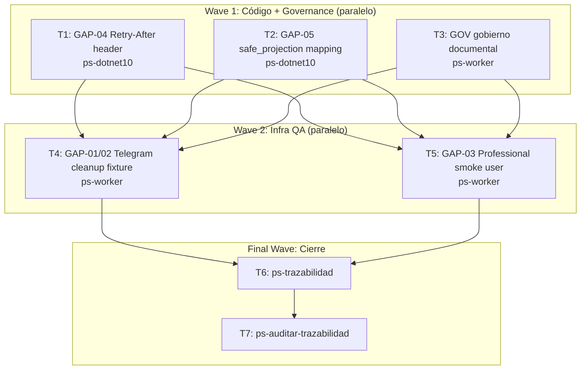

# Gap Resolution 2026-04-15 — Implementation Plan

**Goal:** Resolver los 5 gaps y 1 deuda de gobierno detectados en el E2E full del 2026-04-15 de Bitácora.

**Architecture:** Monolito modular .NET 10. Los fixes de código son quirúrgicos (1-3 líneas cada uno). Los gaps de infraestructura y Telegram se resuelven con curl y shell. El gobierno documental se crea con el skill `crear-gobierno-documental`.

**Tech Stack:** .NET 10 (ASP.NET Core), PostgreSQL, GoTrue v2.177.0, Telegram Bot API, mi-telegram-cli

**Context Source:**
- `infra/.env` — credenciales de producción (GOTRUE_SERVICE_ROLE_KEY, SMOKE_TEST_*)
- `src/Bitacora.Api/Program.cs:81-143` — configuración de rate limiter con OnRejected
- `src/Bitacora.Application/Queries/Visualizacion/GetPatientTimelineQuery.cs:75-115` — bug de mapeo safe_projection
- `src/Bitacora.Application/Queries/Visualizacion/GetPatientSummaryQuery.cs:54-68` — bug de mapeo safe_projection
- `artifacts/e2e/2026-04-15-e2e-full/evidencia-resumen.md` — evidencia de todos los gaps

**Runtime:** CC

**Available Agents:**
- `ps-dotnet10` — Generate/modify .NET 10 code (Bitacora.Api)
- `ps-worker` — Git, config, shell, plans, ops
- `ps-explorer` — Read-only code exploration
- `ps-docs` — Wiki, specs, READMEs, changelogs
- `ps-code-reviewer` — Review diffs, audit quality
- `ps-gap-auditor` — Gap detection across spec-driven stack

**Initial Assumptions:**
1. El `OnRejected` callback en Program.cs YA existe — solo falta agregar el HTTP header `Retry-After`.
2. El bug GAP-05 es un key mismatch: safe_projection almacena `has_medication` etc. pero el timeline handler busca `medication_taken` etc.
3. El usuario profesional smoke se crea via GoTrue Admin API con el GOTRUE_SERVICE_ROLE_KEY de `infra/.env`.

---

## Gaps a Resolver

| ID | Descripción | Tipo | Impacto |
|----|-------------|------|---------|
| GAP-04 | 429 sin header `Retry-After` | Bug backend | Bajo — clientes no saben cuánto esperar |
| GAP-05 | Factores binarios nulos en timeline/summary | Bug backend | Alto — datos de salud no se proyectan |
| GOV | `00_gobierno_documental.md` faltante | Deuda governance | Medio — bloquea mi-lsp y ps-contexto |
| GAP-01/02 | Sin fixture Telegram para smoke user | Infra QA | Medio — TG-P01b no re-ejecutable |
| GAP-03 | Sin usuario profesional smoke | Infra QA | Medio — VIN-P03 no ejecutable |

---

## Risks & Assumptions

**Assumptions needing validation:**
- Program.cs usa `context.HttpContext.Response.Headers.RetryAfter` (ASP.NET Core 7+) — validar que el tipo compile (es `StringValues`).
- GoTrue Admin API en `auth.bitacora.nuestrascuentitas.com` acepta requests con `Authorization: Bearer <service_role_key>` — validar con curl antes de persistir credenciales.

**Known risks:**
- GAP-05: Hay dos handlers que necesitan fix (timeline Y summary). Si se toca solo uno, el summary sigue roto.
- GAP-03: El usuario profesional necesita `role: professional` en `user_metadata` para que el frontend middleware lo permita (T3-SEC-11).

**Unknowns:**
- Si existe algún test unitario que verifique los key names de safe_projection en timeline — revisar antes de cambiar los nombres.

---

## Wave Dispatch Map

---

## Task Index

| Task | Wave | Agent | Subdoc | Done When |
|------|------|-------|--------|-----------|
| T1 | 1 | ps-dotnet10 | `./2026-04-15-gap-resolution/T1-retry-after-header.md` | `dotnet build` exits 0; curl 429 incluye `Retry-After: 60` |
| T2 | 1 | ps-dotnet10 | `./2026-04-15-gap-resolution/T2-safe-projection-mapping.md` | `dotnet build` exits 0; GET /timeline devuelve `medicationTaken: true` |
| T3 | 1 | ps-worker | `./2026-04-15-gap-resolution/T3-gobierno-documental.md` | `.docs/wiki/00_gobierno_documental.md` existe con YAML válido |
| T4 | 2 | ps-worker | `./2026-04-15-gap-resolution/T4-telegram-cleanup-fixture.md` | Script de cleanup documentado en `infra/runbooks/`; smoke user desvinculado |
| T5 | 2 | ps-worker | `./2026-04-15-gap-resolution/T5-profesional-smoke-user.md` | Usuario profesional creado en GoTrue; credenciales en `infra/.env` |
| T6 | F | — | inline | ps-trazabilidad completo, 0 gaps abiertos |
| T7 | F | — | inline | ps-auditar-trazabilidad limpio |

---

## Final Wave: Traceability Closure

### Task T6: Run ps-trazabilidad

Invocar `Skill(ps-trazabilidad)` al cerrar este plan. Verificar:

**Backend closure walk:** `FL-REG-02 → RF-REG-023 → 07_baseline_tecnica.md (T3-RL-01) → TP-REG + TP-VIS`

Checklist:
- [ ] T3-RL-01 en `07_baseline_tecnica.md` actualizado con "Retry-After: 60 fijo"
- [ ] RF-REG-023 refleja que `has_medication` está en safe_projection (ya estaba, confirmar)
- [ ] TP-VIS.md actualizado con VIS-P01 corregido (medicationTaken = true)
- [ ] TP-TG.md actualizado: TG-P01b con estado de fixture actualizado
- [ ] TP-VIN.md actualizado: VIN-P03 con estado de usuario profesional
- [ ] `09_contratos_tecnicos.md` o CT-AUTH: smoke credentials documentadas
- [ ] `infra/.env` no commitea secretos en claro (verificar .gitignore)

### Task T7: Run ps-auditar-trazabilidad

Invocar `Skill(ps-auditar-trazabilidad)` después de T6. Audit scope:
- Módulo REG: RF-REG-023 ↔ safe_projection keys en código y queries
- Módulo VIS: timeline/summary response contracts ↔ TP-VIS
- Módulo TG: TG-P01b fixture ↔ TP-TG
- Módulo VIN: VIN-P03 profesional ↔ TP-VIN
- Rate limiting: T3-RL-01 ↔ código + evidencia E2E

Solo marcar done si el audit retorna 0 gaps sin resolver.
