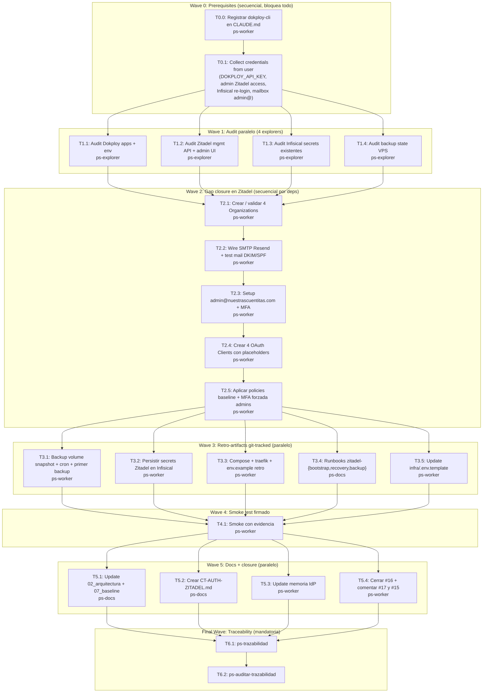

# Wave A — Stand-up Zitadel Teslita (reverse-engineer) — Plan de implementacion

**Goal:** cerrar Wave A del Epic IdP Zitadel Teslita auditando el deploy existente en `id.nuestrascuentitas.com`, completando gaps (orgs/clients/MFA/SMTP/backup), materializando artefactos git-tracked y secrets en Infisical, hasta firmar smoke test y cerrar issue #16 con Wave B (#17) desbloqueada.

**Architecture:** reverse-engineer del Zitadel ya live en VPS turismo (Dokploy, Let's Encrypt, Postgres dedicada). No se redeploya. Se descubre el app Zitadel via Dokploy API, se consulta su estado interno via admin UI/management API, se retro-generan compose y runbooks que reflejen el runtime real, y se persisten todos los secrets descubiertos en Infisical vault `teslita`. Backup: snapshot del volumen Docker de la Postgres Zitadel offsite (destino por definir en T3.1). SMTP: Resend ya wireado en `infra/.env` (RESEND_API_KEY_TESLITA). Admin migra a `admin@nuestrascuentitas.com` con MFA forzada desde dia 1.

**Tech Stack:** Zitadel v2.x self-hosted, PostgreSQL dedicada, Dokploy + Traefik + Let's Encrypt, Infisical vault `teslita` (proj `bitacora-wo9-y`), mkey CLI, dokploy-cli (`dkp.sh`), Resend SMTP, VPS turismo `54.37.157.93`.

**Context Source:** `Skill("ps-contexto")` ejecutado 2026-04-18. Governance `spec_backend` valido y `in_sync`. Canon hardened 10-22 sin migracion pendiente. Decision priority Security > Privacy > Correctness > Usability > Maintainability > Performance > Cost > TTM. Auth actual: Supabase GoTrue v2.177.0 en `auth.bitacora.nuestrascuentitas.com` (contrato `09_contratos/CT-AUTH.md`) — **no se apaga en Wave A**. Wave 1 backend + Phase 40 frontend operativos en prod. Repo sin codigo .NET/Next tocado por esta wave.

**Runtime:** CC

**Available Agents:**
- `ps-explorer` — read-only: buscar symbols, trazar paths, leer codigo y runtime
- `ps-worker` — write: git, config, shell, plans, ops no-codigo (IdP config, compose, env, runbooks)
- `ps-docs` — write: wiki, specs, READMEs, changelogs
- `ps-gap-auditor` — read-only: spec-vs-code y traceability gaps
- `ps-sdd-sync-gen` — write: auto-generar specs desde codigo
- `ps-code-reviewer` — read-only: review diffs (no aplica en esta wave)
- `ps-qa-orchestrator` — read-only: quality + security + testing audit
- `ps-qa-backend-security` — read-only: backend security compliance
- `ps-dotnet10` — write: .NET 10 code (no aplica en Wave A)
- `ps-next-vercel` — write: Next.js 16 code (no aplica en Wave A)
- `ps-python` — write: Python/tooling (no aplica en Wave A)

**Initial Assumptions:**
1. El Zitadel live en `id.nuestrascuentitas.com` es una instancia self-hosted v2.x completa (OIDC discovery valida lo confirma). Validar version exacta en T1.2.
2. Existe una Postgres dedicada Zitadel en Dokploy (no reutiliza `postgres-reboot-solid-state-application-l55mww` de Bitacora). Validar en T1.1.
3. El masterkey de Zitadel fue generado y persistido en Dokploy env vars — hay que descubrirlo y migrarlo a Infisical sin regenerarlo (regenerar = destruir encryption).

---

## Risks & Assumptions

**Assumptions needing validation:**
- *Zitadel deploy es healthy y sin drift* — validar con `dkp.sh status <app-id>` en T1.1 + /health endpoint Zitadel en T1.2.
- *Postgres Zitadel es dedicada* — si comparte host con Bitacora, escalar. Validar en T1.1.
- *Orgs/clients/users pueden no existir aun* — si existen y chocan con lo que vamos a crear, revisar antes de sobre-escribir.
- *SMTP Resend keys en `infra/.env` son las correctas* — probar envio en T2.4.
- *Masterkey y admin password estan persistidos en Dokploy env (no perdidos)* — si no, flujo es no trivial; en peor caso, destroy-and-recreate (ver T1.2 stop condition).

**Known risks:**
- *Perder masterkey*: regenerarlo destruye encryption de DB. Mitigacion: **nunca regenerar**; solo descubrir y persistir en Infisical (T3.2).
- *Rate-limit Let's Encrypt*: si el cert es viejo y renueva durante la wave, puede pegarse a 5 failed issuances/semana. Mitigacion: no forzar renovacion; validar el cert actual y dejarlo.
- *SMTP DKIM/SPF fail*: si el dominio no tiene registros validos aun, test mail queda pending. Mitigacion: T2.4 incluye fallback a staging sub-issue si falla, y Wave A no se cierra con tick verde hasta que DKIM+SPF pasen.
- *Admin MFA misconfig*: si fuerzo MFA en admin y nadie tiene TOTP enrolado, me auto-bloqueo. Mitigacion: primero enrolo MFA en admin nuevo (T2.5 step 1), despues aplico policy MFA forzada (T2.3 step final, depende de T2.5).
- *Backup primero falla*: si el volumen no existe con el nombre esperado, el script tira warning. Mitigacion: T3.1 descubre nombre real del volumen antes de escribir el cron.
- *Pedido de credenciales al usuario*: DOKPLOY_API_KEY, Zitadel admin session, mailbox admin@nuestrascuentitas.com, Infisical CLI re-login. Sin esto no avanzan las Waves 1+. Mitigacion: Wave 0 consolidad la obtencion de credenciales.

**Unknowns:**
- *Que hay en los Dokploy env vars de la app Zitadel (masterkey, DB creds, admin pass)* — se resuelve en T1.1 via `dkp.sh status`/env.
- *Version exacta de Zitadel deployada* — se resuelve en T1.2 via `/debug/healthz` o API `/system/v1/info` si existe.
- *Orgs/Clients ya creados* — se resuelve en T1.2 via mgmt API `/management/v1/orgs/_search`.
- *Nombre real del volumen Docker de Postgres Zitadel* — se resuelve en T1.1 via `dkp.sh` o SSH directo (si sshr esta, sino via dokploy).
- *Mailbox `admin@nuestrascuentitas.com`* — no existe aun (user action en T0.4).

---

## Wave Dispatch Map

## Task Index

| Task | Wave | Agent | Subdoc | Done When |
|------|------|-------|--------|-----------|
| T0.0 | 0 | ps-worker | `./2026-04-18-wave-a-stand-up-zitadel-teslita/T0.0-register-dokploy-cli.md` | CLAUDE.md contiene bloque `## dokploy-cli` y commit local hecho |
| T0.1 | 0 | ps-worker | `./2026-04-18-wave-a-stand-up-zitadel-teslita/T0.1-collect-credentials.md` | DOKPLOY_API_KEY en infra/.env, mkey login OK, admin Zitadel accesible, mailbox admin@ listo |
| T1.1 | 1 | ps-explorer | `./2026-04-18-wave-a-stand-up-zitadel-teslita/T1.1-audit-dokploy.md` | Reporte con app IDs, env vars (masked), volumes, domains para zitadel y su postgres |
| T1.2 | 1 | ps-explorer | `./2026-04-18-wave-a-stand-up-zitadel-teslita/T1.2-audit-zitadel-mgmt.md` | Reporte con version Zitadel, orgs, clients, users admin, policies, SMTP state |
| T1.3 | 1 | ps-explorer | `./2026-04-18-wave-a-stand-up-zitadel-teslita/T1.3-audit-infisical.md` | Lista de keys ZITADEL_* / DOKPLOY_* existentes en vault `teslita` proj bitacora |
| T1.4 | 1 | ps-explorer | `./2026-04-18-wave-a-stand-up-zitadel-teslita/T1.4-audit-backup-state.md` | Reporte: volumen postgres zitadel nombre real, espacio libre, cron existentes, offsite candidate |
| T2.1 | 2 | ps-worker | `./2026-04-18-wave-a-stand-up-zitadel-teslita/T2.1-organizations.md` | 4 Orgs presentes: nuestrascuentitas, bitacora, multi-tedi, gastos |
| T2.2 | 2 | ps-worker | `./2026-04-18-wave-a-stand-up-zitadel-teslita/T2.2-smtp-resend.md` | Test mail entregado con DKIM=pass, SPF=pass; headers en evidencia |
| T2.3 | 2 | ps-worker | `./2026-04-18-wave-a-stand-up-zitadel-teslita/T2.3-admin-migration.md` | admin@nuestrascuentitas.com loguea con MFA TOTP; admin viejo desactivado |
| T2.4 | 2 | ps-worker | `./2026-04-18-wave-a-stand-up-zitadel-teslita/T2.4-oauth-clients.md` | 4 clients creados con client_id y redirect URIs placeholder guardados |
| T2.5 | 2 | ps-worker | `./2026-04-18-wave-a-stand-up-zitadel-teslita/T2.5-policies-mfa.md` | Policy baseline aplicada; MFA obligatoria enforced en roles admin/superadmin |
| T3.1 | 3 | ps-worker | `./2026-04-18-wave-a-stand-up-zitadel-teslita/T3.1-backup-snapshot.md` | Cron ejecutado al menos 1 vez; snapshot en offsite verificable |
| T3.2 | 3 | ps-worker | `./2026-04-18-wave-a-stand-up-zitadel-teslita/T3.2-secrets-infisical.md` | Todas las keys ZITADEL_* / DOKPLOY_* visibles en `mkey pull bitacora prod` |
| T3.3 | 3 | ps-worker | `./2026-04-18-wave-a-stand-up-zitadel-teslita/T3.3-compose-retro.md` | `infra/dokploy/zitadel/` creado con compose.yml + env.example + traefik labels |
| T3.4 | 3 | ps-docs | `./2026-04-18-wave-a-stand-up-zitadel-teslita/T3.4-runbooks.md` | `infra/runbooks/zitadel-{bootstrap,recovery,backup}.md` persistidos |
| T3.5 | 3 | ps-worker | `./2026-04-18-wave-a-stand-up-zitadel-teslita/T3.5-env-template.md` | `infra/.env.template` incluye keys ZITADEL_* + DOKPLOY_* documentadas |
| T4.1 | 4 | ps-worker | `./2026-04-18-wave-a-stand-up-zitadel-teslita/T4.1-smoke.md` | `artifacts/e2e/2026-04-18-zitadel-wave-a-smoke/README.md` firmado con evidencia completa |
| T5.1 | 5 | ps-docs | `./2026-04-18-wave-a-stand-up-zitadel-teslita/T5.1-wiki-arq-baseline.md` | `02_arquitectura.md` + `07_baseline_tecnica.md` mencionan Zitadel (dual IdP Wave A) |
| T5.2 | 5 | ps-docs | `./2026-04-18-wave-a-stand-up-zitadel-teslita/T5.2-ct-auth-zitadel.md` | `09_contratos/CT-AUTH-ZITADEL.md` persistido con endpoints + claims |
| T5.3 | 5 | ps-worker | `./2026-04-18-wave-a-stand-up-zitadel-teslita/T5.3-memoria.md` | `project_idp_zitadel_multi_ecosistema.md` dice "Wave A completada 2026-04-18" con endpoints reales |
| T5.4 | 5 | ps-worker | `./2026-04-18-wave-a-stand-up-zitadel-teslita/T5.4-issues-close.md` | Issue #16 CLOSED; #17 comentado como desbloqueado; #15 actualizado |
| T6.1 | F | — | inline | `ps-trazabilidad` reporta cierre limpio |
| T6.2 | F | — | inline | `ps-auditar-trazabilidad` reporta cero gaps |

---

## Final Wave — Traceability (inline, no subdoc)

### Task T6.1 — ps-trazabilidad
Ejecutar `Skill("ps-trazabilidad")` sobre el delta de Wave A. Verifica sync entre:
- `.docs/wiki/02_arquitectura.md` + `.docs/wiki/07_baseline_tecnica.md` (baseline Zitadel al lado de Supabase)
- `.docs/wiki/09_contratos_tecnicos.md` (indice) + `.docs/wiki/09_contratos/CT-AUTH-ZITADEL.md` (detalle)
- `infra/dokploy/zitadel/compose.yml` + `infra/runbooks/zitadel-*.md`
- `infra/.env.template` con nuevas keys ZITADEL_*
- Memoria `project_idp_zitadel_multi_ecosistema.md`

**Done when:** output del skill confirma "closure limpio, sin gaps abiertos".

### Task T6.2 — ps-auditar-trazabilidad
Ejecutar `Skill("ps-auditar-trazabilidad")` en modo full. Cross-document consistency check read-only entre capas 02/07/09 + memoria + evidencia smoke + issues GitHub.

**Done when:** reporte sin contradicciones; si aparecen gaps, abrir sub-issues y NO cerrar Wave A hasta resolver.

---

## Notas finales

- **Boundaries absolutos:** NO tocar `src/Bitacora.*` ni `frontend/`. NO apagar Supabase Auth. NO regenerar masterkey Zitadel. NO usar `:latest` en compose (pinnear version real descubierta en T1.1). NO commitear secrets en plaintext (todo via `mkey set`).
- **Escalacion temprana:** cualquier task que descubra state inconsistente (ej: Postgres Zitadel compartida con Bitacora, masterkey perdido, Orgs ya creadas con otra configuracion) PAUSA y reporta al user antes de mutar.
- **Gatekeeping MFA:** T2.5 solo se ejecuta DESPUES de T2.3 (admin nuevo con TOTP enrolado), nunca antes — si no, auto-bloqueo.
- **Evidence-driven:** cada task en Wave 1 debe producir un reporte en `.docs/raw/reports/2026-04-18-wave-a-audit/<tN>.md` con output verificable (curl + jq, dokploy API response, mkey list). Esos reportes alimentan Wave 2+.
