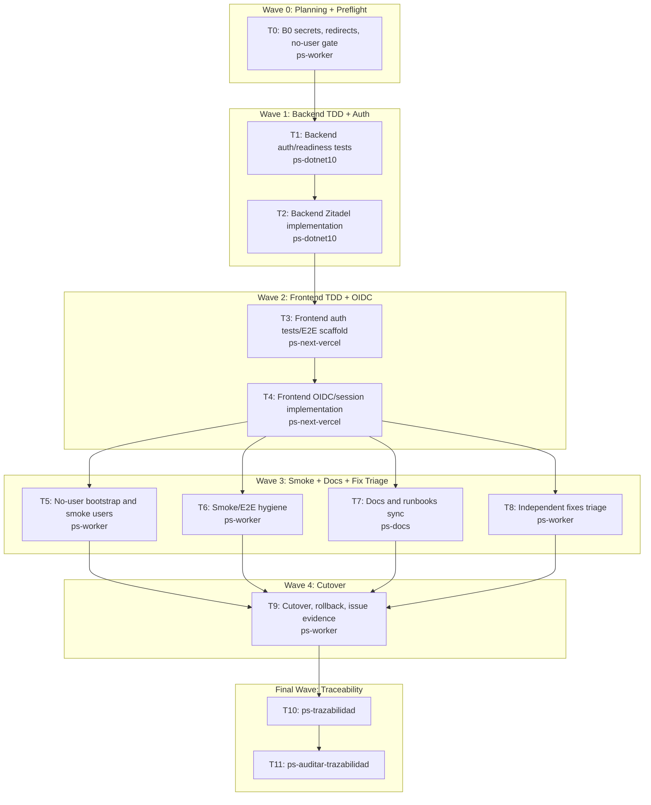

# Bitacora Wave B Zitadel Cutover And Fixes Implementation Plan

**Goal:** Cut Bitacora over from Supabase Auth to Zitadel-only OIDC/PKCE + RS256/JWKS, then organize the remaining open fixes without reopening Wave A decisions.

**Architecture:** Active runtime auth becomes Zitadel-only. The frontend owns the OIDC PKCE browser flow through server route handlers and stores only an httpOnly product session cookie. The backend validates only Zitadel-issued RS256 access tokens against JWKS, issuer, audience, lifetime, and local authorization state.

**Tech Stack:** .NET 10 minimal API, EF Core/PostgreSQL, Next.js 16, Playwright, Telegram webhook adapter, Infisical via `mi-key-cli`, Dokploy on VPS `turismo`.

**Context Source:** `ps-contexto` and `mi-lsp` showed valid governance, Wave A GREEN, Zitadel discovery/JWKS returning `200`, and current implementation still using Supabase HS256 in backend/frontend/smoke. User confirmed there are no real Bitacora users yet, so no bulk import or link-on-first-login migration is needed.

**Runtime:** Codex

**Available Agents:**
- `ps-explorer` - read-only code and documentation exploration.
- `ps-dotnet10` - .NET 10 service implementation.
- `ps-next-vercel` - Next.js/Vercel frontend implementation.
- `ps-worker` - shell, git, config, smoke, and operational work.
- `ps-docs` - wiki, runbooks, reports, and closure docs.
- `ps-qa` - quality, security, and test audit.

**Initial Assumptions:**
- Bitacora has no real production users or clinical records; B0 must verify this before code/data cleanup.
- `ZITADEL_API_AUDIENCE` defaults to Bitacora projectId `369306332534145382` unless masked token evidence proves otherwise.
- Missing Infisical access for vault `teslita` blocks code execution beyond plan persistence.

---

## Risks And Assumptions

**Assumptions needing validation:**
- No real users or clinical data exist in Bitacora production DB; validate with read-only row counts in B0 before any auth/data mutation.
- Zitadel Bitacora web app redirect/logout URIs are configured for production and local smoke; validate with Management API or trusted runbook evidence.
- Real access tokens for smoke include `iss=https://id.nuestrascuentitas.com`, `alg=RS256`, `kid`, and expected `aud`.

**Known risks:**
- Current backend disables issuer/audience validation; Wave B must not carry that behavior into Zitadel.
- Current frontend sends `credentials: include` but comments claim bearer tokens; Wave B must make this explicit through a server proxy.
- Historical E2E artifacts include JWT capture/injection patterns; Wave B evidence must not persist token bodies.

**Unknowns:**
- Exact Zitadel token audience shape for the Bitacora web client; resolve in B0 from masked token metadata.
- Whether `oidc-client-ts` is already installed after branch drift; if missing, B2 installs it and removes `@supabase/supabase-js`.

---

## Wave Dispatch Map

| Task | Wave | Agent | Subdoc | Done When |
|------|------|-------|--------|-----------|
| T0 | 0 | ps-worker | `./2026-04-19-bitacora-wave-b-zitadel-y-fixes/T0-b0-preflight-secrets-redirects.md` | B0 evidence report exists and secrets gate passes |
| T1 | 1 | ps-dotnet10 | `./2026-04-19-bitacora-wave-b-zitadel-y-fixes/T1-backend-auth-tests.md` | Backend auth/readiness tests fail for missing Zitadel behavior |
| T2 | 1 | ps-dotnet10 | `./2026-04-19-bitacora-wave-b-zitadel-y-fixes/T2-backend-zitadel-implementation.md` | `dotnet test src/Bitacora.sln` passes |
| T3 | 2 | ps-next-vercel | `./2026-04-19-bitacora-wave-b-zitadel-y-fixes/T3-frontend-auth-tests.md` | Frontend tests fail for missing OIDC/session behavior |
| T4 | 2 | ps-next-vercel | `./2026-04-19-bitacora-wave-b-zitadel-y-fixes/T4-frontend-oidc-implementation.md` | `npm run build --prefix frontend` and auth tests pass |
| T5 | 3 | ps-worker | `./2026-04-19-bitacora-wave-b-zitadel-y-fixes/T5-no-user-bootstrap-gate.md` | Read-only no-user/clinical-data report exists |
| T6 | 3 | ps-worker | `./2026-04-19-bitacora-wave-b-zitadel-y-fixes/T6-smoke-e2e-hygiene.md` | Smoke/E2E scripts no longer forge or persist JWT bodies |
| T7 | 3 | ps-docs | `./2026-04-19-bitacora-wave-b-zitadel-y-fixes/T7-docs-runbooks-sync.md` | Auth docs and runbooks describe Zitadel-only runtime |
| T8 | 3 | ps-worker | `./2026-04-19-bitacora-wave-b-zitadel-y-fixes/T8-independent-fixes-triage.md` | Fix issue triage report exists |
| T9 | 4 | ps-worker | `./2026-04-19-bitacora-wave-b-zitadel-y-fixes/T9-cutover-rollback-issues.md` | #17 has evidence comment and rollback path is documented |
| T10 | F | - | inline | `ps-trazabilidad` reports no blocking gaps |
| T11 | F | - | inline | `ps-auditar-trazabilidad` verdict is Approved or Approved with follow-ups |

## Final Wave

**Task T10: Run `ps-trazabilidad`**
- Walk `00 -> FL -> RF -> 07/08/09 -> TP`.
- Name `CT-AUTH-ZITADEL.md`, `CT-AUTH.md`, `07_baseline_tecnica.md`, `09_contratos_tecnicos.md`, and all changed source/config evidence.
- Verify no docs still claim Supabase is active runtime except rollback-only references.

**Task T11: Run `ps-auditar-trazabilidad`**
- Audit backend/runtime drift, frontend session/cookie drift, GitHub issue/card sync, and closure evidence.
- Do not close #17 if live smoke evidence is missing or any touched card remains stale.
