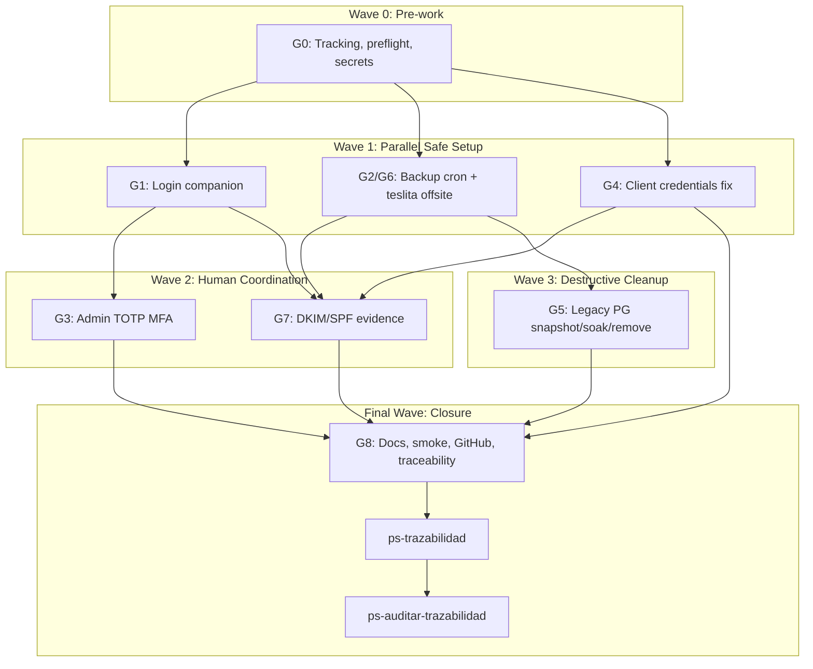

# Wave A Zitadel Gap Closure Implementation Plan

**Goal:** Close the seven Wave A Zitadel gaps so Wave A can move from PARTIAL to GREEN before Wave B starts.

**Architecture:** Keep Supabase Auth untouched for the current Bitacora runtime. Complete the shared Zitadel Teslita IdP operational layer through a separate login companion app, backup/offsite setup, OAuth M2M fix, admin MFA, safe legacy database cleanup, SMTP evidence, and traceability updates.

**Tech Stack:** Zitadel v4.9.0, Dokploy, Traefik, Docker Swarm, PostgreSQL 17/18, rclone SFTP over Tailscale, Infisical via `mi-key-cli`, GitHub issues.

**Context Source:** `ps-contexto`/`mi-lsp` context loaded from `.docs/wiki/00_gobierno_documental.md`, `01_alcance_funcional.md`, `02_arquitectura.md`, `05_modelo_datos.md`, `07_baseline_tecnica.md`, `08_modelo_fisico_datos.md`, `09_contratos_tecnicos.md`, and `.docs/wiki/09_contratos/CT-AUTH-ZITADEL.md`. Runtime evidence confirmed OIDC discovery `200`, #16 closed, base commit `61f17b6`, 70 Infisical keys after `mkey pull`, valid `ZITADEL_ADMIN_PAT`, four live orgs, eight product apps, and a non-empty unused legacy Postgres.

**Runtime:** Codex

**Available Agents:**
- `ps-explorer` — read-only code/docs/runtime exploration.
- `ps-worker` — shell, Git, infra, config, and operational execution.
- `ps-docs` — wiki, runbooks, reports, and documentation updates.
- `ps-qa` — QA/security/test audit.
- `ps-reviewer` — code and architecture review.

**Initial Assumptions:**
- `ZITADEL_ADMIN_PAT` and `ZITADEL_LOGIN_CLIENT_PAT` remain valid in Infisical `teslita/bitacora/prod`.
- Host `teslita` remains reachable via Tailscale SSH and can store Zitadel backup snapshots at `/home/fgpaz/backups/zitadel/`.
- User is available for TOTP QR scan, Gmail headers, and explicit destructive approval before removing legacy Postgres.

---

## Risks & Assumptions

**Assumptions needing validation:**
- Login companion can be deployed with preserved path `/ui/v2/login`; validate with Traefik config and HTTP smoke.
- Existing API clients can be fixed without recreating secrets; stop and escalate if Zitadel requires secret rotation.
- Legacy PG removal is safe only after snapshot, stop, soak, and smoke; direct removal is forbidden.

**Known risks:**
- VPS `turismo` has high swap usage; deploy login companion with memory limits and monitor after startup.
- Offsite to `teslita` is cost-free but still self-managed; verify `rclone ls` and retention.
- DKIM/SPF may fail due to DNS; if so, close G1-G6 and open a DNS follow-up for G7.

**Unknowns:**
- Exact Dokploy endpoint payload for creating the new Docker app may require reading `dokploy-cli` endpoint reference before mutation.
- Exact Zitadel API patch shape for API app client_credentials may require live read of app config before mutation.

---

## Wave Dispatch Map

| Task | Wave | Agent | Subdoc | Done When |
|------|------|-------|--------|-----------|
| G0 | 0 | ps-worker | `./2026-04-19-cerrar-gaps-wave-a-zitadel/G0-prework.md` | Umbrella issue exists and preflight report is GREEN |
| G1 | 1 | ps-worker | `./2026-04-19-cerrar-gaps-wave-a-zitadel/G1-login-companion.md` | `/ui/v2/login` returns HTTP 200 and OIDC remains 200 |
| G2/G6 | 1 | ps-worker | `./2026-04-19-cerrar-gaps-wave-a-zitadel/G2-backup-offsite.md` | Manual backup exists locally and is listable on `teslita` |
| G4 | 1 | ps-worker | `./2026-04-19-cerrar-gaps-wave-a-zitadel/G4-client-credentials.md` | All four API clients return RS256 JWTs |
| G3 | 2 | ps-worker | `./2026-04-19-cerrar-gaps-wave-a-zitadel/G3-admin-mfa.md` | Admin user has `otp` factor and recovery codes are in Infisical |
| G7 | 2 | ps-worker | `./2026-04-19-cerrar-gaps-wave-a-zitadel/G7-dkim-spf.md` | Fresh test mail headers show DKIM/SPF pass or DNS follow-up is open |
| G5 | 3 | ps-worker | `./2026-04-19-cerrar-gaps-wave-a-zitadel/G5-legacy-postgres.md` | Legacy PG removed after snapshot/soak and active OIDC remains 200 |
| G8 | F | ps-docs | `./2026-04-19-cerrar-gaps-wave-a-zitadel/G8-closure.md` | Smoke README, docs, memory, comments, and commits are complete |
| T1 | F | inline | inline | `ps-trazabilidad` closure passes |
| T2 | F | inline | inline | `ps-auditar-trazabilidad` verdict is Approved or Approved with follow-ups |

---

## Final Wave Inline Tasks

**Task T1: Run ps-trazabilidad**
- Validate governance sync, `00 -> FL/RF -> 07/08/09 -> TP`, CT/runbook/runtime alignment, and live evidence for auth headers/routes/backups.
- Closure must name active services, reviewed technical docs, updated evidence paths, and remaining gaps.

**Task T2: Run ps-auditar-trazabilidad**
- Audit architecture, baseline, CT-AUTH-ZITADEL, runbooks, memory, smoke evidence, GitHub issue state, and runtime behavior.
- If audit blocks closure, return to the failing gap task and do not mark Wave A GREEN.
