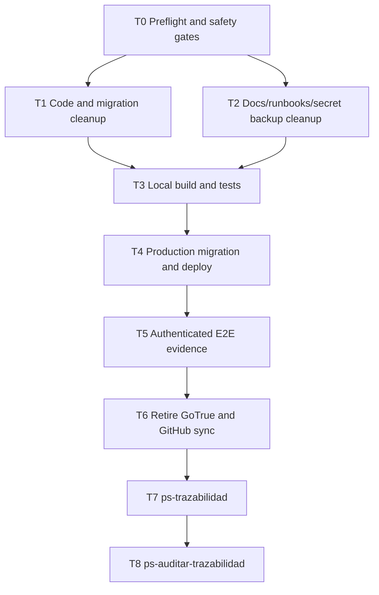

# Bitacora Supabase Retirement Plan

**Goal:** Remove the remaining Supabase/GoTrue rollback surface and leave Bitacora running only on Zitadel.

**Context Source:** `ps-contexto` + `mi-lsp` on 2026-04-20 confirmed governance is valid, Wave B runtime cutover is already deployed, Zitadel discovery and JWKS return `200`, and the remaining Supabase references are rollback-only code/docs/secrets plus the legacy GoTrue Dokploy app.

**Locked Decisions:**
- Active IdP is Zitadel at `https://id.nuestrascuentitas.com`.
- Frontend protocol is OIDC Authorization Code + PKCE.
- Backend protocol is RS256 Bearer JWT validation through OIDC metadata/JWKS.
- Web session cookie stays `bitacora_session`.
- Rollback after this mini-wave is DB/app backup + previous Git commit, not Supabase Auth.
- Do not print JWTs, passwords, PATs, clinical data, or patient identifiers in evidence.

## Wave Dispatch Map

| Task | Owner | Files / Runtime | Acceptance | Rollback |
|------|-------|-----------------|------------|----------|
| T0 | orchestrator | `infra/.env`, Zitadel discovery/JWKS, #17 | mkey pull works, OIDC/JWKS `200`, git only has known untracked docs | Stop before edits |
| T1 | orchestrator | `frontend/lib/auth/*`, `frontend/middleware.ts`, `src/Bitacora.*`, EF migration | No active code clears Supabase cookies or maps users to `supabase_user_id`; tests updated | Revert commit before migration, or restore DB backup after migration |
| T2 | orchestrator | `.docs/wiki/**`, `infra/**`, `README.md`, `AGENTS.md`, `CLAUDE.md` | Canon says Zitadel-only; Supabase docs are removed/retired | Revert docs commit |
| T3 | orchestrator | local repo | `dotnet test`, frontend lint/typecheck/build pass | Fix before deploy |
| T4 | orchestrator | Dokploy + PostgreSQL | migration renames identity column and drops rollback column; API/frontend deploy done | DB backup + previous image/commit |
| T5 | orchestrator | Playwright/E2E evidence | real Zitadel login/logout/protected route smoke saved under `artifacts/e2e/2026-04-20-zitadel-only-retirement/` | Reopen with backup + previous commit if E2E fails |
| T6 | orchestrator | Dokploy GoTrue app/secrets/GitHub | GoTrue app stopped/removed after verified E2E; #17 updated | Start old app only from backup if rollback approved |
| T7 | orchestrator | traceability | no blocking drift | Fix gaps |
| T8 | orchestrator | audit | approved or approved with explicit follow-ups | Fix blockers |

## Evidence Targets

- `artifacts/e2e/2026-04-20-zitadel-only-retirement/README.md`
- #17 final comment with commit, migration, deploy, smoke and E2E evidence
- Epic #15 status update
