# Impeccable Hardening — Frontend Bitácora

**Goal:** Aplicar en cadena las skills `impeccable-*` al frontend de Bitácora para cerrar bloqueantes ortográficos, subir a WCAG 2.1 AA, normalizar tokens del DS, optimizar performance y consolidar la capa visual — sin tocar auth, contratos backend, dominio ni copy congelado.

**Architecture:** UI-only pass sobre `frontend/` (Next.js 16 + React 19 + CSS Modules + Playwright). Diez waves secuenciales (una skill `impeccable-*` por wave) en orden **a11y-first** confirmado por brainstorming. Checkpoints `ps-trazabilidad` intermedios tras W3/W6/W9. Cierre con `ps-trazabilidad` + `ps-auditar-trazabilidad full`.

**Tech Stack:** Next.js 16 (App Router, RSC), React 19, CSS Modules, `@fontsource/*` → candidato a `next/font/google`, Playwright 1.59 (8 specs verdes).

**Context Source:** `ps-contexto` ejecutado; canon cargado (`01`-`04`, `10`-`16`, `23_uxui/INDEX`, `07_tech/TECH-FRONTEND-SYSTEM-DESIGN`, decisión anchor `2026-04-22-dashboard-first-post-login.md`). Governance `in_sync` (perfil `spec_backend`). Priority list del canon: `Security > Privacy > Correctness > Usability > Maintainability > Performance > Cost > TTM`. Baseline impeccable-audit: `.docs/raw/reports/2026-04-22-impeccable-audit-baseline.md`.

**Runtime:** CC

**Available Agents:**
- `ps-explorer` — read-only code/symbol navigation
- `ps-next-vercel` — Next.js 16 code generation/modification (primary executor de waves write)
- `ps-code-reviewer` — diff review con prioridad P>D>S
- `ps-qa-orchestrator` — quality + security + testing audit (read-only)
- `ps-gap-auditor` — spec-vs-code gap detection (read-only)
- `ps-docs` — canon wiki / specs / READMEs
- `ps-worker` — git, config, shell, plans, ops

**Initial Assumptions:**
1. **Copy congelado intocable:** los labels post dashboard-first (`"Ingresar"`, `"Tu espacio personal de registro"`, `"Empezá con tu primer registro"`, `"Registrar humor"`, `"+ Nuevo registro"`, `"Check-in diario"`, `"Nuevo registro"`, `"Recibí recordatorios por Telegram"`, `"Conectar"`, `"Ahora no"`, `"Registro guardado."`, `"Check-in guardado."`) no se modifican en ninguna wave. Validación: `grep -rn "Empezar ahora\|Hacer mi primer registro\|NextActionBridgeCard\|S04-BRIDGE\|signInWithMagicLink" frontend/` → 0 matches activos tras W10.
2. **Radios del DS (4.1 baseline):** el canon dice 8/14/20px, el `tokens.css` actual dice 4/8/12px. Durante W4 `impeccable-normalize`, **conservamos los valores implementados (4/8/12)** y sincronizamos `11_identidad_visual.md` para reflejar eso. Justificación: refactorizar radios a 8/14/20 es visualmente invasivo y fuera del scope UI-only.
3. **Zero dependencias nuevas:** ninguna wave instala npm packages nuevos. Si una skill sugiere una librería, se usa alternativa nativa o se marca como N/A con razón explícita.

---

## Risks & Assumptions

**Assumptions needing validation:**
- Asunción 1 (radios DS): validar en W4 con `ps-next-vercel` que la sync al canon no rompe visualmente ningún componente; si lo rompe, pausar y consultar al humano.
- Asunción 2 (next/font migration): validar en W6 que `@fontsource` → `next/font/google` no rompe `var(--font-display)` en CSS Modules. Test: `npm run build && npm run test:e2e`.
- Asunción 3 (page.tsx → RSC): validar en W6 que convertir 8 page.tsx a Server Components no rompe auth (zona congelada). Test: specs de Playwright pasan sin cambios.

**Known risks:**
- Riesgo 1 (contraste): si oscurecer `--foreground-muted` a `#4A4440` en W3 altera la sensación cálida del canon 11. Mitigación: validar en W4 (normalize) con muestreo de componentes afectados y ajustar tono hasta calibrar AA + temperatura.
- Riesgo 2 (extract): partir `TelegramPairingCard` en 3 subcomponentes (W5) puede romper timers de polling. Mitigación: mantener el estado de polling en el componente padre; solo extraer presentational children.
- Riesgo 3 (normalize tokens): reemplazar `var(--border)` por `var(--border-subtle)` en ExportGate/Timeline (W4) puede cambiar visualmente bordes existentes (hoy probablemente se ven como `currentColor`). Mitigación: screenshot diff local antes de commit.
- Riesgo 4 (tests Playwright): cambios de label descriptivo o ARIA pueden invalidar selectores de specs. Mitigación: correr `npm run test:e2e` tras cada wave que toca texto visible (W2, W3, W6, W7, W9).

**Unknowns:**
- Unknown 1: ¿la `impeccable-critique` (W1) confirma que el Dashboard tiene densidad tipo tablero? Respuesta via subagente `ps-code-reviewer` en W1.
- Unknown 2: ¿existen otros magic numbers de spacing no detectados por explorers iniciales? Respuesta: barrido con grep durante W4.
- Unknown 3: ¿los specs de Playwright rompen cuando `page.tsx` se convierten a RSC? Respuesta: W6 corre suite completa tras la conversión.

---

## Wave Dispatch Map

Diez waves de hardening + Wave 0 (branch setup) + Wave F (traceability). Las waves 1-10 son **secuenciales** (no paralelas): cada skill opera sobre archivos que la anterior ya tocó, y el orden a11y-first garantiza que `normalize`/`optimize` llegan a código ya semánticamente correcto.

```mermaid
graph TD
    subgraph W0["Wave 0: Prereqs"]
        T0["T0: Feature branch + baseline ack<br/>ps-worker"]
    end
    subgraph W1["Wave 1: Critique (read-only)"]
        T1["T1: impeccable-critique<br/>ps-code-reviewer"]
    end
    subgraph W2["Wave 2: Clarify"]
        T2["T2: impeccable-clarify<br/>ps-next-vercel"]
    end
    subgraph W3["Wave 3: Harden"]
        T3["T3: impeccable-harden<br/>ps-next-vercel"]
    end
    subgraph CKP1["Checkpoint 1"]
        C1["ps-trazabilidad (intermedio)"]
    end
    subgraph W4["Wave 4: Normalize"]
        T4["T4: impeccable-normalize<br/>ps-next-vercel"]
    end
    subgraph W5["Wave 5: Extract"]
        T5["T5: impeccable-extract<br/>ps-next-vercel"]
    end
    subgraph W6["Wave 6: Optimize"]
        T6["T6: impeccable-optimize<br/>ps-next-vercel"]
    end
    subgraph CKP2["Checkpoint 2"]
        C2["ps-trazabilidad (intermedio)"]
    end
    subgraph W7["Wave 7: Adapt"]
        T7["T7: impeccable-adapt<br/>ps-next-vercel"]
    end
    subgraph W8["Wave 8: Polish"]
        T8["T8: impeccable-polish<br/>ps-next-vercel"]
    end
    subgraph W9["Wave 9: Onboard"]
        T9["T9: impeccable-onboard<br/>ps-next-vercel"]
    end
    subgraph CKP3["Checkpoint 3"]
        C3["ps-trazabilidad (intermedio)"]
    end
    subgraph W10["Wave 10: Delight"]
        T10["T10: impeccable-delight<br/>ps-next-vercel"]
    end
    subgraph WF["Final Wave: Traceability"]
        T11["T11: ps-trazabilidad (full)"]
        T12["T12: ps-auditar-trazabilidad full"]
        T11 --> T12
    end
    T0 --> T1 --> T2 --> T3 --> C1 --> T4 --> T5 --> T6 --> C2 --> T7 --> T8 --> T9 --> C3 --> T10 --> T11
```

## Task Index

| Task | Wave | Agent | Subdoc | Done When |
|------|------|-------|--------|-----------|
| T0 | 0 | ps-worker | inline | feature branch creada + baseline confirmado |
| T1 | 1 | ps-code-reviewer | `./2026-04-22-impeccable-hardening/T1-critique.md` | Reporte persistido en `.docs/raw/reports/` + 0 cambios de código |
| T2 | 2 | ps-next-vercel | `./2026-04-22-impeccable-hardening/T2-clarify.md` | `npm run typecheck && npm run lint && npm run test:e2e` exit 0; grep de tildes objetivo → 0 matches |
| T3 | 3 | ps-next-vercel | `./2026-04-22-impeccable-hardening/T3-harden.md` | typecheck/lint/e2e exit 0; focus ring visible en modo HCM; touch targets ≥44px |
| CKP1 | — | — | inline | `ps-trazabilidad` intermedio sin gaps críticos |
| T4 | 4 | ps-next-vercel | `./2026-04-22-impeccable-hardening/T4-normalize.md` | typecheck/lint/e2e exit 0; 0 `var(--border)` suelto; 0 fallbacks hex crudos en CSS Modules |
| T5 | 5 | ps-next-vercel | `./2026-04-22-impeccable-hardening/T5-extract.md` | typecheck/lint/e2e exit 0; TelegramPairingCard.tsx ≤250 líneas |
| T6 | 6 | ps-next-vercel | `./2026-04-22-impeccable-hardening/T6-optimize.md` | typecheck/lint/e2e exit 0; page.tsx sin `'use client'` donde no hace falta; `next/font` activo |
| CKP2 | — | — | inline | `ps-trazabilidad` intermedio sin gaps críticos |
| T7 | 7 | ps-next-vercel | `./2026-04-22-impeccable-hardening/T7-adapt.md` | typecheck/lint/e2e exit 0; breakpoints canónicos documentados en tokens.css |
| T8 | 8 | ps-next-vercel | `./2026-04-22-impeccable-hardening/T8-polish.md` | typecheck/lint/e2e exit 0; delay teatral ≤400ms; sin rozaduras de copy listadas en baseline §1.5 |
| T9 | 9 | ps-next-vercel | `./2026-04-22-impeccable-hardening/T9-onboard.md` | typecheck/lint/e2e exit 0; empty state Dashboard testeado |
| CKP3 | — | — | inline | `ps-trazabilidad` intermedio sin gaps críticos |
| T10 | 10 | ps-next-vercel | `./2026-04-22-impeccable-hardening/T10-delight.md` | typecheck/lint/e2e exit 0; respeta `prefers-reduced-motion` local |
| T11 | F | — | inline | `ps-trazabilidad` (full) emite verdict `ui-only, no-schema, no-contract` |
| T12 | F | — | inline | `ps-auditar-trazabilidad` (full) emite `0 critical gaps` |

## Wave 0 — Prereqs (T0 inline)

**T0 Setup — feature branch + baseline ack**
- Crear feature branch: `git switch -c feature/impeccable-hardening-2026-04-22`.
- Confirmar baseline existe: `test -f .docs/raw/reports/2026-04-22-impeccable-audit-baseline.md`.
- Confirmar plan existe: `test -f .docs/raw/plans/2026-04-22-impeccable-hardening.md`.
- Confirmar working tree limpio (excepto plan nuevo + prompt del bootstrap): `git status --short`.
- Sanity run: `cd frontend && npm run typecheck && npm run lint` → exit 0.
- Done when: feature branch activa; sanity checks pasan.
- Commit: no se crea commit propio; el commit del plan ya cubre los artefactos.

## Checkpoints intermedios (inline)

### CKP1 — tras T3
- Invocar `Skill("ps-trazabilidad")` con scope "ui-only waves 1-3 (critique/clarify/harden)".
- Validar que los cambios de copy/ARIA/focus están reflejados en los logs de commits (W2, W3) y no cruzan a `frontend/lib/auth/*`, `frontend/proxy.ts`, `frontend/app/api/*`, `frontend/app/auth/*`.
- Si hay gaps críticos: pausar y escalar al humano con `AskUserQuestion` antes de W4.

### CKP2 — tras T6
- Invocar `Skill("ps-trazabilidad")` con scope "ui-only waves 4-6 (normalize/extract/optimize)".
- Validar `next/font` no alteró claims de Zitadel ni headers de seguridad.
- Validar que ningún page.tsx convertido a RSC leaks `use client` hooks.

### CKP3 — tras T9
- Invocar `Skill("ps-trazabilidad")` con scope "ui-only waves 7-9 (adapt/polish/onboard)".
- Validar breakpoints canónicos documentados en `tokens.css`.
- Validar empty state Dashboard cubierto por spec Playwright.

## Final Wave — Traceability (T11, T12 inline)

**T11 — `Skill("ps-trazabilidad")` full**
- Scope: todo el hardening (W0-W10).
- Clasificar: `ui-only, no-schema, no-contract, no-auth`.
- Validar sync con canon 23_uxui (UXS/UI-RFC/HANDOFF-*) para slices tocados: ONB-001, VIS-001/015, CON (consent panel), REG-001/002, TG-001.
- Validar compliance Ley 25.326/26.529/26.657: ningún cambio afecta storage, access control, consent flows, audit logging.
- Done when: verdict emitido; canon doc sync confirmado.

**T12 — `Skill("ps-auditar-trazabilidad")` modo full**
- Read-only cross-doc audit.
- Verificar: RF ↔ FL ↔ data model ↔ tests ↔ 23_uxui alignment.
- Grep final: `grep -rn "Empezar ahora\|Hacer mi primer registro\|NextActionBridgeCard\|S04-BRIDGE\|signInWithMagicLink" frontend/ .docs/wiki/` → 0 matches activos (solo bloques `> Deprecado 2026-04-22`).
- Done when: `0 critical gaps`; warnings triaged con humano via `AskUserQuestion`.

## Invariantes globales (todas las waves)

1. **No tocar** `frontend/app/auth/callback/route.ts`, `frontend/lib/auth/server.ts`, `frontend/proxy.ts`, `frontend/app/api/**`.
2. **No tocar** copy congelado (lista en Initial Assumptions 1).
3. **No instalar** nuevas dependencias npm.
4. **No `taskkill`** de dev servers del usuario.
5. **No `--no-verify` / `--amend` / `--force push main`**.
6. **Artefactos efímeros** a `tmp/` o `artifacts/e2e/2026-04-22-impeccable/`.
7. **Cross-platform**: condicionar fixes por `process.platform` si aplica.
8. **Cada wave commit**: `style(impeccable-<skill>): <alcance 1 línea>` — sin co-author lines, sin "Generated by" footers.
9. **Post-wave check**: `cd frontend && npm run typecheck && npm run lint && npm run test:e2e` exit 0. Si e2e falla, pausar antes de próxima wave.

## Dispatch rules

- Para cada wave Tn, leer `./2026-04-22-impeccable-hardening/Tn-<name>.md` y pasarlo **verbatim** al agente listado en YAML.
- Si el agente reporta ambigüedad, tratar como defecto del plan: pausar, actualizar el subdoc, reintentar.
- Si una skill `impeccable-*` propone cambios al canon UX/UI (docs 10-16 o 23_uxui), pasarlos por `Skill("ps-asistente-wiki")` antes de escribir el canon.
- Si W4 (normalize) sugiere tocar `11_identidad_visual.md` (radios), usar `Skill("crear-identidad-visual")` o editar puntual con justificación en el commit message.
