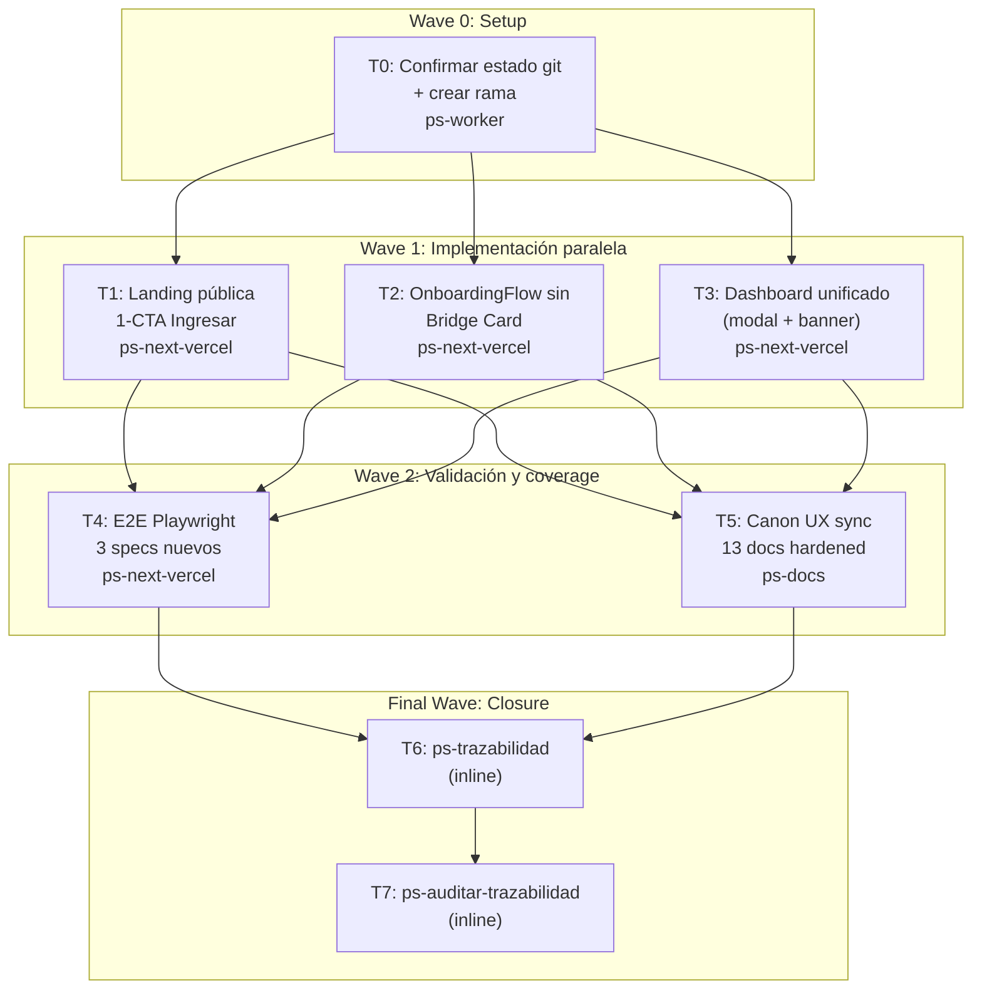

# UX Dashboard-First — Plan de ejecución completo

**Goal:** Reemplazar el flujo "landing con email engañoso → consent → Bridge Card → registro aislado" por "landing un-CTA → consent sólo si falta → dashboard unificado con modal de registro y banner Telegram condicional".

**Architecture:** Frontend Next.js 16 (App Router). La landing pública queda declarativa sin state de form. `OnboardingFlow` sólo corre cuando `bootstrap.needsConsent === true`; en cualquier otro caso redirige a `/dashboard`. El dashboard incorpora un modal nativo `<dialog>` para capturar mood entries sin perder contexto y un banner dismissible para nudge de Telegram basado en `getTelegramSession().linked`.

**Tech Stack:** Next.js 16, React 19, TypeScript, CSS Modules, Playwright 1.59, Zitadel OIDC+PKCE (server-side). Backend .NET 10 (sin cambios). Wiki SDD hardened bajo `.docs/wiki/`.

**Context Source:** `ps-contexto` + `mi-lsp workspace status bitacora` (governance sync, profile `spec_backend`). Canon UX hardened completo (10-23). Decision anchor: `.docs/raw/decisiones/2026-04-22-dashboard-first-post-login.md`. Código pivot: `frontend/app/page.tsx`, `frontend/app/auth/callback/route.ts:57` (ya → `/dashboard`), `frontend/components/patient/onboarding/OnboardingFlow.tsx:149` (bug `needsFirstEntry` invertido), `frontend/components/patient/dashboard/Dashboard.tsx:83-93` (empty state detection). Compliance salud Ley 25.326/26.529/26.657: cambio es puramente UI, no toca storage, access control ni consent storage.

**Runtime:** CC

**Available Agents:**
- `ps-next-vercel` — Next.js specialist (Vercel best practices + security guardrails). Owner de cambios TSX/CSS en `frontend/`.
- `ps-dotnet10` — .NET 10 microservices. No se usa en este plan (cambio UI-only).
- `ps-python` — FastAPI/LangGraph. No se usa.
- `ps-worker` — general-purpose ejecución (git, config, shell, ops, documentación ligera).
- `ps-explorer` — read-only code exploration.
- `ps-code-reviewer` — review de diffs con priorización Performance > Diseño > Seguridad.
- `ps-qa-orchestrator` — QA persistente (quality + security + testing).
- `ps-qa-backend-security` — backend security compliance.
- `ps-qa-security` — OWASP checks.
- `ps-qa-testing` — estrategia de testing.
- `ps-qa-code-review` — code smells y anti-patterns.
- `ps-qa-business` — impacto de negocio.
- `ps-gap-auditor` — read-only auditor de gaps wiki↔código.
- `ps-sdd-sync-gen` — genera/sync specs desde código.
- `ps-docs` — wiki, specs, READMEs, changelogs.
- `gap-terminator` — detector automatizado de gaps.

**Initial Assumptions:**
1. El paciente autenticado siempre quiere ir a su historial como "home". Si esto no aplicara (ej. feature flag oculta el dashboard), el redirect post-callback rompería.
2. El backend expone `GET /telegram/session` con `{ linked: bool }`. El banner depende de ese contrato.
3. El backend acepta `POST /mood-entries` con el mismo payload desde modal que desde página. Ya implementado, sin cambio server-side.

---

## Risks & Assumptions

**Assumptions needing validation:**
- El callback OIDC sigue redirigiendo a `/dashboard` (ya verificado: `frontend/app/auth/callback/route.ts:57`).
- `getTelegramSession` (`frontend/lib/api/client.ts:206`) normaliza `raw.linked ?? raw.isLinked ?? false` correctamente. Validar con un usuario real de pruebas.
- Los tokens de sesión `bitacora_session` (cookie httpOnly) permanecen inalterados por este cambio. Validar con `npm run test:e2e` corriendo contra dev server autenticado.

**Known risks:**
- **Pérdida de pre-fill de email en Zitadel.** Mitigación: Zitadel muestra su propio campo, usuario lo escribe una vez. Monitorear tasa de bounce en Zitadel login.
- **Baja en vinculación Telegram por perder la Bridge Card como recordatorio.** Mitigación: banner dismissible en dashboard. Si 30 días después la tasa cae >10%, reforzar (persistir sin dismiss los primeros 7 días).
- **Canon UX/UI desincronizado (13 archivos referencian `NextActionBridgeCard`/`S04-BRIDGE`).** Mitigación: Wave de canon sync explícita (T5) + `ps-auditar-trazabilidad` en final wave.

**Unknowns:**
- Playwright en modo dev local puede flakear por arranque lento del server. Plan define un `webServer` opcional en `playwright.config.ts`. Investigación: T4 arranca dev server antes de correr specs.
- La cookie de sesión para tests mockeados no atraviesa validación server-side: los specs dependen de `page.route()` sólo para endpoints del backend. Validar con dry-run.

---

## Wave Dispatch Map



---

## Task Index

| Task | Wave | Agent | Subdoc | Done When |
|------|------|-------|--------|-----------|
| T0 | 0 | ps-worker | `./2026-04-22-ux-dashboard-first/T0-setup.md` | Rama `feature/ux-dashboard-first` creada, working tree limpio sobre ella |
| T1 | 1 | ps-next-vercel | `./2026-04-22-ux-dashboard-first/T1-landing.md` | `npm run typecheck && npm run lint` exit 0; landing sin input email |
| T2 | 1 | ps-next-vercel | `./2026-04-22-ux-dashboard-first/T2-onboarding.md` | `NextActionBridgeCard.*` eliminado, `OnboardingFlow` redirige a `/dashboard` en ambas ramas |
| T3 | 1 | ps-next-vercel | `./2026-04-22-ux-dashboard-first/T3-dashboard.md` | `MoodEntryDialog` y `TelegramReminderBanner` renderizan; `Dashboard.tsx` usa modal; typecheck+lint verdes |
| T4 | 2 | ps-next-vercel | `./2026-04-22-ux-dashboard-first/T4-e2e.md` | `npm run test:e2e` exit 0 |
| T5 | 2 | ps-docs | `./2026-04-22-ux-dashboard-first/T5-canon-sync.md` | 13 docs wiki actualizados, sin referencias a `NextActionBridgeCard`/`S04-BRIDGE`/`signInWithMagicLink` |
| T6 | F | — | inline | `ps-trazabilidad` reporta FL/RF/TP/UXS in-sync |
| T7 | F | — | inline | `ps-auditar-trazabilidad` sin gaps críticos |

---

## Final Wave: Traceability Closure (inline)

### T6 — Run `ps-trazabilidad`

**Responsable:** orquestador del plan (no subagente).

**Inputs:**
- Wiki raíz: `.docs/wiki/`
- Decision doc: `.docs/raw/decisiones/2026-04-22-dashboard-first-post-login.md`
- Commits de Wave 1-2.

**Acciones:**
1. Invocar `Skill(ps-trazabilidad)`.
2. Clasificar cambio como `ui-only, no-schema, no-contract`.
3. Verificar sync entre `FL-ONB-01`, `RF-ONB-001..005`, `UXS-ONB-001`, `UI-RFC-ONB-001`, `TP-ONB`, `TP-VIS`, `TECH-FRONTEND-SYSTEM-DESIGN`.
4. Confirmar que el nuevo `RF-VIS-015-dashboard-paciente-inline-entry.md` está referenciado desde `04_RF.md`.
5. Output: reporte breve con "in-sync" o lista de gaps residuales.

**Done When:** reporte muestra `Sync: ok` para todos los docs canon afectados; gaps residuales, si existen, están documentados como follow-up explícito.

### T7 — Run `ps-auditar-trazabilidad`

**Responsable:** orquestador del plan.

**Inputs:** mismo alcance que T6.

**Acciones:**
1. Invocar `Skill(ps-auditar-trazabilidad)` con modo `full`.
2. Revisar salida en busca de:
   - Links `../foo.md` rotos.
   - Estados `S04-BRIDGE` residuales.
   - Menciones de `NextActionBridgeCard` o `signInWithMagicLink` en canon UX/técnico.
   - Desfase entre archivos citados en `23_uxui/HANDOFF-MAPPING-ONB-001.md` y el código real.
3. Si la auditoría reporta gaps críticos, reopen Wave 2 (T5) con las correcciones específicas y re-run T6+T7.

**Done When:** la auditoría imprime `0 critical gaps` (puede haber warnings de info no-bloqueantes que se listen como follow-up).

---

## Execution Handoff

### Step 1: Commit del plan

```bash
git add .docs/raw/plans/2026-04-22-ux-dashboard-first.md .docs/raw/plans/2026-04-22-ux-dashboard-first/
git commit -m "docs(plan): add UX dashboard-first implementation plan"
```

### Step 2: Workspace isolation

Preguntar al usuario si prefiere worktree aislado o rama directa. Si elige worktree, invocar `Skill(using-git-worktrees)`.

### Step 3: Wave execution loop

1. Dispatch T0 (Wave 0) secuencial.
2. Dispatch T1+T2+T3 en paralelo (Wave 1) — un solo mensaje con 3 tool calls `Agent`.
3. Dispatch T4+T5 en paralelo (Wave 2).
4. Final wave: T6 → T7 secuencial (orquestador lo ejecuta, no subagente).

Pass the full subdocument verbatim al dispatchar cada tarea. Si un subagente reporta ambigüedad, tratarlo como defecto de plan y reescribir la tarea.
