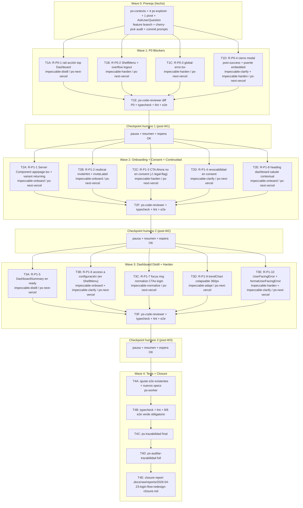

# Login Flow Redesign — Bitácora 2026-04-23

**Goal:** Ejecutar el rediseño P0+P1 del flujo de acceso identificado por el audit read-only del 2026-04-23 — resolver la queja literal del product owner sobre UX de login malísima para el recurrente, arreglar los 4 bloqueantes P0 estructurales (CTA enterrado, logout inseguro, global-error ausente, modal sin cierre) y refinar 10 hallazgos P1 sobre continuidad, consent, dashboard distill y user-facing errors. Zero toque a zonas congeladas (`lib/auth/*`, `app/api/*`, `app/auth/*`, `proxy.ts`, `src/**`).

**Architecture:** Rediseño dirigido por 4 waves secuenciales sobre `frontend/` (Next.js 16 + React 19 + CSS Modules + Playwright). Cada wave termina con checkpoint humano obligatorio. Wave 1 cierra P0 blockers (distill + harden). Wave 2 refina onboarding + consent + continuidad recurrente. Wave 3 aplica distill/normalize sobre dashboard + user-facing errors. Wave 4 ajusta e2e, corre typecheck/lint/e2e + `ps-trazabilidad` + `ps-auditar-trazabilidad`. Dispatch paralelo de subagents dentro de cada wave cuando los archivos no se superponen.

**Tech Stack:** Next.js 16 (App Router, RSC por defecto, `cookies()` de `next/headers`), React 19, CSS Modules con tokens canónicos de `frontend/styles/tokens.css`, Playwright 1.59 (3 specs existentes: `landing`, `dashboard-modal`, `telegram-banner`; posibles nuevos specs para global-error y logout confirm). **3 prod deps solo** (next, react, react-dom) — cero deps nuevas permitidas.

**Context Source:** `ps-contexto` ejecutado; canon 10/12/13/16 cargado; audit maestro `.docs/raw/reports/2026-04-23-login-flow-audit.md` (36 hallazgos, 4 P0, 15 P1) leído con evidencia file:line; baseline consolidado `.docs/raw/reports/2026-04-23-login-flow-baseline.md` verificado; closure previo `.docs/raw/reports/2026-04-22-impeccable-hardening-closure.md` con 12 positivos vigentes a preservar. RF-ONB-003/004/005 confirmados. mi-lsp workspace `bitacora` validado (`governance_sync: in_sync`, profile `spec_backend`).

**Runtime:** Claude Code (CC).

**Available Agents:**
- `ps-explorer` — read-only code/symbol navigation
- `ps-next-vercel` — Next.js 16 / React code generation (executor principal de waves write)
- `ps-code-reviewer` — diff review con prioridad Performance > Diseño > Seguridad
- `ps-worker` — git, config, shell, scripts, ajustes de e2e específicos
- `ps-docs` — sync canon wiki post-cambios (si aplica)
- `ps-qa-orchestrator` — audit final (opcional, Wave 4)

---

## Decisiones cerradas en brainstorming (2026-04-23)

| Decisión | Elección | Fuente |
|----------|----------|--------|
| E2-F2 consent rechazo (⚠ legal-review) | **Agregar CTA secundario "Ahora no"** + redirect `/` sin borrar sesión + flag review legal pre-deploy. Mensaje al rechazo: `"Podés aceptar cuando quieras. Tu sesión sigue activa."` | AskUserQuestion Q1 |
| E3-F7 h1 dashboard (🔒 canon decision) | **Saludo contextual**: h1 `"Hola. Acá está lo que registraste."` + subtítulo `"Solo vos ves lo que registrás. Tus datos son privados."` Absorbe parte del congelado sobre privacidad; instala frame de refugio antes que archivo (canon 10 §5.1). | AskUserQuestion Q2 |
| R-P0-2 logout protection | **Overflow menu `⋯`** (ShellMenu nuevo) con ítem "Cerrar sesión". aria-haspopup/aria-expanded. Habilita R-P1-6 (link a configuración) en el mismo componente. | AskUserQuestion Q3 |
| R-P1-1 continuidad recurrente | **Server Component en `app/page.tsx`** con `cookies()` de `next/headers` + variant `"returning"` en `OnboardingEntryHero`. Render server-side sin flash. Zero toque a `proxy.ts` (zona congelada) ni `lib/auth/*`. (Pivot confirmado post-Explorer 5, que detectó `proxy.ts` como middleware renombrado y bloqueante.) | AskUserQuestion Q4 + Explorer 5 pivot |

---

## Corrección de paths del audit

El audit citaba paths planos (`components/patient/Dashboard.tsx`). Los 4 explorers confirmaron que los paths reales usan subdirectorios. Mapeo canónico para este plan:

| Nombre en audit | Path real |
|-----------------|-----------|
| `Dashboard.tsx` / `.module.css` | `frontend/components/patient/dashboard/Dashboard.tsx` / `.module.css` |
| `DashboardSummary.tsx` / `.module.css` | `frontend/components/patient/dashboard/DashboardSummary.tsx` / `.module.css` |
| `MoodEntryDialog.tsx` / `.module.css` | `frontend/components/patient/dashboard/MoodEntryDialog.tsx` / `.module.css` |
| `TelegramReminderBanner.tsx` | `frontend/components/patient/dashboard/TelegramReminderBanner.tsx` |
| `MoodEntryForm.tsx` / `.module.css` | `frontend/components/patient/mood/MoodEntryForm.tsx` / `.module.css` |
| `MoodScale.tsx` | `frontend/components/patient/mood/MoodScale.tsx` |
| `DailyCheckinForm.tsx` | `frontend/components/patient/checkin/DailyCheckinForm.tsx` |
| `ConsentGatePanel.tsx` / `.module.css` | `frontend/components/patient/consent/ConsentGatePanel.tsx` / `.module.css` |
| `OnboardingEntryHero.tsx` / `.module.css` | `frontend/components/patient/onboarding/OnboardingEntryHero.tsx` / `.module.css` |
| `OnboardingFlow.tsx` | `frontend/components/patient/onboarding/OnboardingFlow.tsx` |
| `PatientPageShell.tsx` / `.module.css` | `frontend/components/ui/PatientPageShell.tsx` / `.module.css` |
| `VinculosManager.tsx` | `frontend/components/patient/vinculos/VinculosManager.tsx` |

---

## Initial Assumptions

1. **Copy congelado 2026-04-22 intocable** (excepto donde el humano autorizó explícitamente): `"Ingresar"`, `"Tu espacio personal de registro"`, `"Solo vos ves lo que registrás. Tus datos son privados."`, `"Registrar humor"`, `"Empezá con tu primer registro"`, `"+ Nuevo registro"` (se mantiene como texto del CTA del rail de acción superior), `"Check-in diario"`, `"Registro guardado."`, `"Check-in guardado."`, `"Tus últimos días"`, `"Recibí recordatorios por Telegram"`, `"Conectar"`, `"Ahora no"`, `"Nuevo registro"`. El h1 del dashboard migra a copy nuevo aprobado (Q2 brainstorming).
2. **Cero dependencias nuevas npm.** Solo next/react/react-dom (+ devDeps ya presentes). Cualquier propuesta de lib se marca `REJECTED` con justificación.
3. **Zonas congeladas NO TOCAR**: `frontend/lib/auth/*`, `frontend/app/api/*`, `frontend/app/auth/*`, `frontend/proxy.ts`, `frontend/src/**`. Grep final por wave confirma 0 cruces.
4. **12 positivos del closure 2026-04-22 preservados**: listados en audit §6. Grep/Read verifica presencia post-cada-wave.
5. **3 specs e2e existentes** (`landing.spec.ts`, `dashboard-modal.spec.ts`, `telegram-banner.spec.ts`) + posibles nuevos en W4. 8/8 passing obligatorio al final de cada wave.

---

## Risks & Assumptions

**Assumptions needing validation:**
- **A1 (cookie name en Server Component)**: `SESSION_COOKIE = 'bitacora_session'` (constante de `frontend/lib/auth/constants.ts:1`, **read-only desde app/page.tsx**, cero import de lib/auth necesario si replicamos el string). Validar en W2 que `cookies().has('bitacora_session')` devuelve el valor esperado en server-side render.
- **A2 (overflow menu focus trap)**: ShellMenu debe cerrar con Esc + clickoutside + return focus al trigger. Implementación inspirada en `MoodEntryDialog` pero más liviana (no `<dialog>` nativo, solo `<button aria-haspopup> + <ul role=menu hidden>`). Validar con keyboard en W1.
- **A3 (handleSaved close timing)**: cierre auto del modal tras ~800ms post-success. Validar que el mensaje "Registro guardado." siga siendo leíble por AT (role=status aria-live=polite ya presente) antes del cierre.

**Known risks:**
- **R1 (h1 nuevo largo ~45 chars)**: `"Hola. Acá está lo que registraste."` puede necesitar clamp en 360px. Mitigación: usar `clamp()` tipográfico ya establecido en el canon (patrón del hardening 2026-04-22 W7).
- **R2 (Server Component + cookies() en Next 16)**: `cookies()` ya existe y está disponible en Next 16 como `async`. Validar que `await cookies()` se usa correctamente en RSC (ver snippet del preview de Q4).
- **R3 (rearm del DOM ready en Dashboard.tsx)**: subir el rail de acción al top cambia el orden DOM. Riesgo: selectores de `dashboard-modal.spec.ts` (`getByRole('button', { name: 'Registrar humor' })` o `"+ Nuevo registro"`) pueden seguir matcheando si usan text-based, pero validar.
- **R4 (ConsentGatePanel CTA secundario "Ahora no")**: la lógica de redirect necesita una ruta destino segura. Si `app/page.tsx` detecta sesión viva y redirige a `/dashboard`, el paciente que pulsa "Ahora no" volvería inmediatamente al consent (bucle). Mitigación: el `"Ahora no"` debe redirigir a `/` con un query param `?declined=1` o cookie efímera que `app/page.tsx` respete para NO redirigir al dashboard durante esa sesión. Evaluar en W2.
- **R5 (legal-review pre-deploy para R-P1-3)**: el humano autorizó implementar "Ahora no" pero flaggeo obligatorio en closure report + marcado explícito en commit que deploy a prod espera validación legal externa.
- **R6 (global-error.tsx Next.js contract)**: debe ser `'use client'` + envolver `<html><body>`. Cualquier desvío del contrato Next rompe el manejo de error root. Mitigación: seguir el snippet canónico en W1.

**Unknowns:**
- **U1**: ¿el Server Component en `app/page.tsx` respeta el `cache: 'no-store'` implícito de rutas dinámicas con cookies? Next 16 marca rutas como dinámicas cuando usan `cookies()`. Validar que esto NO rompe SEO del landing (probablemente OK porque el HTML server-rendered ya es el correcto por variant).
- **U2**: ¿hay algún hook a tests contract de `dashboard-modal.spec.ts` que dependa del orden DOM específico? Reality check del Explorer 4 confirma que las aserciones son text-based. Validar en Wave 4.
- **U3**: ¿el subtítulo `"Solo vos ves lo que registrás. Tus datos son privados."` del dashboard nuevo podría confundirse con el congelado del landing? Ambos son visibles en contextos distintos (primera vez vs recurrente). Validar con ps-code-reviewer en Wave 3.

---

## Wave Dispatch Map

### Reglas de ejecución por wave

1. **Dispatch paralelo dentro de wave** cuando los archivos no se superponen. Ejemplo Wave 1: T1A (Dashboard.tsx + .module.css) ∥ T1C (global-error.tsx archivo nuevo) no colisionan. T1B (PatientPageShell.* + ShellMenu.* nuevo) y T1D (MoodEntryDialog.tsx + MoodEntryForm.tsx + Dashboard.tsx) pueden colisionar en Dashboard.tsx — ejecutar en serie.
2. **Commit atómico por tarea** con prefijo del tipo impeccable-*. Ejemplo: `feat(w1-distill): R-P0-1 rail de accion superior en Dashboard ready`.
3. **Trailer obligatorio** `- Gabriel Paz -` en cada commit.
4. **Grep final por wave** de zonas congeladas: `grep -rE "(lib/auth/|app/api/|app/auth/|proxy\.ts|^frontend/src/)" ... = 0 matches` de archivos tocados.
5. **Typecheck + lint + e2e** al final de cada wave. Si rojo, pausar y diagnosticar.
6. **Checkpoint humano obligatorio** al final de W1, W2, W3. No continuar sin OK.

---

## Task Index

| Task | Wave | Subdoc | Agent | Archivos | Done When |
|------|------|--------|-------|----------|-----------|
| T0 | 0 | inline | main | `feature branch`, `cherry-pick 28b02aa`, `commit prompts` | hecho ✓ |
| T1A | 1 | `W1-blockers.md §T1A` | ps-next-vercel | `Dashboard.tsx`, `Dashboard.module.css` | Rail con CTA "+ Nuevo registro" visible en viewport inicial 360px del ready; DashboardSummary + trendPanel + recentEntries quedan debajo |
| T1B | 1 | `W1-blockers.md §T1B` | ps-next-vercel | `PatientPageShell.tsx`, `.module.css`, `ShellMenu.tsx` (nuevo), `ShellMenu.module.css` (nuevo) | Overflow menu con ítem "Cerrar sesión"; focus trap; aria-haspopup/expanded |
| T1C | 1 | `W1-blockers.md §T1C` | ps-next-vercel | `app/global-error.tsx` (nuevo) | Archivo nuevo con `'use client'` + wordmark + copy canon 13 + `reset()` |
| T1D | 1 | `W1-blockers.md §T1D` | ps-next-vercel | `MoodEntryDialog.tsx`, `MoodEntryForm.tsx`, `MoodEntryForm.module.css` | Modal cierra ~800ms post-success; puente condensado en modo embedded; toast `role=status` en Dashboard tras cierre |
| T1E | 1 | `W1-blockers.md §T1E` | ps-code-reviewer + ps-worker | diff completo W1 | P0 cerrados; typecheck/lint/e2e verde; grep zonas congeladas = 0 |
| CKP1 | — | inline | main | pausa + resumen | humano OK |
| T2A | 2 | `W2-onboard-consent.md §T2A` | ps-next-vercel | `app/page.tsx`, `OnboardingEntryHero.tsx`, `.module.css` | Server Component detecta `bitacora_session` y pasa `variant="returning"`; hero con `"Volviste."` + `"Seguir registrando"` → `/dashboard` |
| T2B | 2 | `W2-onboard-consent.md §T2B` | ps-next-vercel | `ConsentGatePanel.tsx`, `OnboardingEntryHero.tsx` | inviteHint DESPUÉS de sections en consent; inviteLabel bajo h1 en hero |
| T2C | 2 | `W2-onboard-consent.md §T2C` | ps-next-vercel | `ConsentGatePanel.tsx`, `.module.css` | CTA secundario "Ahora no" + mensaje sereno + redirect `/?declined=1` sin borrar cookie |
| T2D | 2 | `W2-onboard-consent.md §T2D` | ps-next-vercel | `ConsentGatePanel.tsx` | Texto breve: `"Podés revocarlo cuando quieras desde Mi cuenta."` cerca del decisionBar |
| T2E | 2 | `W2-onboard-consent.md §T2E` | ps-next-vercel | `app/(patient)/dashboard/page.tsx`, `.module.css` | h1 `"Hola. Acá está lo que registraste."` + sub `"Solo vos ves lo que registrás. Tus datos son privados."` |
| T2F | 2 | `W2-onboard-consent.md §T2F` | ps-code-reviewer + ps-worker | diff W2 | P1 W2 cerrados; typecheck/lint/e2e verde |
| CKP2 | — | inline | main | pausa + resumen | humano OK |
| T3A | 3 | `W3-distill-harden.md §T3A` | ps-next-vercel | `Dashboard.tsx`, `DashboardSummary.tsx` | DashboardSummary en ready colapsado a texto corrido o `
` |
| T3B | 3 | `W3-distill-harden.md §T3B` | ps-next-vercel | `ShellMenu.tsx` | Ítems "Recordatorios" y "Vínculos" en ShellMenu con links a `/configuracion/*` |
| T3C | 3 | `W3-distill-harden.md §T3C` | ps-next-vercel | `OnboardingEntryHero.module.css`, otros CSS con gap | `:focus-visible` + `var(--focus-ring)` en `.primaryCta`, `.footerLink`, y otros con gaps del Explorer 4 |
| T3D | 3 | `W3-distill-harden.md §T3D` | ps-next-vercel | `Dashboard.tsx`, `Dashboard.module.css` | Breakpoint ≤400px limita trendChart a 5 entradas o resumen textual |
| T3E | 3 | `W3-distill-harden.md §T3E` | ps-next-vercel | `lib/errors/user-facing.ts` (nuevo), `app/error.tsx`, `PatientPageShell.tsx`, `OnboardingFlow.tsx`, `VinculosManager.tsx`, `BindingCodeForm.tsx` | `formatUserFacingError()` existe; prop error tipada; sub de error.tsx reemplazado |
| T3F | 3 | `W3-distill-harden.md §T3F` | ps-code-reviewer + ps-worker | diff W3 | P1 W3 cerrados; typecheck/lint/e2e verde |
| CKP3 | — | inline | main | pausa + resumen | humano OK |
| T4A | 4 | `W4-tests-closure.md §T4A` | ps-worker | `e2e/*.spec.ts` (existentes) + posibles nuevos | Selectors ajustados post-rediseño; nuevos specs para global-error + logout confirm |
| T4B | 4 | `W4-tests-closure.md §T4B` | ps-worker | typecheck + lint + e2e | 8/8 verde obligatorio; typecheck + lint exit 0 |
| T4C | 4 | `W4-tests-closure.md §T4C` | main | ps-trazabilidad final | RF/FL/canon/tests sync sin drift crítico |
| T4D | 4 | `W4-tests-closure.md §T4D` | main | ps-auditar-trazabilidad full | cross-check baseline + plan + commits + canon sin drift crítico |
| T4E | 4 | `W4-tests-closure.md §T4E` | main | `.docs/raw/reports/2026-04-23-login-flow-redesign-closure.md` | Closure report persistido con cadena de commits, verdict, follow-ups, deuda aceptada |

---

## Subdocumentos

- [W1-blockers.md](./2026-04-23-login-flow-redesign/W1-blockers.md) — Wave 1 P0 detail
- [W2-onboard-consent.md](./2026-04-23-login-flow-redesign/W2-onboard-consent.md) — Wave 2 onboarding/consent/continuidad detail
- [W3-distill-harden.md](./2026-04-23-login-flow-redesign/W3-distill-harden.md) — Wave 3 dashboard distill + harden detail
- [W4-tests-closure.md](./2026-04-23-login-flow-redesign/W4-tests-closure.md) — Wave 4 tests + trazabilidad + closure detail

---

## Criterios de cierre (release readiness)

1. **Todos los P0 cerrados**: R-P0-1 CTA visible en viewport inicial ready; R-P0-2 logout requiere 2 taps deliberados; R-P0-3 global-error.tsx existe; R-P0-4 modal cierra post-success con puente.
2. **P1 clave cerrados**: R-P1-1, R-P1-2, R-P1-3 (con flag legal), R-P1-4, R-P1-5, R-P1-6, R-P1-7, R-P1-8, R-P1-9, R-P1-10.
3. **12 positivos del closure 2026-04-22 preservados**.
4. **Zero toque a zonas congeladas** verificable con grep.
5. **Zero deps npm nuevas**.
6. **Typecheck + lint + 8/8 e2e verde**.
7. **⚠ R-P1-3 flaggeado para review legal** antes de deploy a prod.
8. **Closure report persistido** con shape del 2026-04-22-impeccable-hardening-closure.md.
9. **NO merge a main** — rama queda para PR humano.

---

*Plan maestro del rediseño P0+P1 del flujo login+dashboard+modal de Bitácora 2026-04-23. Audit fuente: `.docs/raw/reports/2026-04-23-login-flow-audit.md`. Prompt fuente: `.docs/raw/prompts/2026-04-23-login-flow-redesign.md`. Shape de referencia: `.docs/raw/plans/2026-04-22-impeccable-hardening.md`.*
