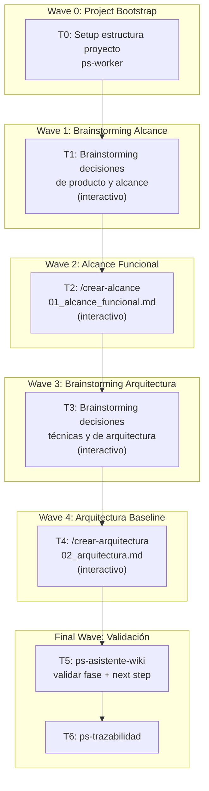

# Plan: Mood Tracker para Pacientes de Psicología/Psiquiatría

## Estado: Investigación completa — Plan listo para ejecución

## Diagnóstico SDD (ps-asistente-wiki)
- **Fase actual:** 0 — Project start (greenfield, nada existe)
- **Start mode:** scope-first (objetivo estable)
- **Siguiente skill:** `/crear-alcance` → genera `01_alcance_funcional.md`
- **Gate de fase 1:** el documento de alcance debe existir, ser estructurado (no brainstorm dump), y cubrir todas las secciones del template
- **Después de fase 1:** `/crear-arquitectura` → `02_arquitectura.md`

---

## Investigación Kickoff (ps-investigar)

### 1. Estándares Clínicos — Escalas de Humor

**NIMH Life Chart Method (LCM-p)** es el estándar clínico validado para charting longitudinal de trastornos afectivos:
- Escala original: **-4 a +4** (donde 0 = eutimia/estado normal)
- 4 niveles de severidad por polo: leve, moderado-bajo, moderado-alto, severo
- La severidad se basa en el **grado de deterioro funcional** asociado al humor
- Validado contra IDS-C (depresión) y YMRS (manía) — correlaciones altas
- Soporta estados mixtos (manía + depresión simultánea)
- Registro diario: humor, sueño, medicación, eventos vitales

**La escala -3 a +3 del usuario** es una simplificación práctica válida:
- Elimina el nivel "severo" (-4/+4) que requiere evaluación clínica
- 3 niveles de cada polo cubren leve/moderado/intenso — suficiente para auto-reporte
- Es más accesible para pacientes sin entrenamiento clínico
- Compatible con el espíritu del NIMH-LCM-p

**Otras escalas relevantes:**
- PHQ-9 (depresión) y GAD-7 (ansiedad): cuestionarios estandarizados, útiles como formularios configurables adicionales
- Escala 0-100 del NIMH (50=equilibrio): alternativa lineal simple
- Young Mania Rating Scale (YMRS): clínica, no auto-reporte

### 2. Apps Existentes — Análisis Competitivo

| App | Fortalezas | Debilidades | Sharing con profesional |
|-----|-----------|-------------|------------------------|
| **eMoods** | Escala bipolar (highs/lows), sueño, medicación, reporte PDF mensual, datos 100% locales | Solo móvil, no web, sin formularios custom | PDF por email al doctor |
| **Daylio** | UX micro-diario excelente, charts bonitos, actividades por íconos | No orientado a clínica, sin escala bipolar, no sharing nativo | Export CSV/charts manual |
| **Bearable** | Tracking holístico (humor+síntomas+estilo de vida), correlaciones automáticas | Complejidad abrumadora, freemium agresivo | Resúmenes semanales/mensuales |
| **MoodChart.co** | Diseñado para psiquiatras, timeline longitudinal clínico | Solo web, sin bot, sin auto-reporte del paciente | Acceso directo del psiquiatra |
| **Moodfit** | PHQ-9/GAD-7 integrados, CBT tools | Más terapia que tracking | Limitado |

**Gaps que nuestro producto puede llenar:**
- **Ninguna app combina web + Telegram bot** para registro
- **Ninguna tiene formularios configurables** por el profesional
- **El sharing es primitivo** (PDF email, CSV export) — no hay acceso en tiempo real seguro
- **Falta modelo multi-tenant** donde el profesional administre pacientes
- **No hay apps en español** diseñadas para el contexto clínico argentino/LATAM

### 3. Regulaciones y Privacidad — Argentina

**Ley 25.326 (Protección de Datos Personales / Habeas Data):**
- Datos de salud son **datos sensibles** — requieren consentimiento expreso, libre e informado
- El consentimiento debe ser documentado por escrito o medio equivalente digital
- Nadie puede ser obligado a proporcionar datos sensibles
- Transferencia solo para fines directamente relacionados con el interés legítimo de ambas partes
- El titular puede ejercer derecho de acceso, rectificación y supresión

**Ley 26.529 (Derechos del Paciente, Historia Clínica, Consentimiento Informado):**
- Historia clínica única por paciente (obligatorio)
- Consentimiento informado para todo acto médico
- Ley 27.706: programa federal de digitalización de historias clínicas

**Ley 26.657 (Salud Mental):**
- Protección especial para datos de salud mental
- Consentimiento informado como derecho fundamental
- Privacidad y confidencialidad reforzadas

**Implicaciones para el diseño:**
- Consentimiento informado digital obligatorio antes del primer registro
- Datos cifrados en reposo y en tránsito
- El paciente controla quién accede y puede revocar en cualquier momento
- Registro de auditoría de cada acceso profesional
- Política de retención y eliminación de datos clara
- No se pueden compartir datos sin consentimiento explícito del paciente

### 4. Compartición Profesional-Paciente — Patrones Seguros

**Patrones encontrados en la industria:**
- **PDF mensual por email** (eMoods): simple pero sin interactividad ni tiempo real
- **Códigos temporales con vencimiento** (smart contracts/blockchain): expiración automática
- **Links con TTL** (como sharing de Google Docs): acceso temporal por URL
- **Acceso delegado con consentimiento** (HIPAA-compliant platforms): el paciente otorga/revoca

**Diseño recomendado (3 niveles):**
1. **Código temporal (público)**: paciente genera código, profesional accede con código + DNI del paciente, vence en X horas/días
2. **Cuenta creada por profesional**: el profesional invita al paciente, el paciente acepta y otorga consentimiento digital, acceso permanente revocable
3. **Export PDF/CSV**: siempre disponible como fallback offline

### 5. Telegram Bots para Salud Mental — Precedentes

**Bots existentes encontrados:**
- **telegram-mood-tracker** (GitHub: twaslowski): tracker configurable, datos locales, integración fluida
- **MindMateBot** (GitHub: taj54): check-ins compasivos, mood tracking, tips de autocuidado
- **MoodTrackerBot** (GitHub: pinae): pregunta 3 veces al día, keyboard optimizado con descripciones numéricas
- **Faino**: creado por psicólogos profesionales, selecciona técnicas apropiadas

**UX que funciona para registro rápido:**
- **Keyboard inline** con opciones de humor (no texto libre)
- **Preguntas secuenciales** cortas (no un formulario largo de golpe)
- **3 registros/día** como frecuencia efectiva
- **Emojis/íconos** para representar estados de ánimo
- **Confirmación visual** inmediata del registro

### 6. Formularios Clínicos Configurables

**Soluciones existentes:**
- **Jotform**: builder de formularios sin código, pero no clínico ni integrado
- **ICANotes**: EHR con 150+ formularios pre-configurados para salud mental
- **Formsort**: templates clínicamente validados (PHQ-9, GAD-7)

**Diseño para nuestro producto:**
- **Form builder simple** para profesionales: campos tipo (escala, sí/no, texto, número, hora)
- **Templates pre-cargados**: mood chart diario, PHQ-9, GAD-7, escala de ansiedad
- **Periodicidad configurable**: diario, semanal, mensual, único (test)
- **Recordatorios automáticos**: push web + mensaje Telegram
- **Scoring automático**: para escalas estandarizadas (PHQ-9, GAD-7)

### 7. Visualización de Datos de Humor

**Tipos de gráficos clínicamente útiles:**
- **Timeline longitudinal** (estilo NIMH-LCM): eje X = días, eje Y = -3 a +3, línea de humor con color por zona
- **Heatmap calendario**: colores por intensidad de humor en vista mensual
- **Correlación sueño-humor**: scatter plot o dual-axis chart
- **Barras de factores**: actividad física, social, medicación como barras apiladas bajo el timeline
- **Resumen mensual PDF**: para compartir con profesional
- **Dashboard del profesional**: vista multi-paciente con alertas

**ChronoRecord** (20 años de uso clínico) confirma que el charting digital longitudinal es superior al papel para detectar patrones.

---

## Fuentes

- [NIMH Life Chart Method - Bipolar Network News](https://www.bipolar-news.org/mood-charting)
- [NIMH-LCM-p Validation - PubMed](https://pubmed.ncbi.nlm.nih.gov/11097079/)
- [NIMH-LCM Self-Rating Validation - BMC Psychiatry](https://bmcpsychiatry.biomedcentral.com/articles/10.1186/1471-244X-14-130)
- [ChronoRecord 20 Years - PMC](https://pmc.ncbi.nlm.nih.gov/articles/PMC10484643/)
- [Best Mood Tracking Apps 2026 - LifeStance Health](https://lifestance.com/blog/best-mood-tracking-apps-therapists-top-choices-2026/)
- [Top Mood Tracker Apps 2026 - Clustox](https://www.clustox.com/blog/mood-tracker-apps/)
- [eMoods Features](https://emoodtracker.com/features)
- [eMoods Compare](https://emoodtracker.com/other-mood-trackers)
- [Ley 25.326 - Argentina.gob.ar](https://www.argentina.gob.ar/justicia/derechofacil/leysimple/datos-personales)
- [Ley 26.529 - Derechos del Paciente](https://www.argentina.gob.ar/normativa/nacional/ley-26529-160432)
- [Privacy in Mental Health Apps - PMC](https://pmc.ncbi.nlm.nih.gov/articles/PMC9643945/)
- [Secure Health Data Sharing - Nature npj Digital Medicine](https://www.nature.com/articles/s41746-025-01945-z)
- [telegram-mood-tracker - GitHub](https://github.com/twaslowski/telegram-mood-tracker)
- [MindMateBot - GitHub](https://github.com/taj54/MindMateBot)
- [MoodChart.co](https://www.moodchart.co/)
- [MoodTrackerBot - GitHub](https://github.com/pinae/MoodTrackerBot)

---

---

## Plan de Trabajo — Fase de Documentación SDD

### Goal
Crear la documentación fundacional (alcance + arquitectura) del proyecto "Humor" siguiendo el flujo SDD canónico, tomando decisiones clave con brainstorming antes de cada documento.

### Architecture
Proyecto greenfield en `C:\repos\mios\humor`. Sigue el patrón SDD del usuario: wiki en `.docs/wiki/` con numeración 01-09+, skills especializados por fase, CLAUDE.md como governance. Stack target: .NET 10 + Next.js 16 + Telegram Bot + PostgreSQL.

### Tech Stack
Documentación: Markdown + Mermaid. Ejecución: Skills SDD (`crear-alcance`, `crear-arquitectura`, `brainstorming`, `ps-asistente-wiki`).

### Context Source
- Proyecto vacío (solo `.git/`)  
- Multi-tedi como referencia de arquitectura (.NET 10 + Next.js 16 + LangGraph + Telegram + PostgreSQL)  
- Investigación kickoff completada (7 ejes: escalas clínicas, apps existentes, regulación AR, sharing, Telegram bots, formularios, visualización)
- Flujo SDD: Fase 0→1→2→3→...→11 con phase gates

### Runtime
CC (Claude Code)

### Available Agents
- `ps-docs` — Documentation specialist (wiki, specs, READMEs, changelogs)
- `ps-worker` — General-purpose execution (file ops, git, config, docs)
- `ps-dotnet10` — .NET 10 microservices
- `ps-next-vercel` — Next.js specialist
- `ps-python` — Python/FastAPI specialist
- `ps-explorer` — Read-only code exploration
- `ps-code-reviewer` — Code review
- `ps-qa-business` — Business impact analysis
- `ps-qa-security` — Security specialist
- `ps-qa-testing` — Testing strategy
- `ps-qa-orchestrator` — QA persistent assistant
- `ps-gap-auditor` — Gap detection (spec vs code)
- `ps-sdd-sync-gen` — SDD auto-generation and sync

### Initial Assumptions
- El proyecto será un repositorio independiente en `C:\repos\mios\humor`, no un módulo dentro de multi-tedi
- La integración con multi-tedi será via capability service protocol (como mis-cals y gastos)
- El MVP cubre el formulario de mood tracking fijo; los formularios configurables son Fase 2

---

## Risks & Assumptions

**Assumptions needing validation:**
- Escala -3 a +3 es suficiente (vs. -4 a +4 del NIMH-LCM) → validar con el usuario en brainstorming
- El profesional crea la cuenta del paciente (vs. self-signup del paciente) → definir en brainstorming
- Los datos se almacenan en servidor propio (no en dispositivo como eMoods) → confirmar con el usuario

**Known risks:**
- Regulación de datos sensibles de salud (Ley 25.326) → diseñar consentimiento informado digital desde el inicio
- Complejidad del form builder configurable → diferir a Fase 2, MVP con formulario fijo
- Integración Telegram puede requerir webhook en HTTPS → resolver en arquitectura

**Unknowns:**
- ¿El proyecto necesita CLAUDE.md + AGENTS.md propios o hereda del workspace? → definir en T0
- ¿Supabase Auth (como multi-tedi) o auth propio? → decidir en brainstorming de arquitectura
- ¿Dominio/subdomain propio o bajo nuestrascuentitas.com? → decidir en brainstorming

---

## Wave Dispatch Map



> **Nota:** Este plan es inherentemente secuencial porque cada fase del SDD depende de la anterior (phase gates). Los brainstormings son interactivos (requieren input del usuario). Las waves se ejecutan una a una.

---

## Task Index

| Task | Wave | Agent/Skill | Descripción | Done When |
|------|------|-------------|-------------|-----------|
| T0 | 0 | `ps-worker` | Setup estructura proyecto + CLAUDE.md | Directorios y archivos base existen |
| T1 | 1 | `/brainstorming` | Decisiones de producto: escala, actores, MVP scope, sharing model | Decisiones documentadas en `.docs/raw/plans/` |
| T2 | 2 | `/crear-alcance` | Documento de alcance funcional | `.docs/wiki/01_alcance_funcional.md` existe y aprobado |
| T3 | 3 | `/brainstorming` | Decisiones técnicas: stack, auth, DB, infra, integración multi-tedi | Decisiones documentadas |
| T4 | 4 | `/crear-arquitectura` | Arquitectura baseline | `.docs/wiki/02_arquitectura.md` existe y aprobado |
| T5 | F | `/ps-asistente-wiki` | Validar fase actual + recomendar siguiente paso | Phase gate pasado |
| T6 | F | `/ps-trazabilidad` | Cierre de trazabilidad documental | Trazabilidad limpia |

---

## Detalle de Tareas

### T0: Setup Estructura del Proyecto (Wave 0)

**Agent:** `ps-worker`

**Crear la estructura base del proyecto en `C:\repos\mios\humor`:**

```
humor/
├── CLAUDE.md                          ← governance para Claude Code
├── AGENTS.md                          ← governance para Codex/agents
├── README.md                          ← descripción del proyecto
├── .docs/
│   ├── wiki/                          ← documentación canónica SDD
│   └── raw/
│       └── plans/                     ← planes de implementación
└── .gitignore
```

**CLAUDE.md debe incluir:**
- Nombre del proyecto: Humor — Mood Tracker Clínico
- Stack: .NET 10 + Next.js 16 + Telegram Bot + PostgreSQL
- Decision Priority: Security > Correctness > Privacy > Usability > Maintainability > Cost
- Flujo SDD referenciado
- Skills registrados

**Done when:** `ls .docs/wiki/ && cat CLAUDE.md` muestra la estructura y el governance.

---

### T1: Brainstorming — Decisiones de Producto y Alcance (Wave 1)

**Skill:** `/brainstorming`

**Decisiones a cerrar (una por una, protocolo brainstorming):**

1. **Escala de humor**: ¿-3 a +3 (7 niveles) o -4 a +4 (9 niveles, NIMH estándar)?
   - Contexto: NIMH usa -4 a +4 con deterioro funcional. La mayoría de apps simplifican a 5-7 niveles.
   
2. **Modelo de actores**: ¿Quién crea la cuenta del paciente?
   - Opción A: El profesional crea la cuenta y envía invitación
   - Opción B: El paciente se registra solo y vincula con código del profesional
   - Opción C: Ambos caminos

3. **MVP scope — formularios**:
   - Opción A: Solo el formulario de mood tracking fijo (MVP)
   - Opción B: Form builder configurable desde el inicio
   
4. **Modelo de sharing profesional-paciente**:
   - Código temporal + DNI (público, con vencimiento)
   - Cuenta vinculada (profesional invita, paciente acepta con consentimiento)
   - Export PDF/CSV (offline)

5. **Canal Telegram — alcance MVP**:
   - Solo registro de humor (keyboard inline rápido)
   - Registro completo (humor + sueño + actividad + medicación)
   - Registro + consulta de gráficos

6. **Nombre del producto**: ¿"Humor"? ¿"MoodTrack"? ¿Otro nombre más clínico/amigable?

**Done when:** Cada decisión documentada con opción elegida y justificación.

---

### T2: Crear Alcance Funcional (Wave 2)

**Skill:** `/crear-alcance`

**Input preparado (respuestas a las preguntas del skill):**

1. **Problema**: Los pacientes de psicología/psiquiatría no tienen una forma estructurada de registrar su estado anímico diario y compartirlo con su profesional. El registro actual es en papel, verbal, o inexistente.
   
2. **Propuesta de valor**: Registro rápido (30 segundos) de humor y factores asociados via web o Telegram, con visualización longitudinal automática y compartición segura con el profesional tratante.

3. **Capacidades principales**: Registro diario, visualización gráfica, gestión paciente-profesional, compartición segura, recordatorios, export.

4. **Actores**: Paciente, Profesional (psicólogo/psiquiatra), Sistema (recordatorios, consolidación).

5. **Áreas funcionales MVP**: Registro de humor, dashboard de visualización, gestión de vínculo profesional-paciente, canal Telegram, consentimiento y privacidad.

6. **Fuera de alcance / roadmap**: Form builder configurable, integración multi-tedi, tests estandarizados (PHQ-9, GAD-7), IA para detección de patrones, app nativa.

**Done when:** `.docs/wiki/01_alcance_funcional.md` existe con todas las secciones del template.

---

### T3: Brainstorming — Decisiones Técnicas y Arquitectura (Wave 3)

**Skill:** `/brainstorming`

**Decisiones a cerrar:**

1. **Project Decision Priority**: Ordenar Security, Privacy, Correctness, Usability, Maintainability, Performance, Cost, Time-to-market

2. **Autenticación**: ¿Supabase Auth (como multi-tedi/gastos) o auth propio?
   - Contexto: Supabase ya está desplegado en `auth.tedi.nuestrascuentitas.com`

3. **Base de datos**: ¿PostgreSQL dedicada o schema dentro de DB compartida?

4. **Arquitectura de servicios**: ¿Monolito modular (1 API) o microservicios separados (como multi-tedi)?
   - Contexto: Multi-tedi tiene Control Plane + Conversation Fabric + Runtime. Para humor, ¿es necesario?

5. **Integración futura con multi-tedi**: ¿Capability service protocol (manifest + request/result/event envelopes) o API REST simple?

6. **Infra y deploy**: ¿Mismo VPS Dokploy (`54.37.157.93`) o VPS separado?

7. **Dominio**: ¿`humor.nuestrascuentitas.com`? ¿Dominio propio?

**Done when:** Decisiones documentadas, Project Decision Priority definido.

---

### T4: Crear Arquitectura Baseline (Wave 4)

**Skill:** `/crear-arquitectura`

Depende de: T2 (alcance aprobado) + T3 (decisiones técnicas cerradas)

El skill ejecuta su propio protocolo de 5 pasos:
1. Step 0: Project Decision Priority (ya cerrado en T3)
2. Step 1: Leer 01_alcance_funcional.md
3. Step 2: Brainstorming de decisiones de alto impacto (complementario a T3)
4. Step 3: Redactar documento
5. Step 4: Agregar sección "Insumos para FL"
6. Step 5: Quality gate

**Done when:** `.docs/wiki/02_arquitectura.md` existe con todas las secciones del template.

---

### T5: Validación con ps-asistente-wiki (Final Wave)

**Skill:** `/ps-asistente-wiki`

Verificar:
- ¿Fase 1 (alcance) completada correctamente?
- ¿Fase 2 (arquitectura) completada correctamente?
- ¿Phase gates pasados?
- ¿Cuál es el siguiente paso recomendado? (debería ser `/crear-flujo`)

**Done when:** Diagnóstico del asistente wiki confirma fases 1-2 completas y recomienda siguiente paso.

---

### T6: Trazabilidad (Final Wave)

**Skill:** `/ps-trazabilidad`

- Verificar que 01_alcance_funcional.md y 02_arquitectura.md son consistentes entre sí
- Verificar que las decisiones del brainstorming están reflejadas en los documentos
- Verificar que CLAUDE.md está actualizado con el Project Decision Priority

**Done when:** Trazabilidad limpia, sin gaps.
