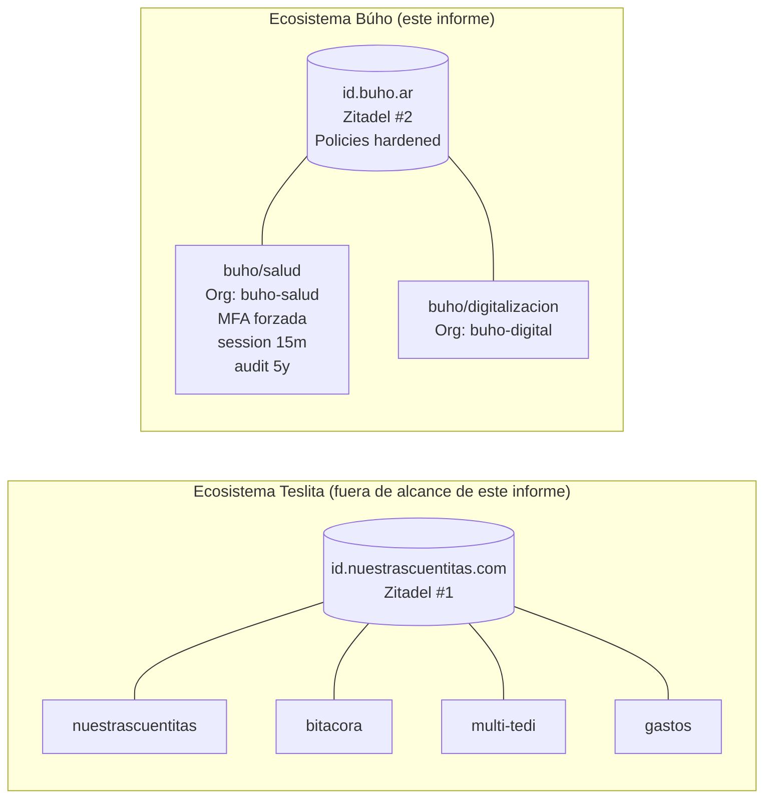

# Informe técnico-estratégico — Migración IdP Zitadel · ecosistema Búho / producto buho/salud

**Audiencia:** equipo de desarrollo y compliance de `C:\repos\buho\salud` (sin contexto previo de la sesión de brainstorming 2026-04-17).
**Emisor:** sesión arquitectónica en proyecto Bitácora (`C:\repos\mios\humor`).
**Fecha:** 2026-04-17.
**Estado del documento:** decisiones arquitectónicas lockeadas; detalles de stack buho/salud pendientes de confirmación local.
**Clasificación de sensibilidad:** datos de salud mental bajo Ley 25.326, 26.529 y 26.657 — tratar como información crítica durante el ciclo de vida del proyecto.

---

## 1. Resumen ejecutivo

El ecosistema Búho (buho/salud, buho/digitalizacion) migra su autenticación a una instancia dedicada y self-hosted de Zitadel publicada en `id.buho.ar` (subdominio definitivo a lockear por infra). Es una instancia **separada** de la que corre el ecosistema Teslita (nuestrascuentitas.com, bitacora, multi-tedi, gastos) en `id.nuestrascuentitas.com`. El split obedece a la rigurosidad de compliance de buho/salud: separar el IdP simplifica radicalmente el audit externo bajo Ley 26.657, minimiza el blast radius de cualquier incidente cruzado, y habilita políticas de endurecimiento (MFA forzada, session 15 min, retención de audit 5 años, IP allowlist, passkeys) sin contaminar a productos consumer menos sensibles. La migración se ejecuta en dos olas: Wave D stand-up del IdP (1-2 días) y Wave E migración de buho/salud con DPIA y pentest externo obligatorio (5-8 días). Este documento es self-contained: explica qué, por qué, cómo, y qué tiene que validar cada stakeholder antes del go-live.

## 2. Contexto y hook

Hoy (2026-04-17) el ecosistema Búho no tiene un IdP unificado. Cada producto resuelve auth por su cuenta, con el patrón habitual en startups: una instancia de Supabase Auth / GoTrue per-app, o integración directa con un proveedor SaaS. Ese patrón sufre por duplicación operacional (SMTP × N, audit trail × N, upgrades × N) y hace imposible dar una respuesta única a una pregunta de auditoría tipo "¿quién accedió al registro clínico del paciente X y desde dónde?". Mientras Búho era un solo producto, no importaba. Hoy buho/salud crece en criticidad (salud mental) y buho/digitalizacion entra al roadmap — el momento de unificar es antes de que los silos se arraiguen.

La decisión arquitectónica se tomó en una sesión de brainstorming ejecutada el 2026-04-17 desde el proyecto Bitácora, con análisis comparativo de 10+ candidatos (Zitadel, Keycloak, Authentik, Logto, Ory, WorkOS, Clerk, Auth0, Firebase Auth, SuperTokens) ponderados por: multi-tenancy nativa, costo, data residency argentina, compliance HIPAA-equivalent, carga operacional y escape hatch a SaaS. El ganador absoluto para Búho fue **Zitadel self-hosted**. Los detalles del análisis y la decisión completa viven en el design doc canónico:

- `C:\repos\mios\humor\.docs\raw\plans\2026-04-17-idp-zitadel-multi-ecosistema-design.md`

Este informe extrae lo que buho/salud necesita para ejecutar.

## 3. Decisiones lockeadas (no reabrir sin evidencia técnica nueva)

| # | Decisión | Justificación primaria |
|---|----------|------------------------|
| D1 | **Stack IdP:** Zitadel self-hosted (Go + Postgres, Apache 2.0). | Multi-tenancy nativa (Organizations/Projects), audit log granular de grado HIPAA, footprint bajo (<512 MB RAM), sin vendor lock-in. |
| D2 | **Dos instancias separadas** — una por ecosistema. | Aislamiento legal (DPIA Búho/salud circunscrito), aislamiento de blast radius, políticas independientes. |
| D3 | **Instancia Búho:** `id.buho.ar` (subdominio a lockear por infra). Postgres dedicada. | Data residency argentina verificable; audit log propio; sin cross-polinación con Teslita. |
| D4 | **Protocolo:** OIDC + PKCE para SPAs/apps; JWT RS256 asimétrico con JWKS para resource servers. | Clave simétrica Supabase actual (`SUPABASE_JWT_SECRET` compartido) queda retirada — un leak deja de ser crítico global. |
| D5 | **Sin SSO cross-ecosistema.** Un usuario de Teslita NO ve sus sesiones en Búho y viceversa. | Minimización de datos: un paciente no necesita saber que existe su usuario Teslita. |
| D6 | **buho/salud corre en una Organization propia** dentro de Zitadel #2, con policies hardened. | Separación administrativa frente a buho/digitalizacion y cualquier futuro producto Búho. |

## 4. Topología objetivo



**Qué leer en este diagrama:** el carril Teslita existe solo como referencia comparativa. Nada lo cruza con Búho. La instancia Zitadel #2 sirve únicamente a los productos Búho, y buho/salud vive en una Organization con políticas estrictamente más duras que buho/digitalizacion.

## 5. Políticas diferenciadas para buho/salud

El producto buho/salud procesa datos clínicos de salud mental. Por norma, la Organization `buho-salud` dentro de Zitadel #2 aplica este set mínimo **no negociable** de políticas. Cada política se traduce a una setting concreta en la administración Zitadel:

| Política | Valor | Setting Zitadel | Justificación |
|----------|-------|-----------------|---------------|
| MFA forzada | TOTP o passkey obligatorio | `Login Policy → Force MFA = true`, `MFA Factors = TOTP + WebAuthn (passkey)` | Ley 26.657 y estándar ISO 27001 para datos clínicos |
| Session lifetime | Access token 15 min · Refresh 24h | `OIDC App → Token Settings` | Reduce ventana de exposición en endpoints clínicos |
| Audit log retention | 5 años | Export automático a S3/Backblaze append-only + purge off | Ley 26.529 retención de registros clínicos |
| Password complexity | 14 caracteres mínimo + breach check (HIBP) | `Password Complexity Policy` + `HIBP integration = on` | OWASP ASVS L2 para datos sensibles |
| Passwordless (passkeys) | Habilitado y preferido | `Login Policy → Passkeys = preferred` | Reducción de superficie de phishing |
| OAuth Google | Permitido | `Identity Provider → Google` (con verified domain corporativo) | UX sin costo de seguridad (email verificado by-default) |
| Magic-link | **Deshabilitado** | `Login Policy → Magic-link = off` | Flujo clínico no tolera pérdida de email; magic-link en dispositivo comprometido = hijack |
| IP allowlist admin UI | Rango VPN corporativa | `Security Policy → Admin UI IP allowlist` | La admin UI toca a todos los usuarios; nunca público |
| Alert webhook | 3 logins fallidos consecutivos → webhook a incident response | `Notification Providers → Webhook` | Detección temprana de credential stuffing |
| Sesión concurrente | Máximo 2 dispositivos activos | `Session Policy → Max concurrent = 2` | Detecta sharing no autorizado de credenciales clínicas |
| User lockout | 5 intentos fallidos → lockout 30 min | `Lockout Policy` | Mitigación brute force |

**Interpretación:** estas políticas son el **baseline** mínimo. Si el DPIA (ver §7) identifica controles adicionales, se suben acá. Nunca se bajan sin aprobación explícita del responsable legal.

## 6. Plan de migración

### Wave D — Stand-up de Zitadel #2 (estimación: 1-2 días)

| Paso | Responsable | Pre-req | Output |
|------|------------|---------|--------|
| D1. Lockear DNS definitivo (ej. `id.buho.ar` o subdominio equivalente) | Infra + legal | Decisión de dominio | Registro A/AAAA propagado |
| D2. Provisionar Postgres 15+ dedicada en el VPS (Dokploy) | Infra | Capacidad VPS | DB `zitadel_buho` con superuser `zitadel` |
| D3. Deploy Zitadel v2.latest vía docker-compose Dokploy | Infra | Postgres + DNS | UI admin respondiendo en HTTPS (Let's Encrypt auto) |
| D4. Config SMTP saliente (proveedor a elegir: Resend, Postmark, AWS SES) | Infra | Dominio verificado + DKIM + SPF | Test email recibido en inbox admin |
| D5. Crear Organizations: `buho-salud` y `buho-digitalizacion` | Admin Zitadel | D3 | IDs de Org anotados |
| D6. Aplicar policies hardened a `buho-salud` (§5) | Admin Zitadel | D5 | Screenshots de cada policy como evidencia |
| D7. Crear user admin inicial (MFA obligatoria desde primer login) | Admin Zitadel | D6 | Credenciales en mi-key-cli / Infisical |
| D8. Smoke test: login admin, creación user test, export audit log, revocación user test | QA | D7 | Artifact `artifacts/e2e/zitadel-d8-smoke.md` |

**Exit criteria Wave D:** smoke test D8 verde, policy sheet firmado por responsable de seguridad.

### Wave E — Migración buho/salud (estimación: 5-8 días + pentest)

> **Wave E no puede arrancar sin Wave D cerrado y firmado.** Tampoco puede cerrar sin DPIA y sin pentest externo positivo.

| Paso | Responsable | Pre-req | Output |
|------|------------|---------|--------|
| E0. Redactar DPIA (ver §7) | Legal + lead dev | Wave D | Documento DPIA firmado |
| E1. Explorar stack actual de buho/salud (frontend + backend) | Lead dev | Wave D | Reporte `auth-surface` del repo `buho/salud` |
| E2. Decidir librería OIDC cliente según stack (ver §8 para el discovery) | Lead dev | E1 | ADR con elección librería |
| E3. Refactor backend: reemplazar validación JWT simétrica (si la hay) por Bearer + JWKS RS256 de Zitadel | Backend | E2 | PR con diff + tests unitarios |
| E4. Refactor frontend: reemplazar cliente Supabase Auth por OIDC PKCE client | Frontend | E2 | PR con diff + flujos login/logout funcionales |
| E5. Migración de usuarios existentes (script) | Backend + datos | E3 + E4 | Script idempotente + usuarios en Zitadel, foreign keys preservadas |
| E6. Update wiki (`02_arquitectura.md`, `09_contratos/CT-AUTH.md`, `07_baseline_tecnica.md`) | Docs | E3 + E4 | Commits en wiki |
| E7. QA E2E: login Google + login password + logout + MFA enforcement + audit export | QA | E3..E5 | Suite Playwright verde |
| E8. **Pentest externo** contratado (alcance: Zitadel #2 + endpoints buho/salud auth-protegidos) | Seguridad externa | E7 | Reporte pentest con severity ratings |
| E9. Resolver cualquier hallazgo P0/P1 del pentest | Dev + seguridad | E8 | Re-test positivo |
| E10. Go-live con feature flag (si la plataforma lo permite) | Devops | E9 | Rollout progresivo 10% → 50% → 100% con monitoring |
| E11. Desmontaje de auth anterior + rotación de secrets | Infra | E10 | Supabase Auth de buho/salud apagado, secrets viejos revocados |

**Exit criteria Wave E:** pentest positivo (sin P0/P1 abiertos), DPIA firmado, audit export funcionando, Supabase Auth apagado.

## 7. DPIA (Data Protection Impact Assessment) — obligatorio

El DPIA es obligatorio bajo Ley 25.326 cuando se cambia un sistema que procesa datos sensibles. Debe cubrir:

1. **Descripción del tratamiento:** qué datos toca buho/salud (PII clínica + historia clínica + registros de humor), qué hace el IdP con ellos (autenticación, sesión, audit).
2. **Mapeo de flujos de datos:** diagrama de dónde entra el dato, por dónde pasa, dónde se guarda, dónde se elimina.
3. **Evaluación de necesidad y proporcionalidad:** por qué Zitadel self-hosted es la opción mínima suficiente (justificación vs. alternativas SaaS).
4. **Riesgos para los derechos y libertades:** incluir al menos: phishing, credential stuffing, session hijack, compromiso de IdP, fuga de audit log.
5. **Medidas para mitigar cada riesgo:** mapear a las políticas de §5. Cada riesgo debe tener al menos una mitigación.
6. **Consulta con el responsable de protección de datos (DPO):** firma formal.
7. **Fecha de revisión:** el DPIA se revisa anualmente y ante cada cambio mayor.

Persistir el DPIA en `C:\repos\buho\salud\.docs\wiki\compliance\2026-04-DPIA-idp-migracion.md` (o la convención que use buho/salud).

## 8. Impacto en el stack backend — validación JWT con JWKS

Zitadel emite JWTs **RS256 asimétricos**. El backend de buho/salud debe:

1. Configurar el `Authority` (issuer) apuntando a `https://id.buho.ar/<project-id>` (o el path correspondiente según config Zitadel).
2. Usar la biblioteca nativa del stack para validar el token contra el JWKS publicado en `{Authority}/oauth/v2/keys`.
3. No cachear claves manualmente — la biblioteca estándar maneja rotación automática.
4. Mapear el claim `urn:zitadel:iam:org:project:role:{roleKey}` al modelo de rol local.

### Discovery obligatorio (preguntas al equipo buho/salud)

Antes de escribir código, la sesión que ejecute Wave E-E3 debe confirmar:

- **¿Qué stack corre el backend?** .NET (ASP.NET Core)? Python (FastAPI)? Node (Express/NestJS)? Go?
- **¿Cómo se valida hoy el JWT?** Simétrico Supabase (`HS256` con `SUPABASE_JWT_SECRET`)? Otro?
- **¿Existe un módulo de auth ya aislado** o hay lógica esparcida por controllers?

### Patrones de referencia (usar el que corresponda al stack confirmado)

**Si es ASP.NET Core (.NET):** patrón equivalente al de Bitácora.Api, con diferencia clave de `Authority` y tipo de firma.

```csharp
// Program.cs — adaptación recomendada cuando Wave E-E3 confirme stack .NET
builder.Services.AddAuthentication(JwtBearerDefaults.AuthenticationScheme)
    .AddJwtBearer(options =>
    {
        options.Authority = builder.Configuration["Zitadel:Authority"]; // https://id.buho.ar/<project-id>
        options.Audience = builder.Configuration["Zitadel:Audience"];   // ClientId de la app buho/salud
        options.RequireHttpsMetadata = true;
        options.MapInboundClaims = false;
        options.TokenValidationParameters.ValidateIssuer = true;
        options.TokenValidationParameters.ValidateAudience = true;
        options.TokenValidationParameters.ValidateLifetime = true;
        options.TokenValidationParameters.ClockSkew = TimeSpan.FromSeconds(30);
    });
```

**Si es Python FastAPI:** usar `python-jose` + fetch dinámico de JWKS, o `authlib`. Patrón:

```python
# auth.py — adaptación recomendada cuando Wave E-E3 confirme stack FastAPI
from authlib.integrations.starlette_client import OAuth
from jose import jwt
import httpx

ZITADEL_ISSUER = os.environ["ZITADEL_AUTHORITY"]
ZITADEL_AUDIENCE = os.environ["ZITADEL_AUDIENCE"]

_jwks_cache = None  # manejar con TTL real en implementacion final

async def get_jwks():
    global _jwks_cache
    if _jwks_cache is None:
        async with httpx.AsyncClient() as client:
            resp = await client.get(f"{ZITADEL_ISSUER}/oauth/v2/keys")
            _jwks_cache = resp.json()
    return _jwks_cache

async def validate_token(token: str) -> dict:
    jwks = await get_jwks()
    return jwt.decode(
        token,
        jwks,
        algorithms=["RS256"],
        audience=ZITADEL_AUDIENCE,
        issuer=ZITADEL_ISSUER,
    )
```

**Si es Node (Express/NestJS):** `express-jwt` + `jwks-rsa`. Patrón:

```typescript
// middleware/auth.ts — adaptación recomendada cuando Wave E-E3 confirme stack Node
import { expressjwt } from 'express-jwt';
import jwksRsa from 'jwks-rsa';

export const requireAuth = expressjwt({
  secret: jwksRsa.expressJwtSecret({
    cache: true,
    rateLimit: true,
    jwksUri: `${process.env.ZITADEL_AUTHORITY}/oauth/v2/keys`,
  }),
  audience: process.env.ZITADEL_AUDIENCE,
  issuer: process.env.ZITADEL_AUTHORITY,
  algorithms: ['RS256'],
});
```

> **Nota clave:** los tres patrones son **ilustrativos**. El equipo buho/salud debe adaptarlos a su versión exacta de librería y al shape real de sus controllers/handlers. No hacer copy-paste sin revisar.

### Frontend (OIDC PKCE client)

Independiente del stack backend, el frontend usa **`oidc-client-ts`** (preferido sobre alternativas) si es React/Next.js/Vue/SPA convencional, o el cliente OIDC nativo si es nativo móvil. Config típica:

```ts
import { UserManager } from 'oidc-client-ts';

export const userManager = new UserManager({
  authority: process.env.NEXT_PUBLIC_ZITADEL_AUTHORITY!,
  client_id: process.env.NEXT_PUBLIC_ZITADEL_CLIENT_ID!,
  redirect_uri: `${window.location.origin}/auth/callback`,
  post_logout_redirect_uri: window.location.origin,
  response_type: 'code',
  scope: 'openid profile email offline_access',
  automaticSilentRenew: true,
  loadUserInfo: true,
});
```

## 9. Compliance argentino — checklist accionable

### Ley 25.326 (Protección de Datos Personales)

- [ ] DPIA redactado y firmado (§7).
- [ ] Consentimiento informado para el procesamiento de PII documentado por paciente, versionado.
- [ ] Contrato de encargado de tratamiento con proveedor SMTP (Resend/SES/Postmark).
- [ ] Los logs de acceso no contienen PII en claro — sólo pseudonym_id (ya patrón interno del ecosistema Búho).
- [ ] Derecho al olvido implementado: desactivar usuario en Zitadel + anonimizar registros clínicos + destrucción de claves.
- [ ] Notificación al Registro Nacional de Protección de Datos Personales si aplica.

### Ley 26.529 (Derechos del paciente)

- [ ] Retención de historia clínica 10 años desde último asiento (buho/salud DB). El audit log Zitadel retiene 5 años y es complementario.
- [ ] Acceso del paciente a su historia: endpoint de export autenticado + auditado.
- [ ] Consentimiento informado explícito previo al primer registro clínico.
- [ ] Revocación de consentimiento → bloquea nuevos registros sin eliminar historia previa (consulta legal).

### Ley 26.657 (Salud Mental)

- [ ] Confidencialidad reforzada: rol `professional` con CareLink explícito para acceder a datos de paciente (patrón Bitácora).
- [ ] Registro de acceso profesional → audit log con `actor_id`, `patient_id`, `trace_id`.
- [ ] Alertas en casos de crisis (mood_score = -3 o equivalente) con protocolo de escalamiento documentado.
- [ ] Política explícita de retención para casos de crisis: mínimo 5 años con destrucción posterior por anonimización.

## 10. Dependencias infra (pre-Wave D)

| Dependencia | Estado hoy | Responsable | Bloqueante de |
|-------------|-----------|-------------|---------------|
| DNS `id.buho.ar` (o subdominio) | No configurado | Infra | Wave D |
| VPS con al menos 2 vCPU + 4 GB RAM libre (Dokploy) | Confirmar capacidad | Infra | Wave D |
| Postgres 15+ dedicada | No creada | Infra | Wave D |
| TLS (Let's Encrypt vía Traefik/Dokploy) | Automático cuando DNS resuelve | Infra | Wave D |
| SMTP proveedor elegido (recomendado: Resend, $0 free tier 3k mails/mes + DKIM auto) | No contratado | Infra + legal | Wave D |
| Dominio verificado + DKIM + SPF + DMARC | No configurado | Infra | Wave D (SMTP) |
| VPN corporativa o rango IP fijo para admin UI allowlist | Confirmar | Infra | Wave D policies |
| Bucket S3 / Backblaze append-only para audit export | No provisionado | Infra | Wave E (go-live) |
| Contrato pentest externo | No contratado | Compras | Wave E-E8 |

## 11. Criterios de aceptación go-live

Antes de routear tráfico real de pacientes al nuevo IdP:

1. Smoke test Wave D verde, artifact en repo.
2. DPIA firmado por DPO y legal.
3. Tests E2E de auth (login password, login Google, logout, MFA enforcement, refresh token, session timeout de 15 min verificado con reloj) pasando al 100%.
4. Pentest externo sin hallazgos P0/P1 abiertos. P2 documentados con plan de mitigación y timeline.
5. Audit export funcionando hacia bucket append-only (probado con retention policy automática).
6. Runbook de incidentes auth publicado en wiki buho/salud: qué hacer si Zitadel cae, cómo rotar secrets, cómo forzar logout global.
7. Monitoring configurado: alertas sobre error rate de login, tiempos de respuesta JWKS, queue length de SMTP.
8. Playbook de soporte para el equipo clínico: qué decir si un paciente no puede loguearse.
9. Secrets rotados (cualquier clave `SUPABASE_JWT_SECRET` o similar heredada queda destruida y fuera de todo sistema operativo).
10. Rollback plan (§12) revisado y ensayado al menos una vez en staging.

## 12. Plan de rollback — pentest bloqueante o incidente post go-live

Si el pentest de Wave E-E8 encuentra un hallazgo P0/P1 que no se puede mitigar en la ventana del sprint, o si post go-live aparece un incidente crítico:

| Paso | Acción | Tiempo objetivo |
|------|--------|-----------------|
| R1 | Activar feature flag "auth_provider = legacy" si se implementó (E10). Tráfico vuelve al IdP anterior sin deploy. | < 5 min |
| R2 | Si no hay feature flag: revertir deploy del frontend + backend al último tag pre-migración. | < 30 min |
| R3 | Notificar al equipo clínico y legal. Documentar incidente con `trace_id` y evidencia. | < 1 h |
| R4 | Mantener Zitadel #2 corriendo pero sin tráfico real (para preservar audit log para forense). | Inmediato |
| R5 | Root-cause analysis obligatorio antes de re-intentar. | < 72 h |
| R6 | Re-pentest si el hallazgo involucraba superficie de Zitadel #2 directamente. | Antes de segundo go-live |

**Condición de muerte del plan:** si durante tres semanas consecutivas el equipo no logra cerrar un rollback sin introducir bugs nuevos, escalar al Steering Committee para reevaluar la decisión D1 (stack IdP).

## 13. Preguntas abiertas al equipo buho/salud

Responder antes de arrancar Wave E:

1. ¿Cuál es el stack concreto del backend y frontend? (.NET / FastAPI / Node / Go; React / Next.js / Vue / otro)
2. ¿Hay usuarios existentes en producción? Si sí, ¿cuántos y dónde viven (Supabase Auth, DB propia, otro)?
3. ¿Qué proveedor SMTP prefieren — Resend, Postmark, AWS SES, otro? Criterios: DKIM automático, volumen mensual esperado, presencia legal en Argentina.
4. ¿Qué dominio exacto se usa para el IdP? (`id.buho.ar`, `auth.buho.ar`, `iam.buho.ar` u otro)
5. ¿Existe ya un DPO designado? Si no, ¿quién lo va a ser para este DPIA?
6. ¿Hay un contrato marco con algún proveedor de pentest o hay que contratarlo desde cero?
7. ¿El VPS actual es el mismo que hostea a Bitácora (54.37.157.93) o Búho corre en infra separada?

## 14. Referencias y enlaces

- **Design doc canónico** (lectura obligatoria para contexto arquitectónico completo): `C:\repos\mios\humor\.docs\raw\plans\2026-04-17-idp-zitadel-multi-ecosistema-design.md`
- **Zitadel docs:** https://zitadel.com/docs
- **Zitadel GitHub:** https://github.com/zitadel/zitadel
- **OIDC core spec:** https://openid.net/specs/openid-connect-core-1_0.html
- **oidc-client-ts:** https://github.com/authts/oidc-client-ts
- **Prompt paste-ready para explorar multi-tedi y gastos (ecosistema Teslita):** `C:\repos\mios\humor\.docs\raw\prompts\2026-04-17-migracion-idp-zitadel-teslita-a-multitedi-y-gastos.md`

## 15. Cierre y próxima acción

Este informe cierra la fase de alineación estratégica. El siguiente paso accionable es que **alguien del equipo buho/salud confirme las preguntas abiertas de §13** y agende Wave D con infra. Una vez arrancada Wave D, la sesión técnica que ejecute Wave E debe usar este informe como input, ejecutar un discovery en el repo (siguiendo el patrón del prompt Teslita para multi-tedi y gastos), y producir un plan detallado bajo `.docs/raw/plans/` específico de buho/salud antes de tocar código de producción.

---

**Control de cambios:**

| Versión | Fecha | Autor | Cambio |
|---------|-------|-------|--------|
| 1.0 | 2026-04-17 | Sesión Bitácora (Claude) | Versión inicial, decisiones lockeadas en brainstorming del día. |
