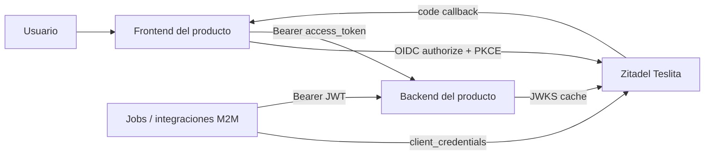

# Handoff técnico — IdP compartido Zitadel Teslita

**Fecha:** 2026-04-19  
**Audiencia:** equipos de `nuestrascuentitas`, `bitacora`, `multi-tedi` y `gastos`  
**Estado:** listo para integración de productos. Wave A cerrada GREEN.  
**Contrato fuente:** `.docs/wiki/09_contratos/CT-AUTH-ZITADEL.md`

## 1. Qué está listo

Teslita ya tiene un IdP compartido self-hosted con Zitadel v4.9.0 en:

```text
https://id.nuestrascuentitas.com
```

El IdP está operativo para:

- Login interactivo de usuarios con OIDC Authorization Code + PKCE.
- Validación backend de JWT firmados RS256 vía JWKS.
- Flujos M2M con `client_credentials` usando machine users.
- SMTP transaccional con DKIM/SPF verificados.
- Backup diario con snapshot de volumen Docker + copia offsite.
- Login UI v2 en la misma instancia.

Wave A dejó cerrados los gaps G1..G7 con evidencia en `artifacts/e2e/2026-04-19-cerrar-gaps-wave-a/README.md`.

## 2. Alcance y límites

Este documento explica cómo un producto Teslita debe consumir el IdP. No es un runbook de operación interna de Zitadel.

Límites explícitos:

- No regenerar `ZITADEL_MASTERKEY`.
- No crear secrets en `.env` como fuente primaria. Todo secret va a Infisical vía `mi-key-cli`.
- No apagar el auth anterior de un producto hasta completar su wave de migración y rollback.
- No reutilizar bases de datos de aplicaciones para Zitadel.
- No usar tags Docker `latest`.
- No exponer Postgres de Zitadel hacia Internet.

## 3. Arquitectura de integración



Contrato práctico:

- El frontend inicia sesión contra `authorization_endpoint`.
- El frontend intercambia `code` por tokens usando PKCE.
- El backend acepta `Authorization: Bearer <access_token>`.
- El backend valida `iss`, `aud`, `exp`, firma RS256 y `kid` vía JWKS.
- Las integraciones server-to-server usan machine users, no credenciales humanas.

## 4. Endpoints OIDC

| Uso | URL |
|-----|-----|
| Discovery | `https://id.nuestrascuentitas.com/.well-known/openid-configuration` |
| Issuer | `https://id.nuestrascuentitas.com` |
| Authorization | `https://id.nuestrascuentitas.com/oauth/v2/authorize` |
| Token | `https://id.nuestrascuentitas.com/oauth/v2/token` |
| UserInfo | `https://id.nuestrascuentitas.com/oidc/v1/userinfo` |
| JWKS | `https://id.nuestrascuentitas.com/oauth/v2/keys` |
| Introspection | `https://id.nuestrascuentitas.com/oauth/v2/introspect` |
| Revocation | `https://id.nuestrascuentitas.com/oauth/v2/revoke` |
| End session | `https://id.nuestrascuentitas.com/oidc/v1/end_session` |

Smoke mínimo antes de integrar:

```bash
curl -sS -o /dev/null -w "%{http_code}\n" \
  https://id.nuestrascuentitas.com/.well-known/openid-configuration

curl -sS -o /dev/null -w "%{http_code}\n" \
  https://id.nuestrascuentitas.com/oauth/v2/keys
```

Ambos deben devolver `200`.

## 5. Organizaciones y clients

| Org | orgId | projectId | Web clientId | M2M clientId |
|-----|-------|-----------|--------------|--------------|
| `nuestrascuentitas` | `369304228570661222` | `369306314246979942` | `369306318709784934` | `nuestrascuentitas-api-client` |
| `bitacora` | `369305924310925670` | `369306332534145382` | `369306336963330406` | `bitacora-api-client` |
| `multi-tedi` | `369305928773665126` | `369306350636761446` | `369306355065946470` | `multi-tedi-api-client` |
| `gastos` | `369305933253181798` | `369306369645347174` | `369306374074597734` | `gastos-api-client` |

Los redirect URIs reales se configuran por producto durante su wave de integración. No asumir que los placeholders actuales son suficientes para producción.

## 6. Variables recomendadas por producto

Cada producto debería consumir estas variables desde Infisical:

```text
ZITADEL_ISSUER=https://id.nuestrascuentitas.com
ZITADEL_ORG=<org-slug>
ZITADEL_ORG_ID=<org-id>
ZITADEL_PROJECT_ID=<project-id>
ZITADEL_WEB_CLIENT_ID=<web-client-id>
ZITADEL_WEB_REDIRECT_URI=<frontend-callback-url>
ZITADEL_WEB_POST_LOGOUT_REDIRECT_URI=<frontend-logout-url>
ZITADEL_API_AUDIENCE=<project-id-or-api-audience>
ZITADEL_M2M_CLIENT_ID=<machine-client-id>
ZITADEL_M2M_CLIENT_SECRET=<from-Infisical-only>
```

Secret naming ya reservado en Infisical:

```text
ZITADEL_CLIENT_<ORG>_WEB_CLIENT_ID
ZITADEL_CLIENT_<ORG>_WEB_REDIRECT_URIS
ZITADEL_CLIENT_<ORG>_API_CLIENT_ID
ZITADEL_CLIENT_<ORG>_API_SECRET
```

Ejemplo:

```bash
bash "$HOME/.claude/skills/mi-key-cli/scripts/mkey.sh" pull bitacora prod
```

Nunca commitear tokens, JWTs completos, PATs ni client secrets en evidencia.

## 7. Frontend: OIDC + PKCE

Requisitos:

- Usar Authorization Code + PKCE.
- Usar `openid profile email` como scopes mínimos.
- Guardar tokens en un storage acorde al threat model del producto.
- Emitir una cookie o sesión propia del producto si el middleware server-side necesita proteger rutas.
- No depender de Supabase-specific claims en nuevas rutas.

Configuración conceptual:

```text
authority: https://id.nuestrascuentitas.com
client_id: <ZITADEL_WEB_CLIENT_ID>
redirect_uri: https://<producto>/auth/callback
post_logout_redirect_uri: https://<producto>/
response_type: code
scope: openid profile email
```

Cada frontend debe registrar en Zitadel:

- Redirect URI exacto de producción.
- Redirect URI local si habrá smoke local.
- Post logout redirect URI.
- Allowed origins si el SDK lo requiere.

## 8. Backend: validación JWT

Validaciones obligatorias:

- `iss == https://id.nuestrascuentitas.com`
- Firma RS256 válida contra `jwks_uri`.
- `exp` e `nbf` válidos.
- `aud` coincide con el `projectId` o audience definido del producto.
- `sub` se trata como identificador estable de Zitadel.
- El rol se deriva de claims de proyecto, no de metadata heredada de otro IdP.

Claims relevantes:

| Claim | Uso |
|-------|-----|
| `sub` | id estable de usuario en Zitadel |
| `email` | email de identidad |
| `email_verified` | estado de verificación |
| `preferred_username` | username mostrado |
| `urn:zitadel:iam:org:id` | organización del usuario |
| `urn:zitadel:iam:org:project:roles` | roles por proyecto/org |

Los backends deben mantener compatibilidad dual solo durante la ventana de migración acordada. Después del cutover, retirar validación del IdP anterior y secrets heredados.

## 9. M2M: client_credentials

Los productos que tengan jobs, CI o backends internos deben pedir tokens M2M con machine user:

```bash
curl -sS -X POST "https://id.nuestrascuentitas.com/oauth/v2/token" \
  -H "Content-Type: application/x-www-form-urlencoded" \
  -d "grant_type=client_credentials" \
  -d "client_id=$ZITADEL_M2M_CLIENT_ID" \
  -d "client_secret=$ZITADEL_M2M_CLIENT_SECRET" \
  -d "scope=openid profile email"
```

Aceptación:

- HTTP `200`.
- `token_type` = `Bearer`.
- JWT con header `alg=RS256`.
- JWT con `kid` presente.
- Backend receptor valida el token igual que un access token interactivo, ajustando audience y roles.

## 10. Migración desde auth existente

Patrón recomendado por producto:

1. Agregar soporte dual detrás de feature flag.
2. Registrar redirect URIs reales en Zitadel.
3. Crear smoke users o migrar usuarios controlados.
4. Validar login, logout, refresh, rutas protegidas y roles.
5. Hacer rollout gradual.
6. Mantener rollback al IdP anterior hasta estabilizar.
7. Retirar secrets y DNS heredados al cierre de la wave del producto.

Para Bitácora, Supabase Auth sigue activo hasta que Wave B cierre. No apagarlo desde otros proyectos ni desde tareas de documentación.

## 11. Smoke checklist por producto

Antes de declarar una integración GREEN:

- Discovery `200`.
- JWKS `200`.
- Login real llega a `/ui/v2/login` y vuelve al callback del producto.
- Callback intercambia `code` por tokens.
- Backend acepta token Zitadel y rechaza token inválido.
- Roles se resuelven desde claims Zitadel.
- Logout limpia sesión local y, si aplica, llama `end_session`.
- M2M `client_credentials` devuelve JWT RS256.
- Secrets existen en Infisical y no en archivos versionados.
- Documentación del producto actualizada con rollback y smoke evidence.

## 12. Operación y evidencia

Referencias internas útiles:

- Contrato: `.docs/wiki/09_contratos/CT-AUTH-ZITADEL.md`
- Smoke final Wave A: `artifacts/e2e/2026-04-19-cerrar-gaps-wave-a/README.md`
- Cierre GREEN: `.docs/raw/reports/2026-04-19-cerrar-gaps/T5-final-green-closure.md`
- Backup runbook: `infra/runbooks/zitadel-backup.md`
- Recovery runbook: `infra/runbooks/zitadel-recovery.md`

Datos operativos relevantes:

- VPS: `turismo` (`54.37.157.93`)
- Dokploy project: `teslita-shared-idp`
- Login companion image: `ghcr.io/zitadel/zitadel-login:v4.9.0`
- SMTP: Resend, DKIM/SPF verificados para `nuestrascuentitas.com`
- Backup offsite: `teslita-zitadel:/home/fgpaz/backups/zitadel`

## 13. Preguntas que cada proyecto debe resolver

Antes de implementar:

- ¿Cuál es la URL exacta de callback en producción?
- ¿Habrá callback local para desarrollo?
- ¿Qué rutas frontend son públicas, autenticadas o por rol?
- ¿Qué audience espera el backend?
- ¿Qué roles del producto se modelan en Zitadel?
- ¿Hay usuarios existentes que migrar o se arranca con alta nueva?
- ¿Qué smoke user se usará y dónde vive su secreto?
- ¿Cuál es el rollback si el login falla en producción?

## 14. Definición de hecho

Un proyecto queda integrado al IdP compartido cuando:

- Usa `https://id.nuestrascuentitas.com` como issuer.
- Tiene frontend con OIDC + PKCE funcional.
- Tiene backend validando JWKS RS256.
- Tiene M2M funcional si lo necesita.
- Tiene secrets en Infisical.
- Tiene evidencia de smoke sin JWTs ni secretos en plaintext.
- Tiene doc/runbook local actualizado.
- El auth anterior queda apagado solo después del cutover aceptado.
