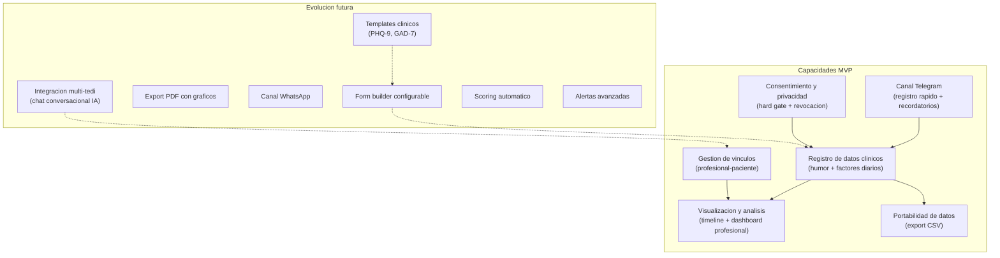

# 01 — Alcance Funcional

## 1. Objetivo del producto

Permitir que pacientes de psicologia y psiquiatria registren de forma estructurada y rapida (menos de 60 segundos) su estado animico diario y factores asociados (sueno, actividad fisica, ansiedad, irritabilidad, medicacion) via web o Telegram, generando visualizacion longitudinal automatica y comparticion segura con su profesional tratante bajo consentimiento informado.

## 2. Propuesta de valor

1. **Formularios dinamicos y trazables creados por profesionales, llenados sin friccion por pacientes** — el profesional disena que datos necesita, el paciente los completa en segundos via web o Telegram.
2. **Registro en menos de 60 segundos via web o Telegram** — ninguna app combina ambos canales con friccion minima.
3. **Escala clinicamente fundamentada (-3..+3)** — basada en NIMH Life Chart Method (LCM-p), validada para auto-reporte, como formulario base pre-cargado.
4. **Vinculo profesional-paciente con consentimiento revocable y auditoria** — acceso seguro y trazable, superando el modelo primitivo de PDF/email de la competencia.
5. **Cumplimiento normativo argentino desde el diseno** — Ley 25.326 (datos sensibles), 26.529 (derechos del paciente), 26.657 (salud mental). En espanol para el contexto clinico LATAM.

## 3. Mapa de capacidades

### Detalle de capacidades MVP

| Capacidad | Descripcion |
|-----------|-------------|
| Registro de humor | Escala -3..0..+3, 1 o mas veces por dia, via web o Telegram |
| Registro de factores diarios | Sueno (horas), actividad fisica (si/no), actividad social (si/no), ansiedad (si/no), irritabilidad (si/no), medicacion (si/no + horario aprox). Una vez por dia. |
| Consentimiento informado | Hard gate obligatorio antes del primer registro. Digital, revocable, con politica de retencion y derecho de supresion. |
| Vinculo profesional-paciente | Persistente, revocable por el paciente, con auditoria de cada acceso. Onboarding hibrido: profesional invita o paciente se auto-vincula. |
| Timeline longitudinal | Grafico tipo NIMH-LCM: eje X = dias, eje Y = -3..+3, con factores asociados. |
| Dashboard multi-paciente | Vista resumen para el profesional con todos sus pacientes vinculados y alertas basicas (ej: paciente con 3+ dias en zona -3). |
| Canal Telegram | Bot con keyboard inline para registro rapido de humor y factores. Recordatorios configurables. |
| Export CSV | Descarga de registros del paciente en formato CSV. |

## 4. Actores

| Actor | Tipo | Responsabilidades |
|-------|------|------------------|
| **Paciente** | Humano | Registra humor y factores diarios (web o Telegram). Otorga y revoca consentimiento informado. Vincula con profesional. Visualiza sus propios graficos. Exporta sus datos (CSV). |
| **Profesional** | Humano | Invita pacientes o acepta vinculos. Visualiza datos de sus pacientes en dashboard multi-paciente. Monitorea alertas basicas. (Futuro: crea formularios dinamicos.) |
| **Sistema** | Automatico | Envia recordatorios (push web + Telegram). Consolida datos diarios. Genera visualizaciones. Registra auditoria de accesos profesionales. Gestiona consentimientos y su revocacion. |

## 5. Areas funcionales de alto nivel

### AF-01: Registro de datos clinicos

Formulario de humor (escala -3..+3, multiples registros por dia) y factores diarios (sueno, actividad fisica, actividad social, ansiedad, irritabilidad, medicacion con horario aproximado). Disponible en web y via bot de Telegram con keyboard inline.

El MVP implementa un formulario fijo (mood tracking). La arquitectura debe modelar este formulario como una instancia de un schema, preparando el camino para formularios dinamicos configurables en Fase 2.

### AF-02: Consentimiento y privacidad

Consentimiento informado digital como hard gate antes del primer registro de datos. Incluye: descripcion de datos recopilados, quien accede, finalidad, derechos del titular (acceso, rectificacion, supresion), y politica de retencion. El paciente puede revocar el consentimiento en cualquier momento. Cumple con Ley 25.326 (datos sensibles), 26.529 (derechos del paciente), y 26.657 (salud mental).

### AF-03: Gestion de vinculos profesional-paciente

Creacion de vinculo via invitacion del profesional o auto-vinculacion del paciente (onboarding hibrido). Vinculo persistente, revocable por el paciente. Cada acceso del profesional a los datos del paciente queda registrado en log de auditoria (quien, cuando, que datos accedio).

### AF-04: Visualizacion y analisis

Timeline longitudinal para el paciente (estilo NIMH-LCM: eje X = dias, eje Y = humor, factores como barras complementarias). Dashboard multi-paciente para el profesional con vista resumen y alertas basicas (ej: paciente X lleva 3+ dias en -3).

### AF-05: Canal Telegram

Bot de Telegram con registro rapido de humor via keyboard inline (un tap), registro secuencial de factores diarios (preguntas cortas), y recordatorios configurables por el paciente (horarios de check-in). No incluye consulta de graficos ni gestion de cuenta (eso es web).

### AF-06: Portabilidad de datos

Export CSV de todos los registros del paciente. Cumple con derecho de acceso del titular (Ley 25.326). El paciente genera y descarga desde la web.

## 6. Fuera de alcance / Evolucion futura

| # | Capacidad | Descripcion | Fase estimada |
|---|-----------|-------------|---------------|
| R1 | Form builder configurable | Profesionales crean formularios dinamicos con campos tipo (escala, si/no, texto, numero, hora). Periodicidad configurable (diario, semanal, mensual, unico). | Fase 2 |
| R2 | Templates clinicos | PHQ-9, GAD-7, escalas de ansiedad. Pre-cargados y editables. | Fase 2 |
| R3 | Export PDF con graficos | Timeline longitudinal renderizado server-side para imprimir o adjuntar a historia clinica. | Fase 2 |
| R4 | Scoring automatico | Puntuacion y categorizacion de escalas estandarizadas (PHQ-9, GAD-7). | Fase 2 |
| R5 | Alertas avanzadas | Patrones automaticos, umbrales configurables por profesional, notificaciones push. | Fase 2 |
| R6 | Canal WhatsApp | Registro rapido via WhatsApp Business API como canal alternativo a Telegram. | Fase 3 |
| R7 | Integracion multi-tedi | Capability service protocol para chat conversacional con IA (Tedi). | Fase 3 |
| R8 | Codigo temporal | Acceso one-off para interconsultas sin vinculo persistente. | Fase 3 |
| R9 | IA interpretativa | Deteccion de patrones, correlaciones automaticas, sugerencias al profesional. | Fase 3+ |
| R10 | App nativa | iOS/Android con notificaciones push nativas. | Fase 3+ |

---

**Restricciones no funcionales (MVP):**

- Datos sensibles de salud: cifrado en transito (HTTPS) y en reposo (encrypted_payload + safe_projection a nivel aplicacion, patron BuhoSalud).
- Idioma: espanol (Argentina) como idioma principal. Ortografia correcta con tildes y ene.
- Accesibilidad: WCAG 2.1 nivel AA como objetivo.
- Auditoria: todo acceso profesional a datos de paciente queda registrado.
- Retencion: politica explicita de retencion y eliminacion de datos.

---

*Documento de alcance funcional — Proyecto Bitacora*
*Fuente de decisiones: `.docs/raw/decisiones/01_decisiones_producto.md`*
*Fuente de investigacion: `.docs/raw/investigacion/`*
