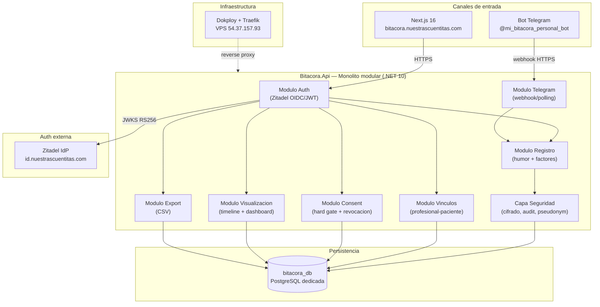
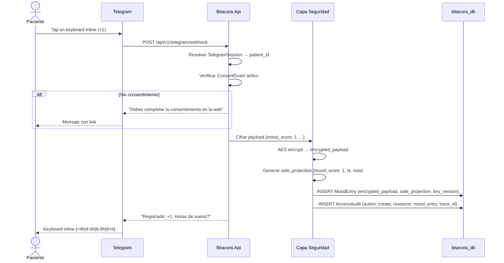

# 02 — Arquitectura

## Project Decision Priority

1. Security
2. Privacy
3. Correctness
4. Usability
5. Maintainability
6. Performance
7. Cost
8. Time-to-market

> Fuente de verdad para `AGENTS.md` / `CLAUDE.md`. Justificacion: datos de salud mental bajo Ley 25.326, 26.529 y 26.657.

## Vista general del sistema

## Stack tecnologico

| Capa | Tecnologia | Justificacion |
|------|-----------|---------------|
| Backend | .NET 10, monolito modular | Template fullskeleton, subagente ps-dotnet10. Un solo proceso para MVP. |
| Frontend | Next.js 16 (React 19) | Patron del ecosistema (multi-tedi, gastos). SSR para SEO minimo. |
| Auth | Zitadel OIDC + JWT RS256 | IdP compartido en `id.nuestrascuentitas.com`. Frontend usa Authorization Code + PKCE; backend valida Bearer JWT contra JWKS. |
| Base de datos | PostgreSQL (dedicada) | DB `bitacora_db` aislada en mismo server. Credenciales propias, backup independiente. |
| ORM | EF Core 10 | Global Query Filters para aislamiento de datos por paciente. Migraciones automaticas. |
| Bot | Telegram.Bot (.NET) | Webhook en prod (Traefik HTTPS), long-polling en dev. |
| Cifrado | AES app-layer | Patron encrypted_payload + safe_projection. PII cifrado. key_version para rotacion. |
| Observabilidad | Structured JSON logs + OpenTelemetry | trace_id end-to-end obligatorio. pseudonym_id en logs operacionales. |
| Deploy | Dokploy PaaS | VPS 54.37.157.93, Traefik como reverse proxy, HTTPS automatico. |

## Responsabilidades por modulo

| Modulo | Responsabilidad | Entidades principales |
|--------|----------------|----------------------|
| Auth | Validar JWT Zitadel, resolver identidad local, vincular `auth_subject` por email hash en primer login, inyectar contexto de paciente/profesional | User |
| Registro | Crear MoodEntry y DailyCheckin, cifrar payload, generar safe_projection | MoodEntry, DailyCheckin |
| Consent | Hard gate antes del primer registro, revocacion, politica de retencion | ConsentGrant |
| Vinculos | Emitir PendingInvite y BindingCode, crear/revocar CareLink, validar acceso profesional (default false) | PendingInvite, BindingCode, CareLink |
| Visualizacion | Queries sobre safe_projection, timeline longitudinal, dashboard multi-paciente, alertas basicas | (queries, sin entidad propia) |
| Telegram | Webhook endpoint, keyboard inline, flujo secuencial de registro, recordatorios | TelegramSession |
| Export | Generar CSV de registros del paciente, descifrar encrypted_payload bajo demanda | (generacion, sin entidad propia) |
| Seguridad | Cifrado/descifrado AES, audit log append-only, pseudonimizacion, fail-closed gates, trace_id | AccessAudit, EncryptionKeyVersion |

## Modelo de seguridad

**Invariantes arquitectonicos (heredados de BuhoSalud + adaptados):**

- **Separacion identidad/salud:** `User` y entidades clinicas (MoodEntry, DailyCheckin) son aggregates separados. PII nunca en tablas clinicas sin cifrar.
- **encrypted_payload + safe_projection:** todo dato clinico cifrado AES antes de PostgreSQL. safe_projection con datos minimos en claro para queries.
- **Fail-closed:** clave ausente = HTTP 500. Auth fallido = sin acceso. Consent no otorgado = sin datos.
- **Audit append-only:** AccessAudit sin UPDATE/DELETE. Cada operacion transaccional genera registro con trace_id.
- **Pseudonimizacion:** logs operacionales usan `pseudonym_id = HASH(actor_id + salt)`. actor_id solo en AccessAudit.
- **Consent default false:** acceso profesional a datos default `false`, solo el paciente activa.
- **Retencion:** crisis 5 anos, audit 2 anos, supresion por anonimizacion + destruccion de clave.
- **trace_id end-to-end:** obligatorio en toda operacion. Si falta, se genera al ingreso.

## Invariantes de privacidad

1. **Clasificacion de datos:** todos los datos del sistema se clasifican en tres niveles:
   - **SENSIBLE (Salud):** MoodEntry, DailyCheckin, encrypted_payload de cualquier entidad. Regulados por Ley 25.326 (proteccion de datos), Ley 26.529 (derechos del paciente) y Ley 26.657 (salud mental). Requiere consentimiento informado explícito y cifrado app-layer obligatorio.
   - **PII (Identidad):** email, email_hash, chat_id de TelegramSession, nombre en encrypted_payload. Regulados por Ley 25.326. Cifrado app-layer y hash para lookup.
   - **OPERACIONAL:** safe_projection, trace_id, pseudonym_id. No contiene PII ni datos clinicos; usado para queries y logs. Trata como informacion sensible por principio de minimizacion.
2. **Dato clinico es sensible por defecto:** MoodEntry, DailyCheckin, y cualquier encrypted_payload se tratan como dato sensible bajo Ley 25.326, 26.529 y 26.657.
3. **PII cifrado app-layer:** email, nombre, DNI, telefono del paciente residen en `encrypted_payload`; `email_hash` es el unico lookup posible sin descifrar.
4. **safe_projection no contiene PII:** nunca incluye texto libre, notas clinicas, datos de contacto o identificadores directos. Solo campos operacionalmente necesarios para queries.
5. **Descifrado solo en memoria:** el material de descifrado no sale del proceso .NET. No se escreve ciphertext en logs, telemetria, ni respuestas AI.
6. **Sin fuga a canales externos:** ningun dato clinico (cifrado o no) puede transmitirse a Telegram, email, notificaciones push u otros canales distinta de la respuesta HTTP autenticada al paciente owner. Esta restriccion incluye: encrypted_payload completo, safe_projection con datos clinicos, timestamps de registros individuales, y cualquier agregado derivable de registros de salud. El bot Telegram solo confirma acciones y solicita proximo input; nunca devuelve datos clinicos ni informacion derivada.
7. **TelegramSession.chat_id es PII:** la vinculacion genera un registro que asocia chat_id con patient_id. Se trata con igual rigor que cualquier otro PII bajo Ley 25.326.

## Invariantes de consentimiento

1. **Hard gate antes del primer registro:** ningun MoodEntry ni DailyCheckin puede crearse sin que ConsentGrant.status = 'granted' activo. ConsentRequiredMiddleware lo enforce en el seam HTTP.
2. **Consentimiento informado es versionado:** el texto vigente no se persist en DB; ConsentGrant registra consent_version y timestamps como evidencia legal.
3. **Revocacion reactiva (no cascada automatica):** revoke de consentimiento hoy revierte el ConsentGrant; las cascadas sobre CareLink, caches y sesiones Telegram siguen diferidas.
4. **Sin lectura profesional sin CareLink.can_view_data=true:** el profesional necesita vinculo activo y permiso explicito del paciente para leer datos.
5. **Invitacion no otorga acceso:** PendingInvite solo preserva contexto de onboarding; no confiere acceso clinico bajo ninguna circunstancia.

## Invariantes de auditoria

1. **AccessAudit es append-only:** sin UPDATE ni DELETE en la tabla access_audits. Registro indeleble.
2. **Toda operacion transaccional genera audit:** con el mismo trace_id de la peticion.
3. **actor_id solo en AccessAudit:** en ninguna otra tabla ni en logs operacionales aparece el identificador real del actor; solo pseudonym_id.
4. **Fail-closed sobre escritura de audit:** si INSERT en access_audits falla, la operacion de negocio completa falla. No se retornan datos.
5. **trace_id obligatorio:** generado al ingreso si no existe en el header X-Trace-Id. Se propaga en toda la cadena.
6. **Export CSV genera audit:** toda generacion de export persiste action_type='export' sobre resource_type='mood_entry' con el patient_id del dueño.

## Retencion y supresion

| Entidad | Retencion minima | Supresion |
|---------|------------------|-----------|
| AccessAudit | 2 anos | No se suprime; archivo regulatorio |
| MoodEntry (crisis: mood_score = -3) | 5 anos | Solo anonimizacion + destruccion de clave |
| MoodEntry (regular) | Segun consentimiento del paciente |Anonimizacion + destruccion de clave |
| ConsentGrant | Permanente | No corresponde; evidencia legal |
| PendingInvite | 7 dias maximo desde emision | Auto-expira o se revoca |
| BindingCode | Hasta expiracion o uso | No persiste tras uso o expiracion |
| TelegramPairingCode | 15 minutos maximo | Auto-expira |
| User (post-supresion) | Registro anonymized con audit retenido | Pseudonimizacion irreversible tras supresion |

> Supresion = UPDATE del registro User a status='anonymized', destruccion de la clave de cifrado para sus encrypted_payloads, y retencion del AccessAudit bajo las reglas de retencion de auditoria.

## Secuencia: registro de humor via Telegram

## Integracion futura con multi-tedi

Bitacora se preparara como capability service:
- Endpoint `/.well-known/multi-tedi/manifest` (no implementado en MVP)
- Queries/commands via `POST /api/v1/capabilities/{queries|commands}` (Roadmap)
- Eventos via RabbitMQ exchange `mtedi.capabilities.v1` (Roadmap)
- Identidad cruzada via `canonical_person_id` de multi-tedi

La arquitectura incluye el "seam" (interfaces y contratos) sin implementacion activa.

## Insumos para FL

### Inventario de flujos candidatos

| ID | Flujo | Actor principal | Modulos involucrados |
|----|-------|----------------|---------------------|
| FL-REG-01 | Registro de humor via web | Paciente | Auth, Consent, Registro, Seguridad |
| FL-REG-02 | Registro de humor via Telegram | Paciente | Telegram, Consent, Registro, Seguridad |
| FL-REG-03 | Registro de factores diarios (web) | Paciente | Auth, Registro, Seguridad |
| FL-CON-01 | Otorgamiento de consentimiento informado | Paciente | Auth, Consent |
| FL-CON-02 | Revocacion de consentimiento | Paciente | Auth, Consent, Vinculos |
| FL-VIN-01 | Creacion de vinculo profesional→paciente (invitacion) | Profesional | Auth, Vinculos |
| FL-VIN-02 | Auto-vinculacion paciente→profesional | Paciente | Auth, Vinculos |
| FL-VIN-03 | Revocacion de vinculo por paciente | Paciente | Auth, Vinculos, Seguridad |
| FL-VIN-04 | Activacion/desactivacion de acceso del profesional | Paciente | Auth, Vinculos, Seguridad |
| FL-VIS-01 | Consulta de timeline longitudinal (paciente) | Paciente | Auth, Visualizacion |
| FL-VIS-02 | Dashboard multi-paciente (profesional) | Profesional | Auth, Vinculos, Visualizacion |
| FL-EXP-01 | Export CSV de registros | Paciente | Auth, Export, Seguridad |
| FL-TG-01 | Vinculacion de cuenta Telegram | Paciente | Auth, Telegram |
| FL-TG-02 | Recordatorio programado | Sistema | Telegram |
| FL-SEC-01 | Registro de auditoria de acceso profesional | Sistema | Seguridad, Vinculos |
| FL-ONB-01 | Onboarding completo del paciente (registro + consent + primer mood) | Paciente | Auth, Consent, Registro |

### Estados y eventos clave

- **ConsentGrant:** `pending` → `granted` → `revoked`
- **PendingInvite:** `issued` → `consumed` / `expired` / `revoked`
- **BindingCode:** `issued` → `used` / `expired` / `revoked`
- **CareLink:** `invited` → `active` → `revoked_by_patient`
- **MoodEntry:** `created` (inmutable, append-only)
- **TelegramSession:** `unlinked` → `linked` → `unlinked`
- **User:** `registered` → `consent_granted` → `active` | `deletion_requested` → `anonymized`

### Cuellos de botella conocidos

- Cifrado AES por cada registro: overhead minimo (~1ms), no es bloqueante.
- Dashboard multi-paciente con muchos pacientes: paginacion obligatoria + cache de safe_projection.
- Telegram webhook concurrencia: el monolito procesa secuencialmente por chat_id (lock optimista).

### Preguntas abiertas

Ninguna. Todas las decisiones estan cerradas.

---

*Fuente de decisiones: `.docs/raw/decisiones/02_decisiones_arquitectura.md`*
*Referencia de seguridad: `C:\repos\buho\salud\.docs\wiki\`*
