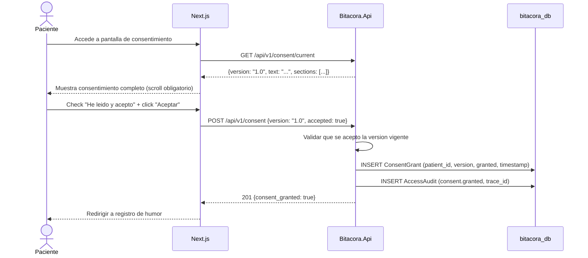

# FL-CON-01: Otorgamiento de consentimiento informado

## Goal
El paciente acepta el consentimiento informado digital como hard gate antes de registrar cualquier dato clinico.

## Scope
**In:** Presentacion del consentimiento, aceptacion, registro de ConsentGrant.
**Out:** Revocacion (→ FL-CON-02), contenido legal del consentimiento (definido por RF).

## Actores y ownership
| Actor | Rol en el flujo |
|-------|----------------|
| Paciente | Lee y acepta consentimiento |
| Modulo Auth | Valida identidad |
| Modulo Consent | Presenta texto, registra aceptacion |
| Capa Seguridad | Registra audit |

## Precondiciones
- Paciente autenticado
- ConsentGrant no existe o esta en estado `revoked`

## Postcondiciones
- ConsentGrant en estado `granted` con timestamp
- AccessAudit registrado (consent.granted)
- Paciente puede registrar datos clinicos

## Secuencia principal

## Paths alternativos / errores

| Condicion | Resultado | HTTP |
|-----------|----------|------|
| Paciente no acepta | No se crea ConsentGrant. Sin acceso a registro. | — |
| Version de consent obsoleta | Rechazar, mostrar version vigente | 409 |
| ConsentGrant ya existe y esta granted | Retornar estado actual sin re-crear | 200 |

## Architecture slice
- **Modulos:** Auth → Consent → Seguridad
- **DB:** `bitacora_db.consent_grants`, `bitacora_db.access_audits`
- **Invariante:** Hard gate — ningun endpoint de registro funciona sin consent granted

## Data touchpoints
| Entidad | Operacion | Estado resultante |
|---------|-----------|------------------|
| ConsentGrant | INSERT | granted |
| AccessAudit | INSERT | append-only |

## RF candidatos
- RF-CON-001: Presentar texto de consentimiento vigente (versionado)
- RF-CON-002: Registrar aceptacion con version y timestamp
- RF-CON-003: Hard gate: bloquear todo registro si consent no granted

## Bottlenecks y mitigaciones
| Riesgo | Mitigacion |
|--------|-----------|
| Paciente no lee el texto | UX: scroll obligatorio + checkbox explicito |
| Cambio de version del consent | Versionado: re-aceptacion requerida para version nueva |

## RF handoff checklist
- [x] Actores y ownership explicitos
- [x] Diagrama explica el flujo sin prosa
- [x] Bottlenecks y mitigaciones explicitos
- [x] Traducible a RF atomicos y testeables
- [x] Dentro del limite de 1 pagina
