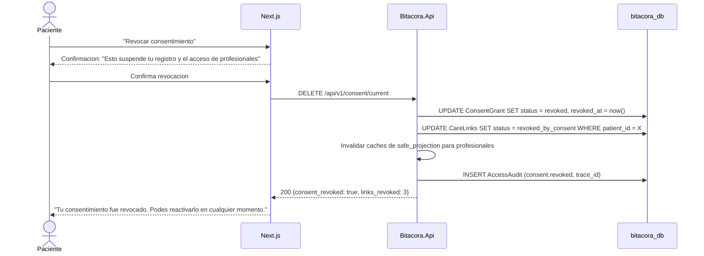

# FL-CON-02: Revocacion de consentimiento

## Goal
El paciente revoca su consentimiento informado, lo cual suspende el registro de datos y puede disparar la anonimizacion.

## Scope
**In:** Revocacion, cascade a vinculos, suspension de registro, inicio de anonimizacion.
**Out:** Eliminacion de cuenta completa (flujo futuro de account deletion).

## Actores y ownership
| Actor | Rol en el flujo |
|-------|----------------|
| Paciente | Solicita revocacion |
| Modulo Consent | Cambia estado de ConsentGrant |
| Modulo Vinculos | Revoca todos los CareLinks activos |
| Capa Seguridad | Registra audit, invalida caches |

## Precondiciones
- Paciente autenticado
- ConsentGrant en estado `granted`

## Postcondiciones
- ConsentGrant en estado `revoked`
- Todos los CareLinks del paciente en estado `revoked_by_consent`
- Registro de datos suspendido (hard gate activo)
- AccessAudit registrado (consent.revoked)
- Profesionales pierden acceso inmediato

## Secuencia principal

## Paths alternativos / errores

| Condicion | Resultado | HTTP |
|-----------|----------|------|
| ConsentGrant ya revocado | Retornar estado actual | 200 |
| Error en cascade de CareLinks | Rollback transaccional, no se revoca nada | 500 |

## Architecture slice
- **Modulos:** Auth → Consent → Vinculos → Seguridad
- **Transaccion:** Atomica (consent + links en misma tx)
- **Invariante:** Revocacion es inmediata, cascade obligatorio

## Data touchpoints
| Entidad | Operacion | Estado resultante |
|---------|-----------|------------------|
| ConsentGrant | UPDATE | revoked |
| CareLink (todos) | UPDATE | revoked_by_consent |
| AccessAudit | INSERT | append-only |

## RF candidatos
- RF-CON-010: Revocar ConsentGrant con confirmacion del paciente
- RF-CON-011: Cascade: revocar todos los CareLinks del paciente
- RF-CON-012: Invalidar caches de safe_projection para profesionales
- RF-CON-013: Transaccion atomica (consent + links)

## Bottlenecks y mitigaciones
| Riesgo | Mitigacion |
|--------|-----------|
| Profesional accede durante la revocacion | Transaccion atomica + invalidacion de cache |
| Paciente revoca por accidente | Confirmacion doble en UI + reactivacion posible |

## RF handoff checklist
- [x] Actores y ownership explicitos
- [x] Diagrama explica el flujo sin prosa
- [x] Bottlenecks y mitigaciones explicitos
- [x] Traducible a RF atomicos y testeables
- [x] Dentro del limite de 1 pagina
