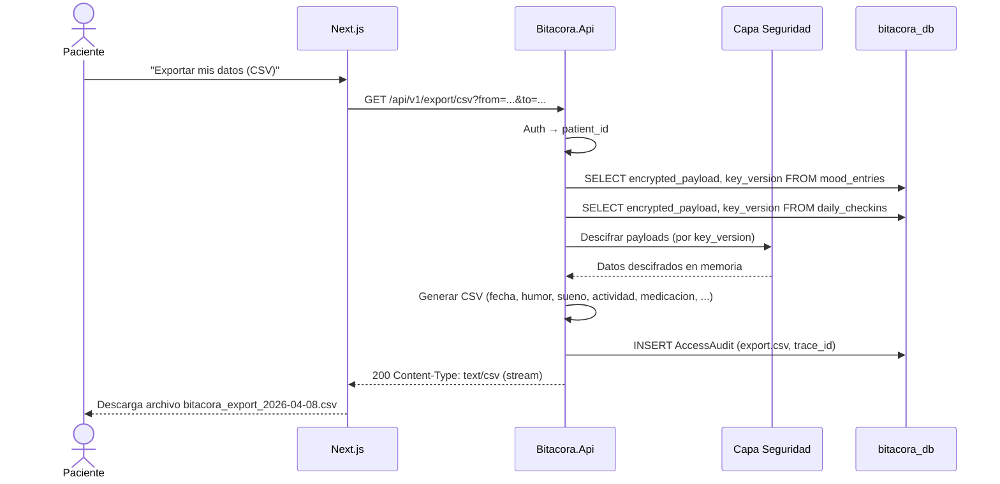

# FL-EXP-01: Export CSV de registros

## Goal
El paciente descarga un CSV con todos sus registros de humor y factores diarios.

## Scope
**In:** Generacion de CSV, descifrado de encrypted_payload, download.
**Out:** Export PDF (Roadmap).

## Actores y ownership
| Actor | Rol en el flujo |
|-------|----------------|
| Paciente | Solicita export |
| Modulo Auth | Valida JWT |
| Modulo Export | Genera CSV |
| Capa Seguridad | Descifra payloads, registra audit |

## Precondiciones
- Paciente autenticado
- Al menos 1 registro existente

## Postcondiciones
- Archivo CSV generado y descargado
- AccessAudit registrado (export.csv)

## Secuencia principal

## Paths alternativos / errores

| Condicion | Resultado | HTTP |
|-----------|----------|------|
| Sin registros en el periodo | CSV con solo headers | 200 |
| Clave de cifrado ausente para alguna version | Fail-closed, export falla | 500 |
| Dataset muy grande (anos de datos) | Stream response, no buffer completo | 200 |

## Architecture slice
- **Modulos:** Auth → Export → Seguridad
- **Nota:** Este es el unico flujo que descifra encrypted_payload (ademas del detalle individual)
- **Compliance:** Ley 25.326 derecho de acceso del titular

## Data touchpoints
| Entidad | Operacion |
|---------|-----------|
| MoodEntry.encrypted_payload | READ + DECRYPT |
| DailyCheckin.encrypted_payload | READ + DECRYPT |
| AccessAudit | INSERT |

## RF candidatos
- RF-EXP-001: Generar CSV con headers estandarizados
- RF-EXP-002: Descifrar payloads por key_version
- RF-EXP-003: Stream response para datasets grandes

## Bottlenecks y mitigaciones
| Riesgo | Mitigacion |
|--------|-----------|
| Descifrado masivo (anos de datos) | Stream: descifrar y escribir row by row |
| Datos en memoria | No buffear CSV completo, stream directo |

## RF handoff checklist
- [x] Actores y ownership explicitos
- [x] Diagrama explica el flujo sin prosa
- [x] Bottlenecks y mitigaciones explicitos
- [x] Traducible a RF atomicos y testeables
- [x] Dentro del limite de 1 pagina
