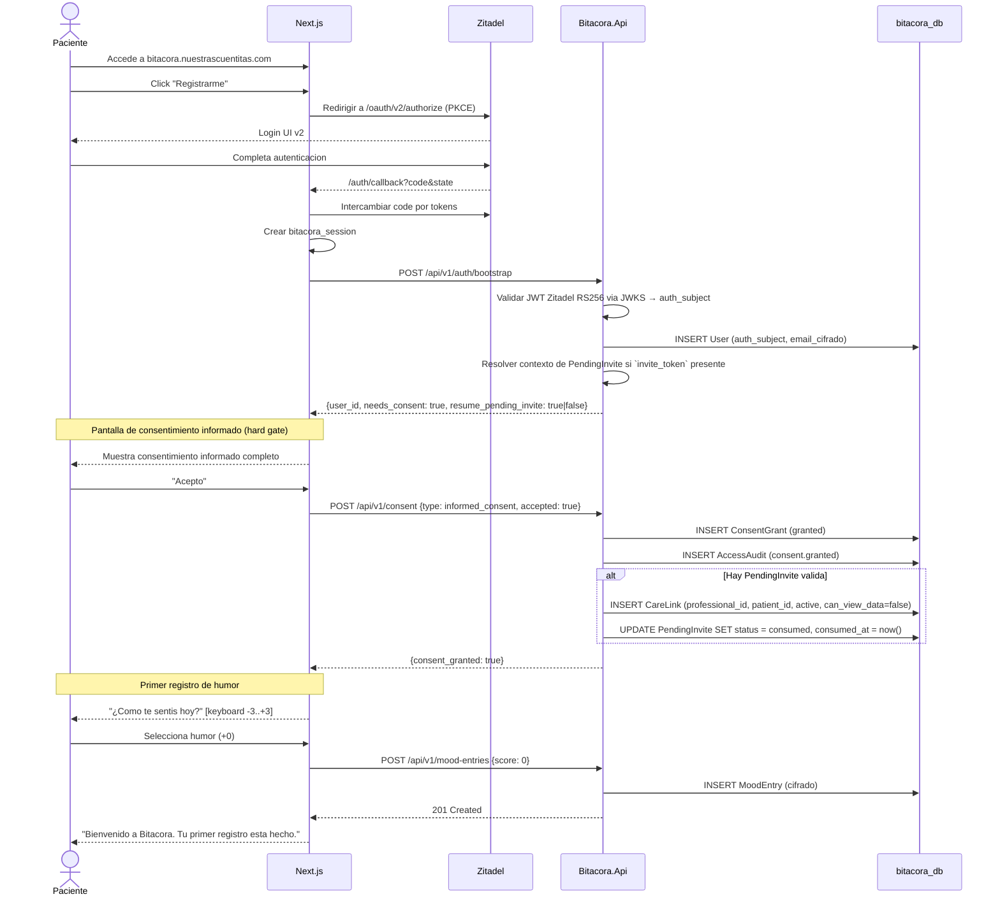

# FL-ONB-01: Onboarding completo del paciente

## Goal
Un nuevo paciente se registra, acepta el consentimiento informado y realiza su primer registro de humor, reanudando automaticamente una invitacion pendiente si llego desde un flujo invitado.

## Scope
**In:** Registro de cuenta (Zitadel OIDC + PKCE), consentimiento (hard gate), reanudacion opcional de invitacion pendiente, primer mood entry.
**Out:** Vinculacion con profesional (→ FL-VIN-02), configuracion Telegram (→ FL-TG-01).

## Actores y ownership
| Actor | Rol en el flujo |
|-------|----------------|
| Paciente | Se registra, acepta consent, registra primer humor |
| Zitadel Auth | Autentica la identidad OIDC del paciente |
| Modulo Auth | Resuelve User desde subject Zitadel |
| Modulo Consent | Presenta y registra consentimiento |
| Modulo Vinculos | Reanuda PendingInvite valida y materializa CareLink si aplica |
| Modulo Registro | Crea primer MoodEntry |

## Precondiciones
- El paciente accede a bitacora.nuestrascuentitas.com por primera vez
- No tiene cuenta previa
- Si llega desde una invitacion, el `invite_token` sigue vigente

## Postcondiciones
- User creado en bitacora_db
- ConsentGrant en estado `granted`
- Si habia invitacion pendiente valida: `CareLink` activo con `can_view_data=false`
- Al menos un MoodEntry creado
- Paciente en estado `active`

## Secuencia principal

## Paths alternativos / errores

| Condicion | Resultado |
|-----------|----------|
| Email ya registrado | "Ya tenes cuenta. Inicia sesion." |
| Paciente rechaza consent | No puede registrar datos. Queda en estado `registered` sin `consent_granted`. |
| invite_token expiro antes del alta | El onboarding continua sin vinculo; se informa que debe pedir una nueva invitacion. |
| Paciente cierra la ventana antes del primer mood | Queda con consent pero sin datos. Proximo login → directo al registro. |
| Auth falla (Zitadel no disponible) | Fail-closed, pagina de error. |

## Architecture slice
- **Modulos:** Auth (Zitadel) → Consent → Vinculos (opcional) → Registro → Seguridad
- **Flujo compuesto:** integra FL-CON-01 y FL-REG-01

## Data touchpoints
| Entidad | Operacion | Estado resultante |
|---------|-----------|------------------|
| User | INSERT | registered → active |
| ConsentGrant | INSERT | granted |
| PendingInvite | UPDATE (opcional) | consumed |
| CareLink | INSERT (opcional) | active, can_view_data=false |
| MoodEntry | INSERT | created |
| AccessAudit | INSERT x3 | append-only |

## RF candidatos
- RF-ONB-001: Crear User desde JWT Zitadel (bootstrap)
- RF-ONB-002: Detectar usuario nuevo vs existente
- RF-ONB-003: Forzar pantalla de consent y preservar contexto invitado
- RF-ONB-004: Registrar primer MoodEntry post-consent
- RF-ONB-005: Transicionar User a estado `active` y cerrar onboarding reanudado

## Bottlenecks y mitigaciones
| Riesgo | Mitigacion |
|--------|-----------|
| Magic link lento (email delivery) | UX: mostrar "Revisa tu email" + opcion Google OAuth |
| Perdida de contexto de invitacion | Reanudacion automatica por `invite_token` valido tras auth |
| Abandono en pantalla de consent | El consent es obligatorio; sin el no se puede avanzar |

## RF handoff checklist
- [x] Actores y ownership explicitos
- [x] Diagrama explica el flujo sin prosa
- [x] Bottlenecks y mitigaciones explicitos
- [x] Traducible a RF atomicos y testeables
- [x] Dentro del limite de 2 paginas (flujo compuesto)
