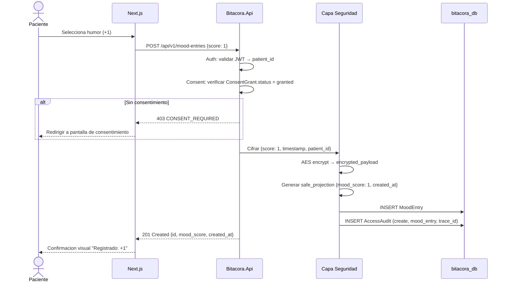

# FL-REG-01: Registro de humor via web

## Goal
El paciente registra su estado animico (escala -3..+3) desde la interfaz web.

## Scope
**In:** Seleccion de humor, cifrado, safe_projection, audit.
**Out:** Factores diarios (→ FL-REG-03), registro via Telegram (→ FL-REG-02).

## Actores y ownership
| Actor | Rol en el flujo |
|-------|----------------|
| Paciente | Inicia el registro, selecciona valor de humor |
| Modulo Auth | Valida JWT, resuelve patient_id |
| Modulo Consent | Verifica consentimiento activo (hard gate) |
| Modulo Registro | Crea MoodEntry |
| Capa Seguridad | Cifra payload, genera safe_projection, registra audit |

## Precondiciones
- Paciente autenticado (JWT valido via Supabase Auth)
- ConsentGrant en estado `granted` para este paciente

## Postcondiciones
- MoodEntry creado con `encrypted_payload` + `safe_projection`
- AccessAudit registrado (action: `create`, resource: `mood_entry`)
- Respuesta al paciente con confirmacion visual

## Secuencia principal

## Paths alternativos / errores

| Condicion | Resultado | HTTP |
|-----------|----------|------|
| JWT invalido/expirado | Redirigir a login | 401 |
| ConsentGrant no existe o revocado | Redirigir a consent | 403 |
| Clave de cifrado ausente | Fail-closed, no se escribe | 500 |
| Score fuera de rango (-3..+3) | Validacion rechazada | 422 |

## Architecture slice
- **Modulos:** Auth → Consent → Registro → Seguridad
- **DB:** `bitacora_db.mood_entries`, `bitacora_db.access_audits`
- **Cifrado:** encrypted_payload + safe_projection (T3-5)
- **Filtrado:** EF Core Global Query Filter por patient_id (T3-6)

## Data touchpoints
| Entidad | Operacion | Estado resultante |
|---------|-----------|------------------|
| MoodEntry | INSERT | created (inmutable) |
| AccessAudit | INSERT | append-only |

## RF candidatos
- RF-REG-001: Crear MoodEntry con score validado
- RF-REG-002: Validar score en rango -3..+3
- RF-REG-003: Cifrar payload y generar safe_projection
- RF-REG-004: Registrar audit de creacion
- RF-REG-005: Verificar consent activo antes de registro

## Bottlenecks y mitigaciones
| Riesgo | Mitigacion |
|--------|-----------|
| Cifrado AES por cada registro | Overhead ~1ms, no bloqueante |
| Multiples registros en rafaga | Idempotencia por patient_id + timestamp (ventana 1 min) |

## RF handoff checklist
- [x] Actores y ownership explicitos
- [x] Diagrama explica el flujo sin prosa
- [x] Bottlenecks y mitigaciones explicitos
- [x] Traducible a RF atomicos y testeables
- [x] Dentro del limite de 1 pagina
