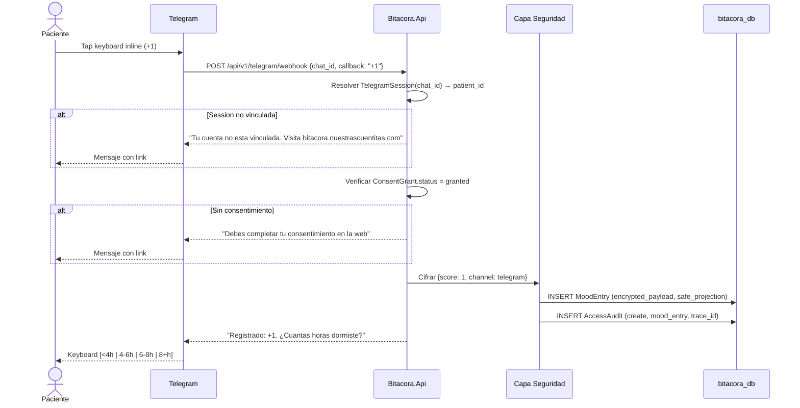

# FL-REG-02: Registro de humor via Telegram

## Goal
El paciente registra su estado animico desde el bot de Telegram con un solo tap en keyboard inline.

## Scope
**In:** Webhook Telegram, resolver session, registro de humor, cifrado, audit.
**Out:** Factores diarios (se preguntan secuencialmente despues, parte de este mismo flujo en extension), gestion de cuenta (→ web).

## Actores y ownership
| Actor | Rol en el flujo |
|-------|----------------|
| Paciente | Tap en keyboard inline |
| Telegram API | Envia webhook POST |
| Modulo Telegram | Recibe webhook, resuelve TelegramSession → patient_id |
| Modulo Consent | Verifica consentimiento activo |
| Modulo Registro | Crea MoodEntry |
| Capa Seguridad | Cifra, safe_projection, audit |

## Precondiciones
- TelegramSession en estado `linked` (cuenta vinculada via FL-TG-01)
- ConsentGrant en estado `granted`

## Postcondiciones
- MoodEntry creado con encrypted_payload + safe_projection
- AccessAudit registrado
- Bot responde con confirmacion y pregunta siguiente (factores)

## Secuencia principal

## Paths alternativos / errores

| Condicion | Resultado |
|-----------|----------|
| chat_id sin TelegramSession | Mensaje: "Vincula tu cuenta en la web" |
| ConsentGrant revocado | Mensaje: "Completa tu consentimiento" |
| Clave de cifrado ausente | Fail-closed, mensaje generico de error |
| Score invalido | Ignorar callback, reenviar keyboard |

## Architecture slice
- **Modulos:** Telegram → Consent → Registro → Seguridad
- **Endpoint:** `POST /api/v1/telegram/webhook`
- **Modo:** Webhook (prod) / long-polling (dev)
- **Cifrado:** encrypted_payload + safe_projection

## Data touchpoints
| Entidad | Operacion | Estado resultante |
|---------|-----------|------------------|
| TelegramSession | READ | linked (validacion) |
| MoodEntry | INSERT | created |
| AccessAudit | INSERT | append-only |

## RF candidatos
- RF-REG-010: Recibir y validar webhook de Telegram
- RF-REG-011: Resolver TelegramSession por chat_id
- RF-REG-012: Crear MoodEntry desde callback de Telegram
- RF-REG-013: Responder con pregunta secuencial de factores
- RF-REG-014: Manejar session no vinculada
- RF-REG-015: Manejar consent no otorgado via Telegram

## Bottlenecks y mitigaciones
| Riesgo | Mitigacion |
|--------|-----------|
| Concurrencia de webhooks del mismo chat | Lock optimista por chat_id |
| Latencia de cifrado en webhook | AES ~1ms, dentro del timeout de Telegram (10s) |

## RF handoff checklist
- [x] Actores y ownership explicitos
- [x] Diagrama explica el flujo sin prosa
- [x] Bottlenecks y mitigaciones explicitos
- [x] Traducible a RF atomicos y testeables
- [x] Dentro del limite de 1 pagina
