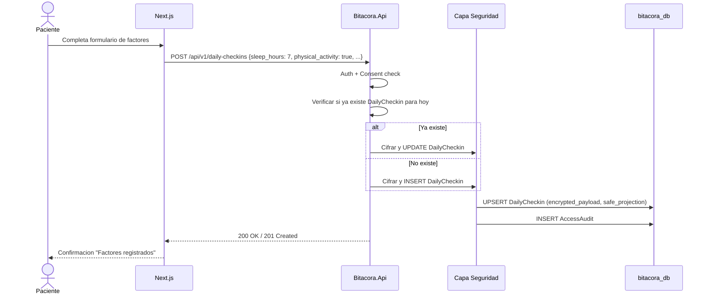

# FL-REG-03: Registro de factores diarios (web)

## Goal
El paciente registra los factores diarios asociados a su humor: sueno, actividad fisica, actividad social, ansiedad, irritabilidad y medicacion.

## Scope
**In:** Formulario de factores diarios, cifrado, safe_projection, audit. Una vez por dia.
**Out:** Registro de humor (→ FL-REG-01), registro via Telegram (→ FL-REG-02).

## Actores y ownership
| Actor | Rol en el flujo |
|-------|----------------|
| Paciente | Completa formulario de factores |
| Modulo Auth | Valida JWT |
| Modulo Consent | Verifica consentimiento activo |
| Modulo Registro | Crea DailyCheckin |
| Capa Seguridad | Cifra, safe_projection, audit |

## Precondiciones
- Paciente autenticado
- ConsentGrant en estado `granted`
- No existe DailyCheckin para hoy (o se permite update del existente)

## Postcondiciones
- DailyCheckin creado/actualizado con encrypted_payload + safe_projection
- AccessAudit registrado

## Secuencia principal

## Paths alternativos / errores

| Condicion | Resultado | HTTP |
|-----------|----------|------|
| JWT invalido | Redirigir a login | 401 |
| Consent no otorgado | Redirigir a consent | 403 |
| Campos fuera de rango (sleep_hours < 0) | Validacion rechazada | 422 |
| Clave cifrado ausente | Fail-closed | 500 |

## Architecture slice
- **Modulos:** Auth → Consent → Registro → Seguridad
- **DB:** `bitacora_db.daily_checkins`, `bitacora_db.access_audits`
- **Patron:** UPSERT por patient_id + date (un DailyCheckin por dia)

## Data touchpoints
| Entidad | Operacion | Estado resultante |
|---------|-----------|------------------|
| DailyCheckin | UPSERT | created o updated |
| AccessAudit | INSERT | append-only |

## RF candidatos
- RF-REG-020: Crear DailyCheckin con campos validados
- RF-REG-021: Validar rangos (sleep_hours 0-24, booleanos)
- RF-REG-022: UPSERT: si ya existe para hoy, actualizar
- RF-REG-023: Cifrar payload y generar safe_projection
- RF-REG-024: Registrar audit de creacion/actualizacion
- RF-REG-025: Incluir medicacion con horario aproximado

## Bottlenecks y mitigaciones
| Riesgo | Mitigacion |
|--------|-----------|
| Race condition en UPSERT concurrente | Constraint UNIQUE(patient_id, date) + retry |

## RF handoff checklist
- [x] Actores y ownership explicitos
- [x] Diagrama explica el flujo sin prosa
- [x] Bottlenecks y mitigaciones explicitos
- [x] Traducible a RF atomicos y testeables
- [x] Dentro del limite de 1 pagina
