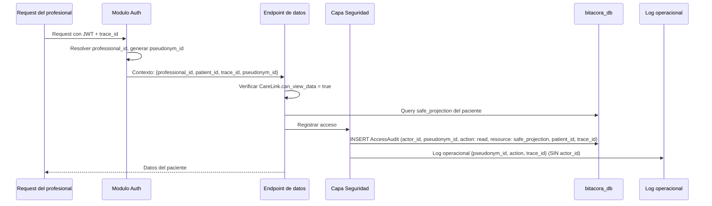

# FL-SEC-01: Auditoria de acceso profesional

## Goal
El sistema registra automaticamente cada acceso de un profesional a los datos de un paciente, generando un trail auditable.

## Scope
**In:** Registro automatico de audit en cada acceso profesional, pseudonimizacion en logs.
**Out:** Reportes de auditoria para compliance (flujo futuro).

## Actores y ownership
| Actor | Rol en el flujo |
|-------|----------------|
| Sistema | Intercepta y registra automaticamente |
| Profesional | Accede a datos (dispara audit implicitamente) |
| Capa Seguridad | Genera AccessAudit + pseudonym_id en logs |

## Precondiciones
- Profesional autenticado accediendo a datos de un paciente
- CareLink activo con `can_view_data = true`

## Postcondiciones
- AccessAudit registrado (append-only)
- Log operacional con pseudonym_id (sin actor_id)

## Secuencia principal

## Paths alternativos / errores

| Condicion | Resultado |
|-----------|----------|
| CareLink inexistente o can_view_data = false | 403 HEALTH_PROFILE_ACCESS_DENIED (sin revelar existencia) |
| Error al escribir audit | Fail-closed: no se retornan datos sin audit |
| trace_id ausente en request | Se genera uno antes de continuar |

## Architecture slice
- **Modulos:** Auth → Seguridad (transversal a todos los endpoints de datos)
- **Invariantes:** T3-8 (pseudonimizacion), T3-9 (append-only), T3-10 (fail-closed), T3-13 (trace_id)
- **Patron:** Middleware/interceptor que se ejecuta en cada request de profesional a datos de paciente

## Data touchpoints
| Entidad | Operacion |
|---------|-----------|
| AccessAudit | INSERT (append-only, sin UPDATE/DELETE) |
| CareLink | READ (verificar can_view_data) |

## RF candidatos
- RF-SEC-001: Interceptor de audit para acceso profesional a datos de paciente
- RF-SEC-002: Generar pseudonym_id = HASH(actor_id + salt)
- RF-SEC-003: Fail-closed: no retornar datos si audit falla

## Campos de AccessAudit

| Campo | Tipo | Descripcion |
|-------|------|-------------|
| audit_id | UUID | PK |
| trace_id | UUID | Traza end-to-end |
| actor_id | UUID | ID real del profesional (solo en audit) |
| pseudonym_id | string | HASH(actor_id + salt) |
| action_type | enum | create/read/update/delete |
| resource_type | string | mood_entry/daily_checkin/safe_projection |
| resource_id | UUID | ID del recurso accedido |
| patient_id | UUID | Paciente cuyos datos se acceden |
| outcome | enum | ok/failed/denied |
| created_at_utc | timestamp | Momento del acceso |

## Bottlenecks y mitigaciones
| Riesgo | Mitigacion |
|--------|-----------|
| Overhead de audit en cada request | INSERT es O(1), no bloqueante para reads |
| Tabla de audit crece indefinidamente | Retencion 2 anos minimo, archivado despues |

## RF handoff checklist
- [x] Actores y ownership explicitos
- [x] Diagrama explica el flujo sin prosa
- [x] Bottlenecks y mitigaciones explicitos
- [x] Traducible a RF atomicos y testeables
- [x] Dentro del limite de 1 pagina
