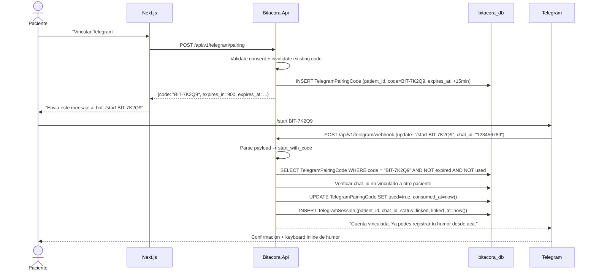

# FL-TG-01: Vinculacion de cuenta Telegram

## Goal
El paciente vincula su cuenta de Telegram con su cuenta de Bitacora para habilitar el registro via bot.

## Scope
**In:** Generacion de codigo de vinculacion, envio al bot, confirmacion via webhook.
**Out:** Registro via Telegram (→ FL-REG-02), recordatorios (→ FL-TG-02).
**Estado: IMPLEMENTADO.**

## Actores y ownership
| Actor | Rol en el flujo |
|-------|----------------|
| Paciente | Genera codigo en web, lo envia al bot |
| Modulo Auth | Valida JWT |
| Modulo Telegram | Recibe /start via webhook, valida codigo, vincula chat_id |

## Precondiciones
- Paciente autenticado en web
- Bot de Telegram activo (@mi_bitacora_personal_bot)

## Postcondiciones
- TelegramSession creada en estado `linked` con chat_id
- Paciente puede registrar humor via Telegram

## Secuencia principal

## Paths alternativos / errores

| Condicion | Resultado |
|-----------|----------|
| Codigo expirado | "Codigo invalido o expirado." |
| Codigo invalido | "Codigo invalido o expirado." |
| Codigo ya usado | "Codigo invalido o expirado." |
| chat_id ya vinculado a otro paciente | "Este Telegram ya esta vinculado a otra cuenta." |
| chat_id ya vinculado al mismo paciente | "Cuenta vinculada. Ya podes registrar tu humor desde aca." (idempotente) |

## Architecture slice
- **Modulos:** Auth → Telegram
- **Patron:** Pairing code con TTL (15 min)
- **Endpoint implementado:** `POST /api/v1/telegram/webhook` (webhook para actualizaciones entrantes)
- **Endpoint implementado:** `POST /api/v1/telegram/pairing` (generacion de codigo de vinculacion para paciente autenticado — RF-TG-001)

## Data touchpoints
| Entidad | Operacion | Estado |
|---------|-----------|--------|
| TelegramPairingCode | SELECT → UPDATE (MarkAsUsed) | consumido |
| TelegramSession | INSERT | linked |
| AccessAudit | INSERT | append-only |

## Pendientes explícitos
- El flujo de registro de humor via Telegram (`ProcessMoodInputAsync`) tiene el handler wireado pero solo confirma recepcion; no persiste el registro (RF-REG-012 diferido).

## RF candidatos
- RF-TG-001: Generar pairing code con TTL (**Implementado**)
- RF-TG-002: Vincular chat_id via /start + code (**Implementado**)
- RF-TG-003: Validar unicidad de chat_id por paciente (**Implementado**)
- RF-TG-005: Desvincular sesion Telegram desde UI web (**Implementado** — Phase 40, 2026-04-16)

## Bottlenecks y mitigaciones
| Riesgo | Mitigacion |
|--------|-----------|
| Fuerza bruta de codigos | Formato BIT-XXXXX (alfanumerico 5 chars = 60M combinaciones) + TTL 15min + rate limit |

## RF handoff checklist
- [x] Actores y ownership explicitos
- [x] Diagrama explica el flujo sin prosa
- [x] Bottlenecks y mitigaciones explicitos
- [x] Traducible a RF atomicos y testeables
- [x] Dentro del limite de 1 pagina
- [x] Pendientes explícitos documentados
