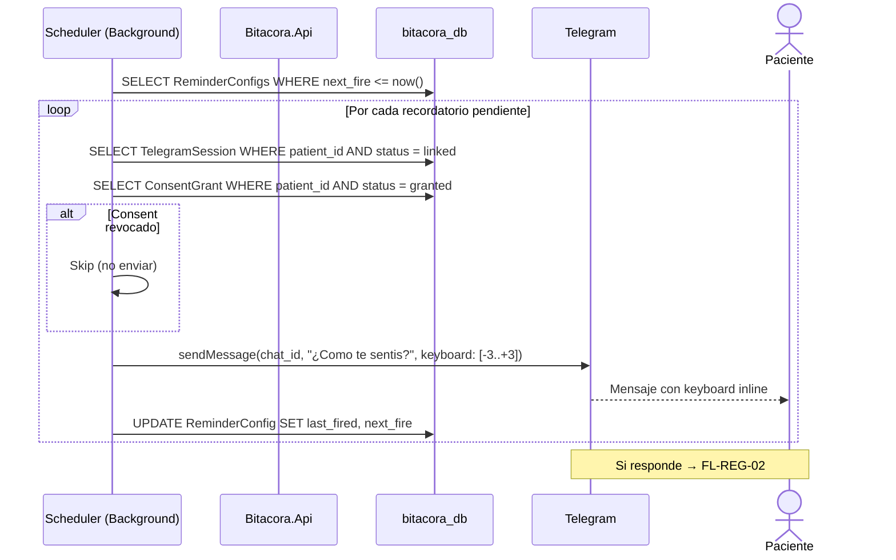

# FL-TG-02: Recordatorio programado

## Goal
El sistema envia recordatorios automaticos via Telegram a los pacientes que configuraron horarios de check-in.

## Scope
**In:** Scheduler, envio de mensaje, manejo de respuesta inline.
**Out:** Registro de humor (→ FL-REG-02).

## Actores y ownership
| Actor | Rol en el flujo |
|-------|----------------|
| Sistema | Ejecuta scheduler, envia mensajes |
| Paciente | Recibe recordatorio, responde (opcional) |
| Modulo Telegram | Gestiona envio y recepcion |

## Precondiciones
- TelegramSession en estado `linked`
- Paciente tiene al menos un horario de recordatorio configurado
- ConsentGrant activo (si el consent fue revocado, no se envian recordatorios)

## Postcondiciones
- Mensaje de recordatorio enviado al paciente
- Si el paciente responde, flujo continua en FL-REG-02

## Secuencia principal

## Paths alternativos / errores

| Condicion | Resultado |
|-----------|----------|
| TelegramSession unlinked | Skip recordatorio |
| ConsentGrant revocado | Skip recordatorio (hard invariant) |
| Telegram API falla | Retry con backoff (max 3 intentos) |
| Paciente no responde | No action, proximo recordatorio en siguiente horario |

## Architecture slice
- **Modulos:** Telegram (background scheduler)
- **Patron:** Background service con timer (hosted service .NET)
- **Invariante:** No enviar si consent revocado

## Data touchpoints
| Entidad | Operacion |
|---------|-----------|
| ReminderConfig | READ + UPDATE (next_fire) |
| TelegramSession | READ |
| ConsentGrant | READ |

## RF candidatos
- RF-TG-010: Scheduler background para recordatorios
- RF-TG-011: Enviar mensaje con keyboard inline a Telegram
- RF-TG-012: Skip si consent revocado o session unlinked

## Bottlenecks y mitigaciones
| Riesgo | Mitigacion |
|--------|-----------|
| Muchos recordatorios al mismo minuto | Batch de envios + rate limit de Telegram API (30 msg/seg) |
| Telegram API down | Retry con backoff exponencial (max 3) |

## RF handoff checklist
- [x] Actores y ownership explicitos
- [x] Diagrama explica el flujo sin prosa
- [x] Bottlenecks y mitigaciones explicitos
- [x] Traducible a RF atomicos y testeables
- [x] Dentro del limite de 1 pagina
