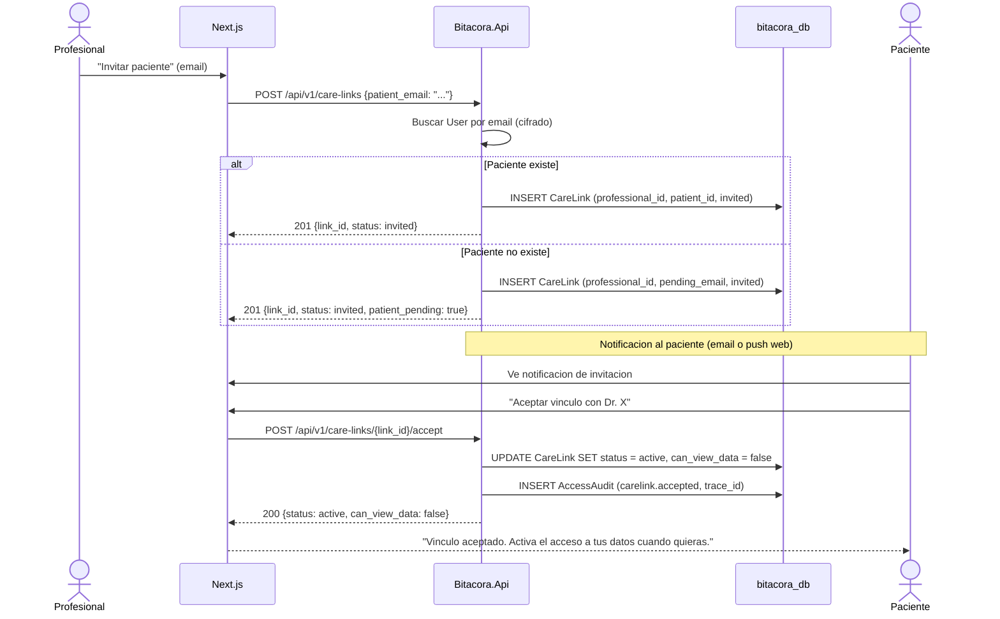

# FL-VIN-01: Invitacion profesional a paciente

## Goal
Un profesional invita a un paciente a vincularse, generando un CareLink pendiente que el paciente debe aceptar.

## Scope
**In:** Creacion de invitacion, notificacion al paciente, aceptacion.
**Out:** Auto-vinculacion (→ FL-VIN-02), revocacion (→ FL-VIN-03).

## Actores y ownership
| Actor | Rol en el flujo |
|-------|----------------|
| Profesional | Genera invitacion con email o codigo |
| Paciente | Acepta o rechaza la invitacion |
| Modulo Vinculos | Crea CareLink, gestiona estados |
| Capa Seguridad | Audit de creacion y aceptacion |

## Precondiciones
- Profesional autenticado con rol `professional`
- Paciente existe en el sistema (por email) o se le envia invitacion para registrarse

## Postcondiciones
- CareLink creado en estado `invited` → `active` (tras aceptacion)
- `can_view_data` default `false` hasta que paciente active
- AccessAudit registrado

## Secuencia principal

## Paths alternativos / errores

| Condicion | Resultado | HTTP |
|-----------|----------|------|
| Email de paciente no encontrado | CareLink pending hasta que se registre | 201 |
| CareLink ya existe y esta activo | Retornar link existente | 409 |
| Paciente rechaza invitacion | CareLink → rejected | 200 |

## Architecture slice
- **Modulos:** Auth → Vinculos → Seguridad
- **Invariante T3-11:** `can_view_data` default false, paciente activa

## Data touchpoints
| Entidad | Operacion | Estado |
|---------|-----------|--------|
| CareLink | INSERT → UPDATE | invited → active |
| AccessAudit | INSERT x2 | append-only |

## RF candidatos
- RF-VIN-001: Crear CareLink con invitacion del profesional
- RF-VIN-002: Buscar paciente por email cifrado
- RF-VIN-003: Aceptar invitacion y activar CareLink
- RF-VIN-004: `can_view_data` default false (T3-11)

## Bottlenecks y mitigaciones
| Riesgo | Mitigacion |
|--------|-----------|
| Busqueda por email cifrado (no indexable) | Indice sobre hash(email) para lookup |
| Spam de invitaciones | Rate limit por profesional (max 10/dia) |

## RF handoff checklist
- [x] Actores y ownership explicitos
- [x] Diagrama explica el flujo sin prosa
- [x] Bottlenecks y mitigaciones explicitos
- [x] Traducible a RF atomicos y testeables
- [x] Dentro del limite de 1 pagina
