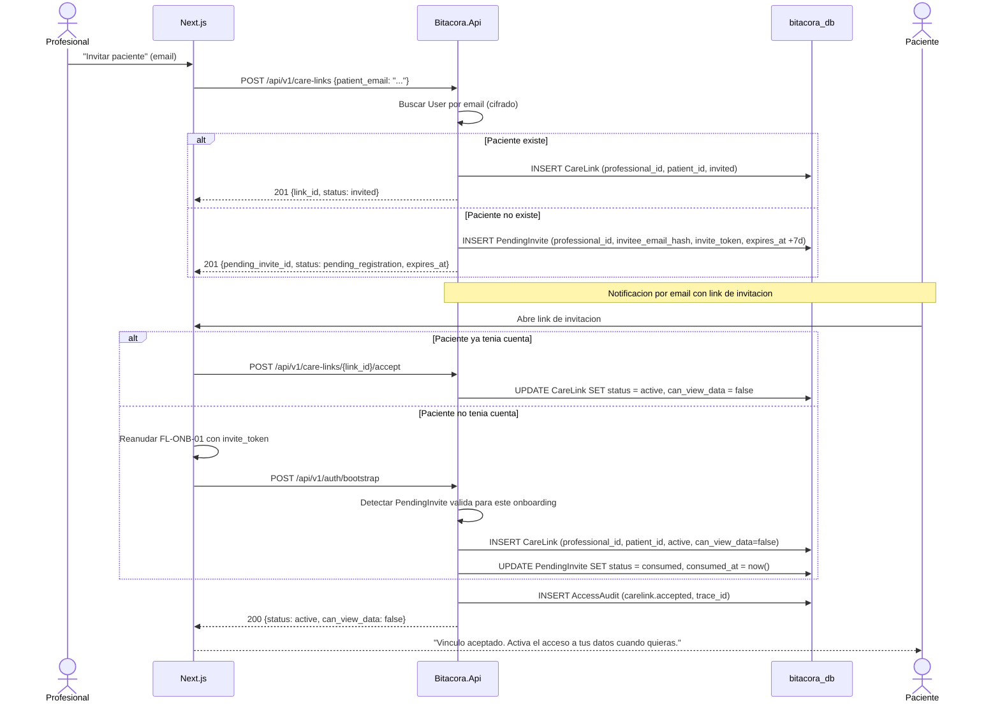

# FL-VIN-01: Invitacion profesional a paciente

## Estado actual

`Diferido — no implementado en Wave 30`.

Este flujo describe la invitacion directa del profesional y sigue siendo canon objetivo del MVP. La emision de `POST /api/v1/care-links` aun no existe en el runtime.

## Goal
Un profesional emite una invitacion de vinculo para un paciente, generando un `CareLink` en estado `invited` si el paciente ya existe o una `PendingInvite` si todavia no tiene cuenta.

## Scope
**In:** Emision de invitacion por email, notificacion al paciente, aceptacion o reanudacion automatica del onboarding invitado.
**Out:** Auto-vinculacion (→ FL-VIN-02), revocacion (→ FL-VIN-03).

## Actores y ownership
| Actor | Rol en el flujo |
|-------|----------------|
| Profesional | Emite la invitacion con email del paciente |
| Paciente | Acepta la invitacion o reanuda onboarding desde el link |
| Modulo Vinculos | Crea `CareLink` o `PendingInvite`, gestiona expiracion y aceptacion |
| Capa Seguridad | Audit de creacion y aceptacion |

## Precondiciones
- Profesional autenticado con rol `professional`
- Email del paciente provisto y valido

## Postcondiciones
- Si el paciente existe: `CareLink` creado en estado `invited`
- Si el paciente no existe: `PendingInvite` emitida con TTL fijo de 7 dias y `invite_token` opaco
- Si la invitacion se completa: `CareLink` activo con `can_view_data=false`
- AccessAudit registrado

## Secuencia principal

## Paths alternativos / errores

| Condicion | Resultado | HTTP |
|-----------|----------|------|
| Email de paciente no encontrado en la base local | PendingInvite emitida con TTL 7 dias | 201 |
| PendingInvite expirada | Debe emitirse una nueva invitacion | 410 |
| CareLink ya existe y esta activo | Retornar link existente | 409 |
| Paciente rechaza invitacion | CareLink → rejected | 200 |

## Architecture slice
- **Modulos:** Auth → Vinculos → Seguridad
- **Invariante T3-11:** `can_view_data` default false, paciente activa

## Data touchpoints
| Entidad | Operacion | Estado |
|---------|-----------|--------|
| PendingInvite | INSERT → UPDATE | issued → consumed / expired |
| CareLink | INSERT → UPDATE | invited → active |
| AccessAudit | INSERT x2 | append-only |

## RF candidatos
- RF-VIN-001: Emitir invitacion de vinculo del profesional
- RF-VIN-002: Buscar paciente por email cifrado
- RF-VIN-003: Aceptar invitacion y materializar/activar CareLink
- RF-VIN-004: `can_view_data` default false (T3-11)

## Bottlenecks y mitigaciones
| Riesgo | Mitigacion |
|--------|-----------|
| Busqueda por email cifrado (no indexable) | Indice sobre hash(email) para lookup |
| Invitacion a paciente no registrado expira antes del alta | TTL fijo 7 dias + reanudacion automatica de onboarding |
| Spam de invitaciones | Rate limit por profesional (max 10/dia) |

## RF handoff checklist
- [x] Actores y ownership explicitos
- [x] Diagrama explica el flujo sin prosa
- [x] Bottlenecks y mitigaciones explicitos
- [x] Traducible a RF atomicos y testeables
- [x] Dentro del limite de 1 pagina
