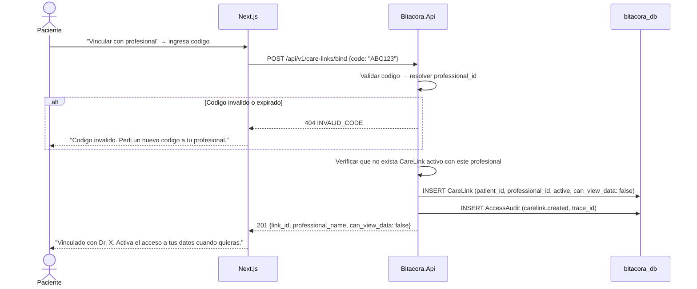

# FL-VIN-02: Auto-vinculacion paciente a profesional

## Goal
Un paciente se vincula a un profesional usando un codigo de vinculacion que el profesional comparte (ej: en consultorio).

## Scope
**In:** Paciente ingresa codigo, se crea CareLink directo.
**Out:** Invitacion del profesional (→ FL-VIN-01), revocacion (→ FL-VIN-03).

## Actores y ownership
| Actor | Rol en el flujo |
|-------|----------------|
| Paciente | Ingresa codigo de vinculacion |
| Profesional | Previamente genero el codigo desde su dashboard |
| Modulo Vinculos | Valida codigo, crea CareLink |
| Capa Seguridad | Audit |

## Precondiciones
- Paciente autenticado con ConsentGrant granted
- Profesional tiene un codigo de vinculacion activo

## Postcondiciones
- CareLink creado en estado `active`
- `can_view_data` default `false`
- AccessAudit registrado

## Secuencia principal

## Paths alternativos / errores

| Condicion | Resultado | HTTP |
|-----------|----------|------|
| Codigo invalido/expirado | Rechazo con mensaje | 404 |
| CareLink ya existe | Retornar existente | 409 |
| Profesional inactivo | Rechazo | 404 |

## Architecture slice
- **Modulos:** Auth → Vinculos → Seguridad
- **Patron:** Codigo alfanumerico con TTL (24-72h), generado por profesional

## Data touchpoints
| Entidad | Operacion | Estado |
|---------|-----------|--------|
| CareLink | INSERT | active (can_view_data: false) |
| AccessAudit | INSERT | append-only |

## RF candidatos
- RF-VIN-010: Generar codigo de vinculacion para profesional
- RF-VIN-011: Validar codigo y resolver professional_id
- RF-VIN-012: Crear CareLink por auto-vinculacion

## Bottlenecks y mitigaciones
| Riesgo | Mitigacion |
|--------|-----------|
| Fuerza bruta de codigos | Codigos alfanumericos 8+ chars + rate limit + expiracion |

## RF handoff checklist
- [x] Actores y ownership explicitos
- [x] Diagrama explica el flujo sin prosa
- [x] Bottlenecks y mitigaciones explicitos
- [x] Traducible a RF atomicos y testeables
- [x] Dentro del limite de 1 pagina
