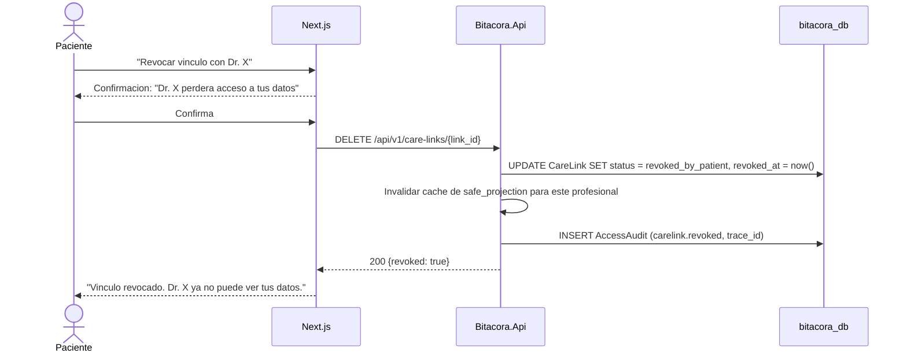

# FL-VIN-03: Revocacion de vinculo por paciente

## Goal
El paciente revoca un vinculo con un profesional, cortando inmediatamente el acceso a sus datos.

## Scope
**In:** Revocacion de CareLink, cascade de cache, audit.
**Out:** Revocacion de consentimiento completa (→ FL-CON-02).

## Actores y ownership
| Actor | Rol en el flujo |
|-------|----------------|
| Paciente | Solicita revocacion del vinculo |
| Modulo Vinculos | Cambia estado del CareLink |
| Capa Seguridad | Invalida caches, registra audit |

## Precondiciones
- Paciente autenticado
- CareLink en estado `active`

## Postcondiciones
- CareLink en estado `revoked_by_patient`
- Profesional pierde acceso inmediato
- Caches de safe_projection invalidadas
- AccessAudit registrado

## Secuencia principal

## Paths alternativos / errores

| Condicion | Resultado | HTTP |
|-----------|----------|------|
| CareLink ya revocado | Retornar estado actual | 200 |
| CareLink no pertenece al paciente | Rechazo | 403 |

## Architecture slice
- **Modulos:** Auth → Vinculos → Seguridad
- **Invariante:** Revocacion inmediata + invalidacion de cache

## Data touchpoints
| Entidad | Operacion | Estado |
|---------|-----------|--------|
| CareLink | UPDATE | revoked_by_patient |
| AccessAudit | INSERT | append-only |

## RF candidatos
- RF-VIN-020: Revocar CareLink por paciente
- RF-VIN-021: Invalidar caches de safe_projection del profesional
- RF-VIN-022: Registrar audit de revocacion
- RF-VIN-023: Verificar ownership del CareLink antes de revocar

## Bottlenecks y mitigaciones
| Riesgo | Mitigacion |
|--------|-----------|
| Profesional accede durante revocacion | Invalidacion de cache sincrona en la tx |

## RF handoff checklist
- [x] Actores y ownership explicitos
- [x] Diagrama explica el flujo sin prosa
- [x] Bottlenecks y mitigaciones explicitos
- [x] Traducible a RF atomicos y testeables
- [x] Dentro del limite de 1 pagina
