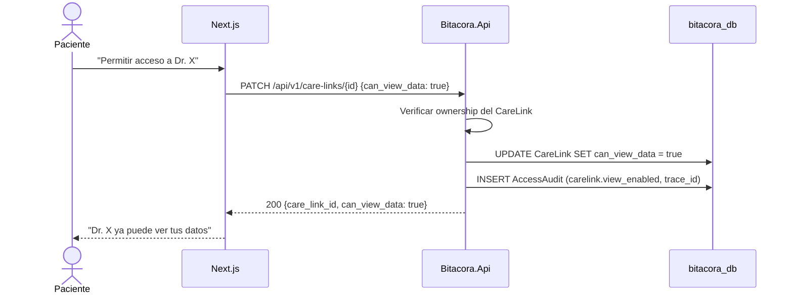

# FL-VIN-04: Gestion de acceso del profesional por paciente

## Goal
El paciente controla si un profesional vinculado puede ver o dejar de ver sus datos clinicos, activando o desactivando `can_view_data` sobre un `CareLink` activo.

## Scope
**In:** Verificacion de ownership, cambio de `can_view_data`, audit del cambio.
**Out:** Creacion de vinculo (→ FL-VIN-01 / FL-VIN-02), revocacion total del vinculo (→ FL-VIN-03).

## Actores y ownership
| Actor | Rol en el flujo |
|-------|----------------|
| Paciente | Habilita o deshabilita el acceso del profesional |
| Modulo Vinculos | Verifica ownership y actualiza `can_view_data` |
| Capa Seguridad | Registra audit del cambio |

## Precondiciones
- Paciente autenticado
- `CareLink` existente en estado `active`
- El `patient_id` autenticado es owner del `CareLink`

## Postcondiciones
- `CareLink.can_view_data` actualizado segun la decision del paciente
- El dashboard profesional refleja el cambio en la siguiente consulta
- AccessAudit registrado

## Secuencia principal

## Paths alternativos / errores

| Condicion | Resultado | HTTP |
|-----------|----------|------|
| Requestor no es owner del CareLink | Rechazo | 403 |
| CareLink no esta `active` | Rechazo | 409 |
| CareLink inexistente | Rechazo | 404 |

## Architecture slice
- **Modulos:** Auth → Vinculos → Seguridad
- **Invariante T3-11:** solo el paciente controla `can_view_data`

## Data touchpoints
| Entidad | Operacion | Estado |
|---------|-----------|--------|
| CareLink | UPDATE | `can_view_data=true|false` |
| AccessAudit | INSERT | append-only |

## RF candidatos
- RF-VIN-022: Verificar ownership del CareLink
- RF-VIN-023: Activar o desactivar `can_view_data` por paciente

## Bottlenecks y mitigaciones
| Riesgo | Mitigacion |
|--------|-----------|
| Profesional lee justo despues del cambio | El filtro por `can_view_data` aplica en el siguiente request |

## RF handoff checklist
- [x] Actores y ownership explicitos
- [x] Diagrama explica el flujo sin prosa
- [x] Bottlenecks y mitigaciones explicitos
- [x] Traducible a RF atomicos y testeables
- [x] Dentro del limite de 1 pagina
