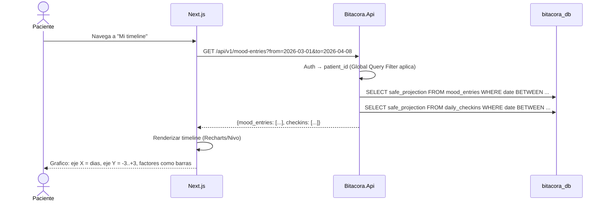

# FL-VIS-01: Timeline longitudinal (paciente)

## Goal
El paciente visualiza su grafico de humor longitudinal (estilo NIMH-LCM) con factores asociados.

## Scope
**In:** Query de safe_projection, render de timeline, filtros de periodo.
**Out:** Dashboard del profesional (→ FL-VIS-02), export (→ FL-EXP-01).

## Actores y ownership
| Actor | Rol en el flujo |
|-------|----------------|
| Paciente | Consulta su timeline |
| Modulo Auth | Valida JWT, resuelve patient_id |
| Modulo Visualizacion | Query safe_projection, genera datos para chart |

## Precondiciones
- Paciente autenticado
- Al menos 1 MoodEntry registrado

## Postcondiciones
- Timeline renderizado en el navegador
- No se generan registros de escritura (flujo de solo lectura)

## Secuencia principal

## Paths alternativos / errores

| Condicion | Resultado | HTTP |
|-----------|----------|------|
| Sin datos en el periodo | Grafico vacio con mensaje "Sin registros" | 200 (array vacio) |
| Periodo > 365 dias | Paginacion obligatoria | 200 (paginado) |

## Architecture slice
- **Modulos:** Auth → Visualizacion
- **Datos:** Solo `safe_projection` (nunca encrypted_payload)
- **Filtrado:** EF Core Global Query Filter por patient_id

## Data touchpoints
| Entidad | Operacion |
|---------|-----------|
| MoodEntry.safe_projection | READ |
| DailyCheckin.safe_projection | READ |

## RF candidatos
- RF-VIS-001: Query de mood_entries por rango de fechas (safe_projection)
- RF-VIS-002: Query de daily_checkins por rango de fechas
- RF-VIS-003: Paginacion para periodos largos (> 90 dias)

## Bottlenecks y mitigaciones
| Riesgo | Mitigacion |
|--------|-----------|
| Muchos registros (paciente de anos) | Paginacion + limite default 90 dias |

## RF handoff checklist
- [x] Actores y ownership explicitos
- [x] Diagrama explica el flujo sin prosa
- [x] Bottlenecks y mitigaciones explicitos
- [x] Traducible a RF atomicos y testeables
- [x] Dentro del limite de 1 pagina
