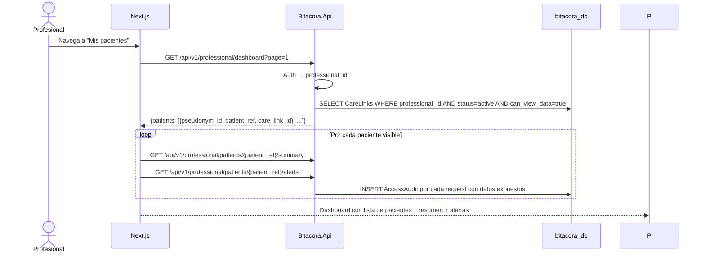

# FL-VIS-02: Dashboard multi-paciente (profesional)

## Goal
El profesional visualiza un dashboard resumen de todos sus pacientes vinculados, con alertas basicas.

## Scope
**In:** Listar pacientes vinculados, resumen de humor reciente, alertas basicas.
**Out:** Detalle de un paciente (→ FL-VIS-01 con contexto profesional), export (→ FL-EXP-01).

## Actores y ownership
| Actor | Rol en el flujo |
|-------|----------------|
| Profesional | Consulta dashboard |
| Modulo Auth | Valida JWT, resuelve professional_id |
| Modulo Vinculos | Lista CareLinks activos con can_view_data = true |
| Modulo Visualizacion | Lista pacientes accesibles y expone queries por paciente para resumen y alertas |
| Capa Seguridad | Registra audit de acceso a datos de paciente |

## Precondiciones
- Profesional autenticado con rol `professional`
- Al menos 1 CareLink activo con `can_view_data = true`

## Postcondiciones
- Dashboard renderizado
- AccessAudit registrado por cada paciente cuyos datos se acceden en `/dashboard`, `/summary` o `/alerts`

## Secuencia principal

## Paths alternativos / errores

| Condicion | Resultado | HTTP |
|-----------|----------|------|
| Sin CareLinks activos | Dashboard vacio "Sin pacientes vinculados" | 200 |
| CareLink activo pero can_view_data = false | Paciente oculto silenciosamente | 200 |
| Consent del paciente revocado | CareLink no aparece (filtrado automatico) | 200 |

## Architecture slice
- **Modulos:** Auth → Vinculos → Visualizacion → Seguridad
- **Invariante T3-11:** Solo pacientes con `can_view_data = true`
- **Audit:** Cada acceso a safe_projection de paciente se audita

## Data touchpoints
| Entidad | Operacion |
|---------|-----------|
| CareLink | READ (filtro active + can_view_data) |
| MoodEntry.safe_projection | READ (via `/summary` y `/alerts`) |
| AccessAudit | INSERT (por paciente accedido) |

## RF candidatos
- RF-VIS-010: Listar pacientes vinculados con can_view_data = true
- RF-VIS-011: Resumen de humor ultimos 7 dias por paciente
- RF-VIS-012: Calcular alertas basicas (N dias consecutivos en zona critica)
- RF-VIS-013: Paginacion de lista de pacientes
- RF-VIS-014: Audit por cada paciente cuyos datos se acceden

## Bottlenecks y mitigaciones
| Riesgo | Mitigacion |
|--------|-----------|
| Profesional con muchos pacientes (100+) | Paginacion obligatoria (20/pagina) |
| N+1 queries por paciente | Batch query con safe_projection agrupado |
| Audit masivo (1 registro por paciente) | Batch insert de audits en misma tx |

## RF handoff checklist
- [x] Actores y ownership explicitos
- [x] Diagrama explica el flujo sin prosa
- [x] Bottlenecks y mitigaciones explicitos
- [x] Traducible a RF atomicos y testeables
- [x] Dentro del limite de 1 pagina
