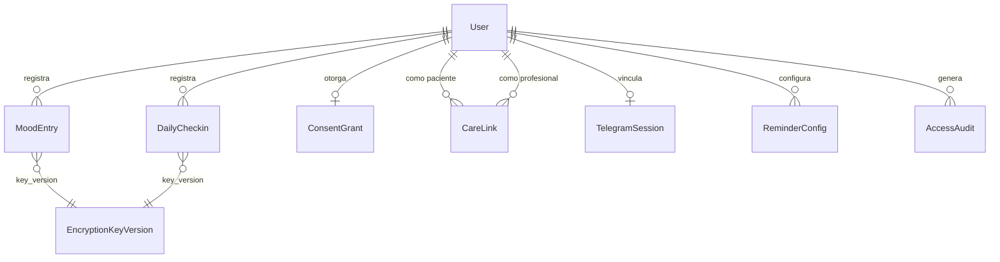

# 05 — Modelo de Datos

## Entidades principales

### User (Identidad)

| Campo | Tipo | Descripcion |
|-------|------|-------------|
| user_id | UUID | PK |
| supabase_user_id | string | ID externo de Supabase Auth |
| encrypted_email | bytea | Email cifrado AES (app-layer) |
| email_hash | string | HASH(email) para lookup sin descifrar |
| encrypted_first_name | bytea | Nombre cifrado AES |
| encrypted_last_name | bytea | Apellido cifrado AES |
| encrypted_dni | bytea | DNI cifrado AES |
| encrypted_phone | bytea | Telefono cifrado AES |
| role | enum | `patient` / `professional` |
| status | enum | `registered` → `consent_granted` → `active` / `deletion_requested` → `anonymized` |
| created_at_utc | timestamp | |
| sessions_revoked_at | timestamp? | Para revocacion global de sesiones |

> **Invariante T3-7:** Ningun campo de salud en esta tabla. PII cifrado a nivel app.

### MoodEntry (Dato clinico — humor)

| Campo | Tipo | Descripcion |
|-------|------|-------------|
| mood_entry_id | UUID | PK |
| patient_id | UUID | FK → User (Global Query Filter) |
| encrypted_payload | bytea | {mood_score, notes, channel, ...} cifrado AES |
| safe_projection | jsonb | {mood_score: int, channel: string, created_at: timestamp} en claro |
| key_version | int | Version de clave de cifrado |
| encrypted_at | timestamp | |
| created_at_utc | timestamp | |

> **Invariante:** Inmutable (append-only, sin UPDATE/DELETE).
> **safe_projection:** Solo datos operacionales minimos para queries de visualizacion.

### DailyCheckin (Dato clinico — factores diarios)

| Campo | Tipo | Descripcion |
|-------|------|-------------|
| daily_checkin_id | UUID | PK |
| patient_id | UUID | FK → User |
| checkin_date | date | Una entrada por dia (UNIQUE con patient_id) |
| encrypted_payload | bytea | {sleep_hours, physical_activity, social_activity, anxiety, irritability, medication_taken, medication_time, ...} cifrado AES |
| safe_projection | jsonb | {sleep_hours: decimal, has_physical: bool, has_social: bool, has_anxiety: bool, has_irritability: bool, has_medication: bool} en claro |
| key_version | int | |
| encrypted_at | timestamp | |
| created_at_utc | timestamp | |
| updated_at_utc | timestamp? | Se permite update del mismo dia |

> **Constraint:** UNIQUE(patient_id, checkin_date) — un DailyCheckin por dia.

### ConsentGrant (Consentimiento informado)

| Campo | Tipo | Descripcion |
|-------|------|-------------|
| consent_grant_id | UUID | PK |
| patient_id | UUID | FK → User |
| consent_version | string | Version del texto de consentimiento (ej: "1.0") |
| status | enum | `pending` → `granted` → `revoked` |
| granted_at | timestamp? | |
| revoked_at | timestamp? | |
| created_at_utc | timestamp | |

> **Invariante:** Hard gate — ningun registro clinico sin status = `granted`.

### CareLink (Vinculo profesional-paciente)

| Campo | Tipo | Descripcion |
|-------|------|-------------|
| care_link_id | UUID | PK |
| professional_id | UUID | FK → User (role = professional) |
| patient_id | UUID | FK → User (role = patient) |
| status | enum | `invited` → `active` → `revoked_by_patient` / `revoked_by_consent` / `rejected` |
| can_view_data | bool | Default `false`. Solo el paciente puede cambiar a `true`. |
| invited_at | timestamp | |
| accepted_at | timestamp? | |
| revoked_at | timestamp? | |
| created_at_utc | timestamp | |

> **Invariante T3-11:** `can_view_data` default false. Solo el paciente activa.

### TelegramSession (Vinculacion Telegram)

| Campo | Tipo | Descripcion |
|-------|------|-------------|
| telegram_session_id | UUID | PK |
| patient_id | UUID | FK → User |
| chat_id | bigint | ID del chat de Telegram (UNIQUE) |
| status | enum | `linked` → `unlinked` |
| linked_at | timestamp | |
| unlinked_at | timestamp? | |

### TelegramPairingCode (Temporal)

| Campo | Tipo | Descripcion |
|-------|------|-------------|
| pairing_code_id | UUID | PK |
| patient_id | UUID | FK → User |
| code | string | Codigo alfanumerico (ej: "BIT-A7X3K2") |
| expires_at | timestamp | TTL 15 min |
| used | bool | Default false |

### ReminderConfig (Recordatorios)

| Campo | Tipo | Descripcion |
|-------|------|-------------|
| reminder_config_id | UUID | PK |
| patient_id | UUID | FK → User |
| time_of_day | time | Hora del recordatorio |
| is_active | bool | |
| last_fired_at | timestamp? | |
| next_fire_at | timestamp? | |

### AccessAudit (Auditoria — append-only)

| Campo | Tipo | Descripcion |
|-------|------|-------------|
| audit_id | UUID | PK |
| trace_id | UUID | Traza end-to-end |
| actor_id | UUID | ID real (solo en audit) |
| pseudonym_id | string | HASH(actor_id + salt) |
| action_type | enum | `create` / `read` / `update` / `delete` / `grant` / `revoke` / `export` |
| resource_type | string | `mood_entry` / `daily_checkin` / `consent_grant` / `care_link` / `telegram_session` |
| resource_id | UUID? | |
| patient_id | UUID? | Paciente afectado |
| outcome | enum | `ok` / `failed` / `denied` |
| created_at_utc | timestamp | |

> **Invariante T3-9:** Sin UPDATE ni DELETE. Append-only.
> **Invariante T3-8:** `pseudonym_id` en logs operacionales. `actor_id` solo aqui.

### EncryptionKeyVersion (Gestion de claves)

| Campo | Tipo | Descripcion |
|-------|------|-------------|
| key_version | int | PK, monotonically increasing |
| created_at_utc | timestamp | |
| is_active | bool | Solo una version activa a la vez |

> Key material no se almacena en DB. Se carga desde vault/env.

## Diagrama de relaciones

## Reglas de retencion

| Entidad | Retencion | Justificacion |
|---------|-----------|---------------|
| AccessAudit | 2 anos minimo | Compliance auditoria |
| MoodEntry (crisis: mood_score = -3) | 5 anos minimo | Ley 26.657 salud mental |
| MoodEntry (regular) | Segun consentimiento | Definido con el paciente |
| ConsentGrant | Permanente | Evidencia legal |
| User (post-supresion) | Anonimizado, audit retenido | Ley 25.326 |

---

*Fuente: `.docs/wiki/02_arquitectura.md`, `.docs/wiki/03_FL/FL-*.md`, `.docs/raw/decisiones/02_decisiones_arquitectura.md`*
