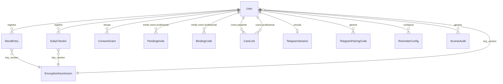

# 05 — Modelo de Datos

## Estado de implementacion actual

`Wave 1 + Wave 30 + Phase 31` del runtime backend:

- `User`
- `ConsentGrant`
- `MoodEntry`
- `DailyCheckin`
- `PendingInvite`
- `AccessAudit`
- `EncryptionKeyVersion`
- `BindingCode` (Wave 30)
- `CareLink` (Wave 30)
- `TelegramSession` (Phase 31)
- `TelegramPairingCode` (Phase 31)
- `ReminderConfig` (Phase 31 — entidades + ReminderWorker implementados; SendTelegramMessageAsync es stub)

La autoridad activa para planificar su materializacion pendiente vive en `.docs/plans/wave-prod/`. `.docs/raw/plans/wave-1/` se conserva solo como antecedente historico.

## Entidades principales

### User (Identidad)

| Campo | Tipo | Descripcion |
|-------|------|-------------|
| user_id | UUID | PK |
| supabase_user_id | string | ID externo de Supabase Auth |
| encrypted_email | bytea | Email cifrado app-layer |
| email_hash | string | HASH(email) para lookup sin descifrar |
| key_version | int | Version de clave usada para PII en `users` |
| role | enum | `patient` / `professional` |
| status | enum | `registered` → `consent_granted` → `active` / `deletion_requested` → `anonymized` |
| created_at_utc | timestamp | |
| sessions_revoked_at | timestamp? | Para revocacion global de sesiones |

> Invariante T3-7: Ningun campo de salud vive en esta tabla. La PII se cifra a nivel aplicacion.
> En `Wave 1` solo se materializaron `encrypted_email` y `email_hash`; otros campos PII extendidos quedan diferidos hasta que exista un caso funcional que los requiera.

### MoodEntry (Dato clinico — humor)

| Campo | Tipo | Descripcion |
|-------|------|-------------|
| mood_entry_id | UUID | PK |
| patient_id | UUID | FK → User (Global Query Filter) |
| encrypted_payload | bytea | `{mood_score, notes, channel, ...}` cifrado AES |
| safe_projection | jsonb | `{mood_score, channel, created_at}` en claro |
| key_version | int | Version de clave de cifrado clinico |
| encrypted_at | timestamp | |
| created_at_utc | timestamp | |

> Invariante: append-only, sin UPDATE ni DELETE.

### DailyCheckin (Dato clinico — factores diarios)

| Campo | Tipo | Descripcion |
|-------|------|-------------|
| daily_checkin_id | UUID | PK |
| patient_id | UUID | FK → User |
| checkin_date | date | Una entrada por dia (UNIQUE con `patient_id`) |
| encrypted_payload | bytea | `{sleep_hours, physical_activity, social_activity, anxiety, irritability, medication_taken, medication_time, ...}` cifrado AES |
| safe_projection | jsonb | `{sleep_hours, has_physical, has_social, has_anxiety, has_irritability, has_medication}` en claro |
| key_version | int | Version de clave de cifrado clinico |
| encrypted_at | timestamp | |
| created_at_utc | timestamp | |
| updated_at_utc | timestamp? | Se permite update del mismo dia |

> Constraint: `UNIQUE(patient_id, checkin_date)`.
> `medication_time` representa una hora aproximada autodeclarada, normalizada a bloques de 15 minutos y solo vive en `encrypted_payload`.

### ConsentGrant (Consentimiento informado)

| Campo | Tipo | Descripcion |
|-------|------|-------------|
| consent_grant_id | UUID | PK |
| patient_id | UUID | FK → User |
| consent_version | string | Version del texto de consentimiento activo al momento de aceptar |
| status | enum | `pending` → `granted` → `revoked` |
| granted_at | timestamp? | |
| revoked_at | timestamp? | |
| created_at_utc | timestamp | |

> Invariante: hard gate. Ningun registro clinico se crea sin `status='granted'`.
> El texto fuente del consentimiento vive en configuracion; en DB solo persiste la evidencia (`consent_version`, timestamps, estado).

### PendingInvite (Invitacion a paciente no registrado)

| Campo | Tipo | Descripcion |
|-------|------|-------------|
| pending_invite_id | UUID | PK |
| professional_id | UUID | FK → User (role=`professional`) |
| invitee_email_hash | string | HASH del email normalizado del invitado |
| invite_token | string | Token opaco para reanudar onboarding |
| status | enum | `issued` → `consumed` / `expired` / `revoked` |
| expires_at | timestamp | TTL fijo de 7 dias |
| consumed_at | timestamp? | |
| created_at_utc | timestamp | |

> Invariante: `PendingInvite` no otorga acceso clinico. Solo preserva contexto hasta que el paciente se registre y otorgue consentimiento.

### BindingCode (Codigo temporal de auto-vinculacion — Wave 30)

| Campo | Tipo | Descripcion |
|-------|------|-------------|
| binding_code_id | UUID | PK |
| professional_id | UUID | FK → User (role=`professional`) |
| code | string | Codigo con formato `BIT-XXXXX` |
| ttl_preset | string | `15m` / `3h` / `24h` / `72h` |
| expires_at | timestamp | Momento exacto de expiracion |
| used | bool | Default `false` |
| created_at_utc | timestamp | |

> Invariante: el TTL es configurable por emision de codigo, no por profesional ni por `CareLink`.

### CareLink (Vinculo profesional-paciente — Wave 30)

| Campo | Tipo | Descripcion |
|-------|------|-------------|
| care_link_id | UUID | PK |
| professional_id | UUID | FK → User (role=`professional`) |
| patient_id | UUID | FK → User (role=`patient`) |
| status | enum | `invited` → `active` → `revoked_by_patient` / `revoked_by_consent` / `rejected` |
| can_view_data | bool | Default `false`. Solo el paciente owner puede cambiarlo. |
| invited_at | timestamp | |
| accepted_at | timestamp? | |
| revoked_at | timestamp? | |
| created_at_utc | timestamp | |

> Invariante T3-11: `can_view_data` nace siempre en `false`.

## Entidades materializadas en Phase 31

### TelegramSession (Vinculacion Telegram — Phase 31)

| Campo | Tipo | Descripcion |
|-------|------|-------------|
| telegram_session_id | UUID | PK |
| patient_id | UUID | FK → User |
| chat_id | string | ID del chat de Telegram (UNIQUE cuando status=linked) |
| status | enum | `Linked` → `Unlinked` |
| linked_at_utc | timestamp | |
| unlinked_at_utc | timestamp? | |
| created_at_utc | timestamp | |

> Invariante: un `chat_id` solo puede estar vinculado a un paciente a la vez. Partial unique index sobre `(chat_id, status='linked')`.

### TelegramPairingCode (Temporal — Phase 31)

| Campo | Tipo | Descripcion |
|-------|------|-------------|
| telegram_pairing_code_id | UUID | PK |
| code | string | Codigo alfanumerico con formato `BIT-XXXXX` |
| patient_id | UUID | FK → User |
| expires_at | timestamp | TTL 15 min |
| used | bool | Default `false` |
| consumed_at | timestamp? | |
| created_at_utc | timestamp | |

> Invariante: un solo codigo activo por paciente; generar uno nuevo invalida el anterior. TTL rigido de 15 minutos para minimizar exposicion de PII.

### ReminderConfig (Recordatorios — Phase 31)

| Campo | Tipo | Descripcion |
|-------|------|-------------|
| reminder_config_id | UUID | PK |
| patient_id | UUID | FK → User |
| hour_utc | int | Hora del recordatorio (0-23 UTC) |
| minute_utc | int | Minuto (0-59 UTC) |
| enabled | bool | Si el recordatorio esta activo |
| next_fire_at_utc | timestamp? | Proximo disparo |
| created_at_utc | timestamp | |
| disabled_at_utc | timestamp? | |

> Invariante: `enabled=false` no se calcula automaticamente al desvincular la sesion Telegram; el registro persiste hasta que el paciente lo desactive explicitamente. El `ReminderWorker` procesa configs con `next_fire_at_utc <= now` cada 60 segundos. `SendTelegramMessageAsync` esta implementada en `SendReminderCommand.cs:118`.

### AccessAudit (Auditoria — append-only)

| Campo | Tipo | Descripcion |
|-------|------|-------------|
| audit_id | UUID | PK |
| trace_id | UUID | Traza end-to-end |
| actor_id | UUID | ID real del actor (solo en audit) |
| pseudonym_id | string | HASH(actor_id + salt) |
| action_type | enum | `create` / `read` / `update` / `delete` / `grant` / `revoke` / `export` |
| resource_type | string | `mood_entry` / `daily_checkin` / `consent_grant` / `care_link` / `pending_invite` / `binding_code` / `telegram_session` |
| resource_id | UUID? | |
| patient_id | UUID? | Paciente afectado |
| outcome | enum | `ok` / `failed` / `denied` |
| created_at_utc | timestamp | |

> Invariante T3-9: sin UPDATE ni DELETE. Append-only.
> Invariante T3-8: `pseudonym_id` en logs operacionales; `actor_id` solo aqui.

### EncryptionKeyVersion (Gestion de claves)

| Campo | Tipo | Descripcion |
|-------|------|-------------|
| key_version | int | PK, monotonically increasing |
| created_at_utc | timestamp | |
| is_active | bool | Solo una version activa a la vez |

> El key material no se almacena en DB. Solo se persiste el identificador de version.

## Proyecciones derivadas (no persistidas)

| Proyeccion | Descripcion |
|-----------|-------------|
| patient_ref | Identificador opaco de API para endpoints profesionales. No es una columna persistida; se deriva para contratos de lectura. |

## Diagrama de relaciones

## Invariantes de privacidad

1. **Dato clinico sensible por defecto:** MoodEntry y DailyCheckin son datos sensibles bajo Ley 25.326, 26.529 y 26.657. Todo acceso o persistencia debe respear estas invariantes.
2. **encrypted_payload: cifrado AES-256-GCM antes de PostgreSQL.** Ningun campo clinico se inscribe en texto plano. La unica excepcion es safe_projection (ver siguiente invariante).
3. **safe_projection no contiene PII, texto libre ni identificadores directos.** Solo campos operacionalmente necesarios: mood_score, channel, created_at para MoodEntry; sleep_hours, flags booleanos para DailyCheckin.
4. **key_version para trazabilidad de rotacion.** Cada registro lleva la version de clave con la que fue cifrado. Rotacion futura no requiere re-cifrado inmediato de records historicos.
5. **Descifrado solo en memoria de aplicacion.** El material de descifrado reside en variable de entorno o vault; nunca en logs, trazas ni respuestas HTTP.
6. **email_hash para lookup sin descifrado.** SHA256(email) permite identificacion del usuario sin exponer PII en tablas clinicas.
7. **TelegramSession.chat_id es PII.** La vinculacion Telegram genera un registro que asocia chat_id con patient_id. Este mapeo debe tratarse con igual rigor que cualquier otro PII.

## Invariantes de supresion y retencion

1. **MoodEntry (crisis: mood_score = -3) retencion minima 5 anos** bajo Ley 26.657 salud mental. No se elimina ni anonimiza automaticamente; la supresion requiere destruccion de clave + anonimizacion.
2. **AccessAudit retencion minima 2 anos** como archivo regulatorio bajo Ley 25.326. No aplica DELETE ni UPDATE.
3. **ConsentGrant es permanente:** evidencia legal de consentimiento informado. No se elimina aunque el paciente revoque.
4. **User post-supresion: status='anonymized', audit retenido.** El email y PII se hacen irreversibles. EncryptionKeyVersion para ese usuario pierde material. AccessAudit se retiene por su propio periodo regulatorio.
5. **PendingInvite expira en 7 dias.** No requiere accion de supresion; expira por TTL.
6. **BindingCode expira segun ttl_preset.** Una vez usado o expirado, no se reutiliza.
7. **TelegramPairingCode expira en 15 minutos.** Vinculacion rapida con TTL rigido para minimizar exposicion de PII.

---

*Fuente: `.docs/wiki/02_arquitectura.md`, `.docs/wiki/03_FL/FL-*.md`, `.docs/raw/decisiones/02_decisiones_arquitectura.md`*
