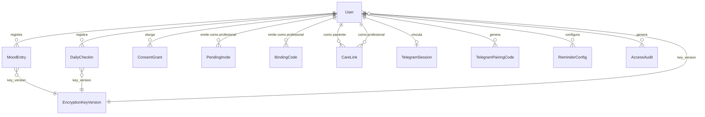

# 05 — Modelo de Datos

## Estado de implementación actual

`Wave 1` del runtime backend ya materializa en código y en la migración `InitialCore` este subconjunto del canon:

- `User`
- `ConsentGrant`
- `MoodEntry`
- `DailyCheckin`
- `PendingInvite`
- `AccessAudit`
- `EncryptionKeyVersion`

Las entidades `BindingCode`, `CareLink`, `TelegramSession`, `TelegramPairingCode` y `ReminderConfig` siguen siendo parte del canon funcional, pero todavía no forman parte del runtime generado bajo `src/` ni de la base física inicial.

## Entidades principales

### User (Identidad)

| Campo | Tipo | Descripcion |
|-------|------|-------------|
| user_id | UUID | PK |
| supabase_user_id | string | ID externo de Supabase Auth |
| encrypted_email | bytea | Email cifrado app-layer |
| email_hash | string | HASH(email) para lookup sin descifrar |
| key_version | int | Version de clave usada para PII en `users` |
| role | enum | `patient` / `professional` |
| status | enum | `registered` → `consent_granted` → `active` / `deletion_requested` → `anonymized` |
| created_at_utc | timestamp | |
| sessions_revoked_at | timestamp? | Para revocacion global de sesiones |

> Invariante T3-7: Ningun campo de salud vive en esta tabla. La PII se cifra a nivel aplicacion.
> En `Wave 1` solo se materializaron `encrypted_email` y `email_hash`; otros campos PII extendidos quedan diferidos hasta que exista un caso funcional que los requiera.

### MoodEntry (Dato clinico — humor)

| Campo | Tipo | Descripcion |
|-------|------|-------------|
| mood_entry_id | UUID | PK |
| patient_id | UUID | FK → User (Global Query Filter) |
| encrypted_payload | bytea | `{mood_score, notes, channel, ...}` cifrado AES |
| safe_projection | jsonb | `{mood_score, channel, created_at}` en claro |
| key_version | int | Version de clave de cifrado clinico |
| encrypted_at | timestamp | |
| created_at_utc | timestamp | |

> Invariante: append-only, sin UPDATE ni DELETE.

### DailyCheckin (Dato clinico — factores diarios)

| Campo | Tipo | Descripcion |
|-------|------|-------------|
| daily_checkin_id | UUID | PK |
| patient_id | UUID | FK → User |
| checkin_date | date | Una entrada por dia (UNIQUE con `patient_id`) |
| encrypted_payload | bytea | `{sleep_hours, physical_activity, social_activity, anxiety, irritability, medication_taken, medication_time, ...}` cifrado AES |
| safe_projection | jsonb | `{sleep_hours, has_physical, has_social, has_anxiety, has_irritability, has_medication}` en claro |
| key_version | int | Version de clave de cifrado clinico |
| encrypted_at | timestamp | |
| created_at_utc | timestamp | |
| updated_at_utc | timestamp? | Se permite update del mismo dia |

> Constraint: `UNIQUE(patient_id, checkin_date)`.
> `medication_time` representa una hora aproximada autodeclarada, normalizada a bloques de 15 minutos y solo vive en `encrypted_payload`.

### ConsentGrant (Consentimiento informado)

| Campo | Tipo | Descripcion |
|-------|------|-------------|
| consent_grant_id | UUID | PK |
| patient_id | UUID | FK → User |
| consent_version | string | Version del texto de consentimiento activo al momento de aceptar |
| status | enum | `pending` → `granted` → `revoked` |
| granted_at | timestamp? | |
| revoked_at | timestamp? | |
| created_at_utc | timestamp | |

> Invariante: hard gate. Ningun registro clinico se crea sin `status='granted'`.
> El texto fuente del consentimiento vive en configuracion; en DB solo persiste la evidencia (`consent_version`, timestamps, estado).

### PendingInvite (Invitacion a paciente no registrado)

| Campo | Tipo | Descripcion |
|-------|------|-------------|
| pending_invite_id | UUID | PK |
| professional_id | UUID | FK → User (role=`professional`) |
| invitee_email_hash | string | HASH del email normalizado del invitado |
| invite_token | string | Token opaco para reanudar onboarding |
| status | enum | `issued` → `consumed` / `expired` / `revoked` |
| expires_at | timestamp | TTL fijo de 7 dias |
| consumed_at | timestamp? | |
| created_at_utc | timestamp | |

> Invariante: `PendingInvite` no otorga acceso clinico. Solo preserva contexto hasta que el paciente se registre y otorgue consentimiento.

## Entidades canonicas aun no materializadas

Las siguientes entidades siguen vigentes en el modelo canonico y en `04_RF`, pero no existen todavia en la migracion `InitialCore` ni en el codigo del runtime:

### BindingCode (Codigo temporal de auto-vinculacion)

| Campo | Tipo | Descripcion |
|-------|------|-------------|
| binding_code_id | UUID | PK |
| professional_id | UUID | FK → User (role=`professional`) |
| code | string | Codigo con formato `BIT-XXXXX` |
| ttl_preset | enum | `15m` / `3h` / `24h` / `72h` |
| expires_at | timestamp | Momento exacto de expiracion |
| used | bool | Default `false` |
| created_at_utc | timestamp | |

> Invariante: el TTL es configurable por emision de codigo, no por profesional ni por `CareLink`.

### CareLink (Vinculo profesional-paciente)

| Campo | Tipo | Descripcion |
|-------|------|-------------|
| care_link_id | UUID | PK |
| professional_id | UUID | FK → User (role=`professional`) |
| patient_id | UUID | FK → User (role=`patient`) |
| status | enum | `invited` → `active` → `revoked_by_patient` / `revoked_by_consent` / `rejected` |
| can_view_data | bool | Default `false`. Solo el paciente owner puede cambiarlo. |
| invited_at | timestamp | |
| accepted_at | timestamp? | |
| revoked_at | timestamp? | |
| created_at_utc | timestamp | |

> Invariante T3-11: `can_view_data` nace siempre en `false`.

### TelegramSession (Vinculacion Telegram)

| Campo | Tipo | Descripcion |
|-------|------|-------------|
| telegram_session_id | UUID | PK |
| patient_id | UUID | FK → User |
| chat_id | bigint | ID del chat de Telegram (UNIQUE) |
| status | enum | `linked` → `unlinked` |
| linked_at | timestamp | |
| unlinked_at | timestamp? | |

### TelegramPairingCode (Temporal)

| Campo | Tipo | Descripcion |
|-------|------|-------------|
| pairing_code_id | UUID | PK |
| patient_id | UUID | FK → User |
| code | string | Codigo alfanumerico con formato `BIT-XXXXX` |
| expires_at | timestamp | TTL 15 min |
| used | bool | Default `false` |

### ReminderConfig (Recordatorios)

| Campo | Tipo | Descripcion |
|-------|------|-------------|
| reminder_config_id | UUID | PK |
| patient_id | UUID | FK → User |
| time_of_day | time | Hora del recordatorio |
| is_active | bool | |
| last_fired_at | timestamp? | |
| next_fire_at | timestamp? | |

### AccessAudit (Auditoria — append-only)

| Campo | Tipo | Descripcion |
|-------|------|-------------|
| audit_id | UUID | PK |
| trace_id | UUID | Traza end-to-end |
| actor_id | UUID | ID real del actor (solo en audit) |
| pseudonym_id | string | HASH(actor_id + salt) |
| action_type | enum | `create` / `read` / `update` / `delete` / `grant` / `revoke` / `export` |
| resource_type | string | `mood_entry` / `daily_checkin` / `consent_grant` / `care_link` / `pending_invite` / `binding_code` / `telegram_session` |
| resource_id | UUID? | |
| patient_id | UUID? | Paciente afectado |
| outcome | enum | `ok` / `failed` / `denied` |
| created_at_utc | timestamp | |

> Invariante T3-9: sin UPDATE ni DELETE. Append-only.
> Invariante T3-8: `pseudonym_id` en logs operacionales; `actor_id` solo aqui.

### EncryptionKeyVersion (Gestion de claves)

| Campo | Tipo | Descripcion |
|-------|------|-------------|
| key_version | int | PK, monotonically increasing |
| created_at_utc | timestamp | |
| is_active | bool | Solo una version activa a la vez |

> El key material no se almacena en DB. Solo se persiste el identificador de version.

## Proyecciones derivadas (no persistidas)

| Proyeccion | Descripcion |
|-----------|-------------|
| patient_ref | Identificador opaco de API para endpoints profesionales. No es una columna persistida; se deriva para contratos de lectura. |

## Diagrama de relaciones

## Reglas de retencion

| Entidad | Retencion | Justificacion |
|---------|-----------|---------------|
| AccessAudit | 2 anos minimo | Compliance auditoria |
| MoodEntry (crisis: mood_score = -3) | 5 anos minimo | Ley 26.657 salud mental |
| MoodEntry (regular) | Segun consentimiento | Definido con el paciente |
| ConsentGrant | Permanente | Evidencia legal |
| PendingInvite | 7 dias maximo | Invitacion temporal previa al alta |
| BindingCode | Hasta expiracion o uso | Artefacto temporal |
| TelegramPairingCode | 15 min maximo | Artefacto temporal |
| User (post-supresion) | Anonimizado, audit retenido | Ley 25.326 |

---

*Fuente: `.docs/wiki/02_arquitectura.md`, `.docs/wiki/03_FL/FL-*.md`, `.docs/raw/decisiones/02_decisiones_arquitectura.md`*
