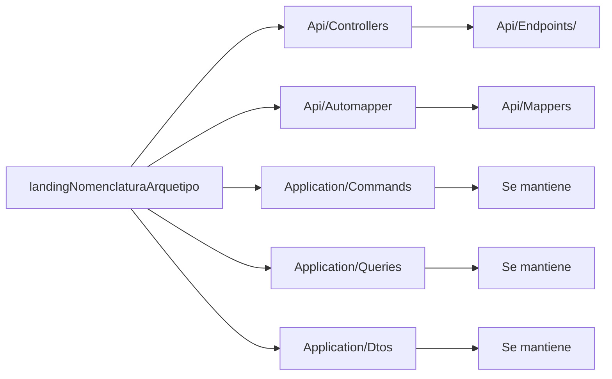

# Mapeo de Convenciones: landing -> Minimal API

Prerrequisito recomendado:
- Completar [Onboarding Dia 1](./first-day-onboarding.md).

## Mapa Visual

## Convenciones que se Mantienen
- `Api/ViewModels/<Controller>/<Operacion>/Input|Output`
- `Application/Commands/<Dominio>`
- `Application/Queries/<Dominio>`
- `Application/Dtos/<Operacion>/Input|Output`
- `DataAccess.*`, `Domain`, `EventBus`, `Infrastructure`, `Shared.*`

## Convenciones Adaptadas
- `Api/Controllers/*` -> `Api/Endpoints/<Dominio>/*`
- `Api/Automapper/*` -> `Api/Mappers/*` (Mapperly)

## Ejemplo de Nombres
- Operacion: `EditarUsuario`
- Endpoint: `MapPost("/api/v1/usuario/editar-usuario", ...)`
- Command: `EditarUsuarioCommand`
- Query: `GetUsuarioQuery`
