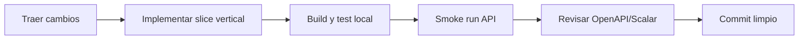
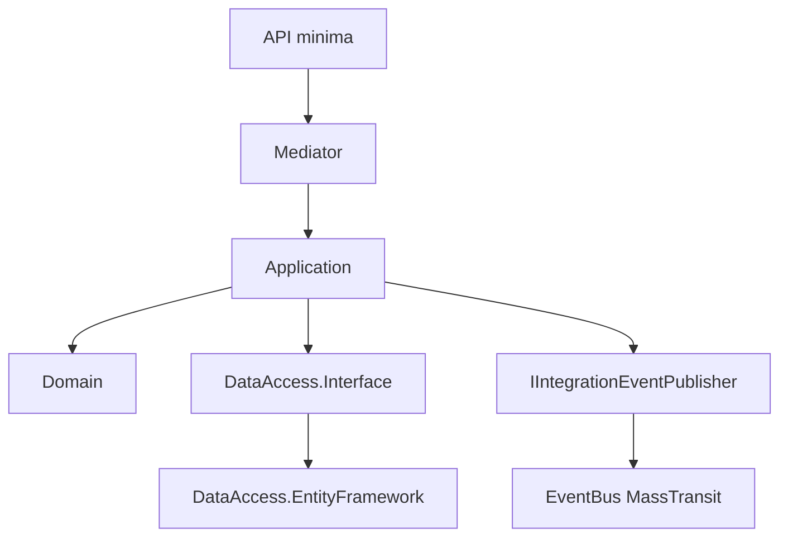
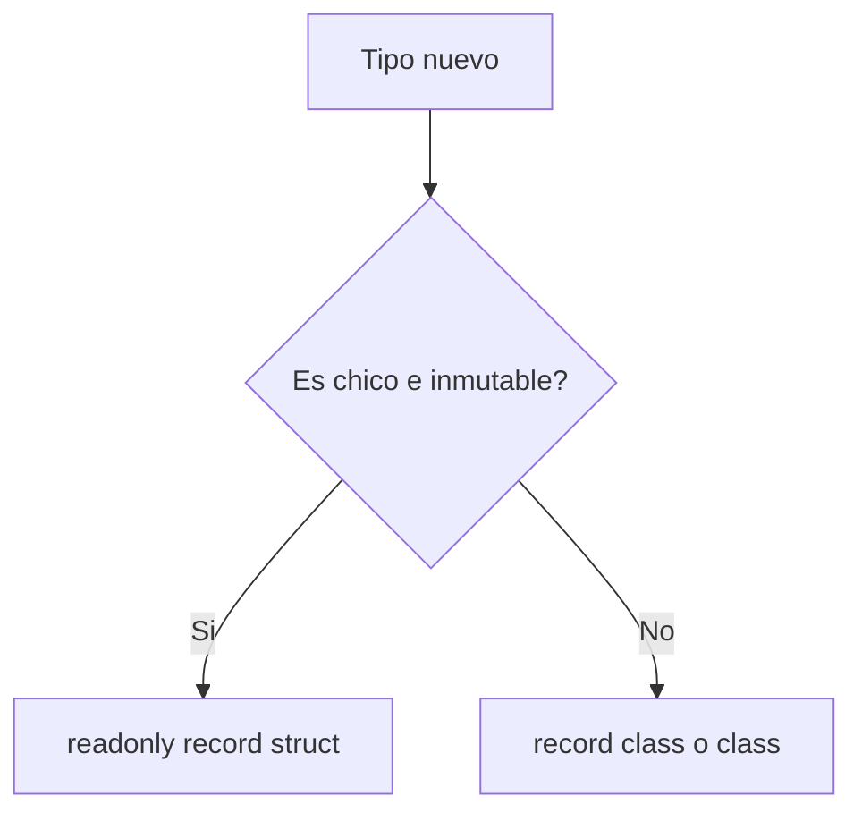
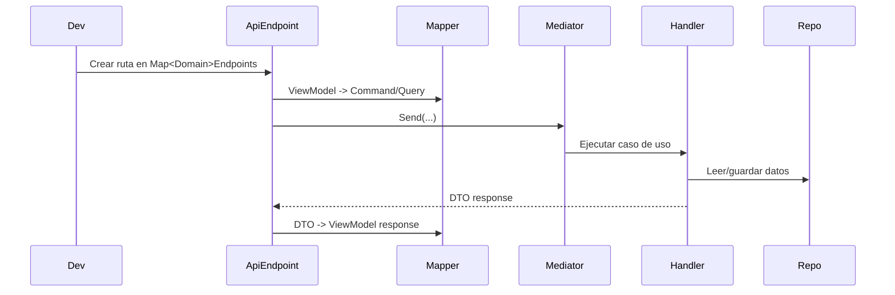
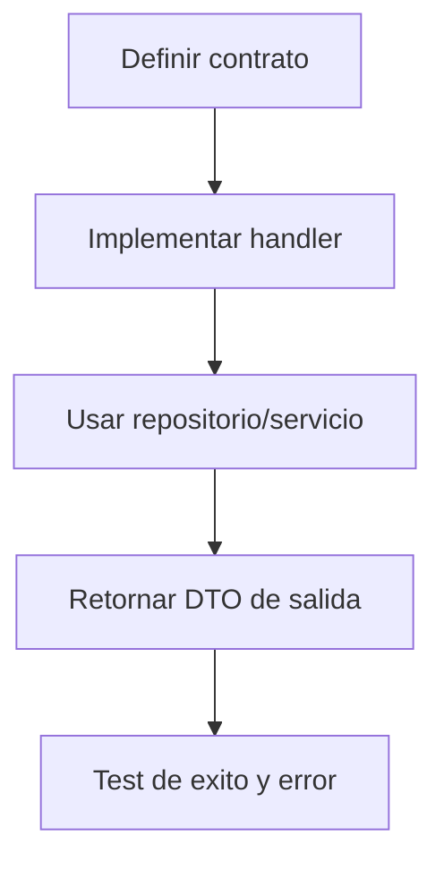
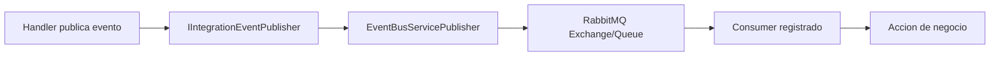

# Flujo Diario y Buenas Practicas de Codigo

## Objetivo
Definir una forma de trabajo diaria, simple y repetible, para equipos que usan este microservicio.

Antes de usar esta guia:
- Completar [Onboarding Dia 1](./first-day-onboarding.md).

## Flujo Diario


Comandos base:
```powershell
dotnet restore
dotnet build -c Release
dotnet test -c Release
dotnet run --project Bitacora.Api
```

## Buenas Practicas


- Mantener API delgada: endpoint solo valida transporte, mapea y llama `IMediator`.
- Reglas de negocio en `Application/Domain`, no en endpoints.
- Contratos inmutables (`readonly record struct`) cuando aplique.
- Mapping explicito con Mapperly.
- Evitar acoplar logica de negocio al transporte de mensajeria.
- Cuidar ciclos de vida en DI (`Scoped` vs `Singleton`).

## Politica Struct (Conservadora)


Reglas:
1. Usar `readonly record struct` en value objects y contratos chicos.
2. Evitar `struct` en modelos grandes, mutables o de comportamiento complejo.
3. Preferir claridad y mantenibilidad por sobre micro-optimizaciones tempranas.

## Receta: Agregar Endpoint Nuevo


Pasos minimos:
1. Crear ViewModels de input/output en `Api/ViewModels/...`.
2. Crear mapper en `Api/Mappers/...`.
3. Crear command/query + handler en `Application/...`.
4. Registrar endpoint en `Api/Endpoints/...`.
5. Agregar pruebas de handler en `Tests/...`.

## Receta: Agregar Command o Query


Checklist rapido:
- `Command`: muta estado.
- `Query`: solo lectura.
- Handler sin conocimiento HTTP.
- Dependencias explicitas por constructor.

## Receta: Configurar MassTransit para Evento Nuevo


Pasos minimos:
1. Crear contrato en `Shared.Contract/Events`.
2. Usar namespace `Shared.Contract` (sin prefijo de microservicio) para evitar drift de tipos entre publisher/consumer.
3. Publicar desde handler via `IIntegrationEventPublisher`.
4. Crear consumer en `EventBus/EventBusConsumer`.
5. Registrar consumer en `ConfigureConsumerManager`.
6. Validar publish/consume en entorno local.

## Definicion de Terminado
- Build `Release` exitoso.
- Tests verdes.
- Endpoint visible en OpenAPI/Scalar.
- Mapping y contratos revisados.
- Sin violaciones de lifetimes DI.
- Si hubo eventos: flujo publish/consume validado.
