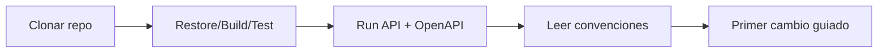
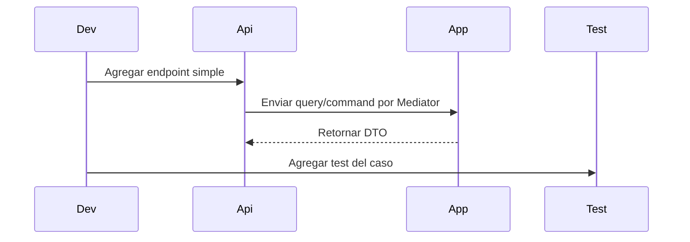

# Onboarding Dia 1

## Objetivo
Que cualquier desarrollador pueda clonar, ejecutar y hacer su primer cambio en menos de 1 hora.

## Ruta Recomendada


## Checklist de 30 Minutos
1. Ejecutar comandos base:
```powershell
dotnet restore
dotnet build -c Release
dotnet test -c Release
dotnet run --project Bitacora.Api
```
2. Abrir `http://localhost:5254/scalar/v1` y validar que el endpoint ejemplo responde.
3. Revisar convenciones en `docs/convention-mapping.md`.
4. Revisar flujo diario en `docs/daily-workflow-and-coding-practices.md`.

## Primer Cambio Recomendado


Pasos:
1. Crear un endpoint nuevo en `Bitacora.Api/Endpoints`.
2. Crear `Query` o `Command` y su handler en `Bitacora.Application`.
3. Ejecutar `dotnet test`.
4. Verificar endpoint en Scalar.

## Reglas Baseline del Template
- API minima por dominio.
- CQRS con `Mediator.SourceGenerator`.
- Mapeo con `Mapperly`.
- Mensajeria con `MassTransit` + RabbitMQ.
- Contratos de eventos en `Shared.Contract` (sin prefijo).
- `EventBusSettings:HostAddress` vacio por defecto para facilitar arranque local.

## Definicion de Listo para PR
1. Compila en `Release`.
2. Tests en verde.
3. Endpoint/documentacion visible en OpenAPI.
4. Sin warnings nuevos relevantes.
